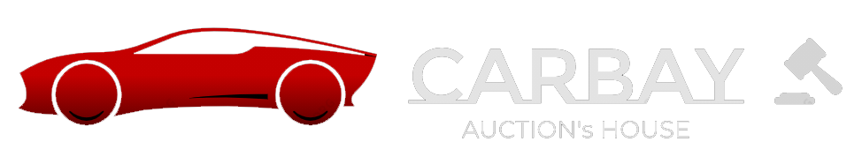

# CarBay

<iframe src="https://drive.google.com/file/d/1tkYCCOoToFUIrzzssedewqL0a5ViSj8t/preview" width="100%" height="480" allow="autoplay"></iframe>

An online bidding platform destined for car model lovers, allowing them to sell or complete their private collections, by participating in real-time traditional auctions and interacting with other worldwide collectors.

Check the [Wiki](https://github.com/edurbrito/carbay/wiki) for the full development documentation.

## 1. Installation

To run our website locally simple clone the repository and run the following command on the root of the repository:

* `docker-compose -f dev-compose.yml up`

## 2. Usage

**URL to the product:** http://lbaw2155.lbaw-prod.fe.up.pt

### 2.1. Administration Credentials

**Administration URL:** http://lbaw2155.lbaw-prod.fe.up.pt/admin
 
|     Email     | Password |
| ------------- |----------|
| aflowerden0@posterous.com | aflowerden0 |
| nberrisford1@netscape.com | nberrisford1 |
| gmcfadin2@washington.edu | gmcfadin2 |

### 2.2. User Credentials

| Type | Email | Password |
|------|----------|----------|
| basic account | fbrauned@cam.ac.uk | fbrauned |
| basic account | rkemmey1x@homestead.com | rkemmey1x |
| basic account (banned) | mtaffrey1@pbs.org | mtaffrey1 |

## Team

* Eduardo Brito
    * [up201806271@fe.up.pt](mailto:up201806271@fe.up.pt)
    * [up201806271@g.uporto.pt](mailto:up201806271@g.uporto.pt)
* Paulo Ribeiro
    * [up201806505@fe.up.pt](mailto:up201806505@fe.up.pt)
    * [up201806505@g.uporto.pt](mailto:up201806505@g.uporto.pt)
* Pedro Ferreira
    * [up201806506@fe.up.pt](mailto:up201806506@fe.up.pt)
    * [up201806506@g.uporto.pt](mailto:up201806506@g.uporto.pt)
* Pedro Ponte
    * [up201809694@fe.up.pt](mailto:up201809694@fe.up.pt)
    * [up201809694@g.uporto.pt](mailto:up201809694@g.uporto.pt)

GROUP 2155, 01/03/2021
