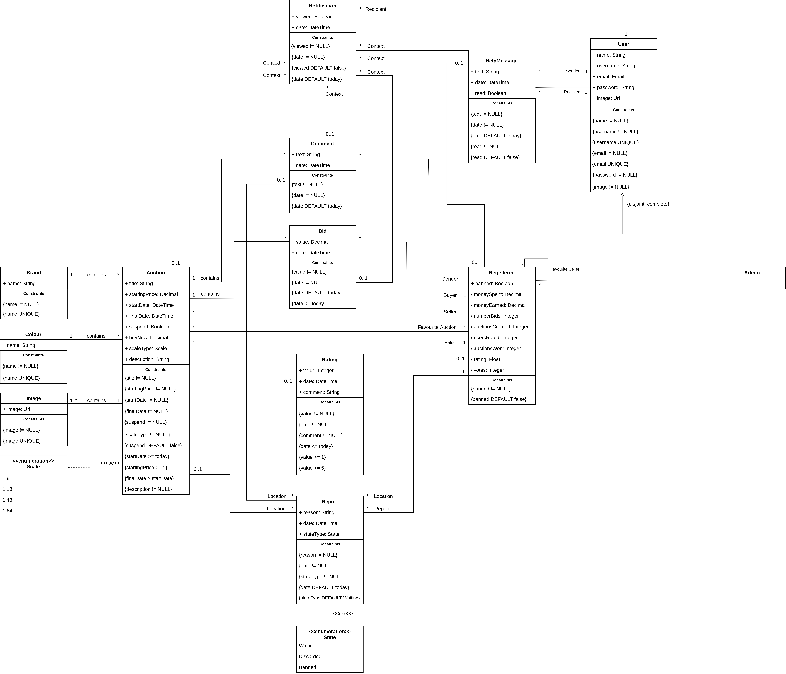

# EBD: Database Specification Component

An online bidding platform destined for car model lovers, allowing them to sell or complete their private collections, by participating in real-time traditional auctions and interacting with other worldwide collectors.

## A4: Conceptual Data Model

The goal of this artefact is to describe and identify the main entities of the domain, as well as their relationships, attributes and constraints, using a UML class diagram.

### 1. Class diagram



Figure 1: UML Class Diagram.

### 2. Additional Business Rules

- In a HelpMessage, the Sender must be of a different type of the Recipient.
- A new bid must have a greater value than the starting price of the auction.
- A new bid must have a greater value than the previous set bid.
- The seller cannot bid on his own auction.
- The registered user can only give a rating to an auction he won.
- Report only has one location.
- Notification only has one context.
- A user can only delete its account if there are no active auctions or bids.

## A5: Relational Schema, validation and schema refinement

The following artefact has by objective mapping the Conceptual Data Model, obtaining the Relational Schema, which gives information about the primary keys, foreign keys and other integrity rules of the UML tables. 
The domain, functional dependencies and normalization of all relations schemas are also present, as well as the corresponding SQL code.
Since every relation is in the Boyce–Codd Normal Form (BCNF), the relational schema is also in the BCNF, not being its normalization necessary.

### 1. Relational Schema

| Relation reference | Relation Compact Notation|
|:------------------:|--------------------------|
|         R01        | "user"(<ins>id</ins>, name **NN**, username **UK** **NN**, email **UK** **NN**, password **NN**, image **NN**, banned **NN** **DF** False, admin **NN** **DF** False)|
|         R02        | favouriteSeller(<ins>user1ID</ins> -> "user", <ins>user2ID</ins> -> "user")|
|         R03        | favouriteAuction(<ins>userID</ins> -> "user", <ins>auctionID</ins> -> auction)|
|         R04        | helpMessage(<ins>id</ins>, text **NN**, dateHour **NN** **DF** Now **CK** dateHour <= Now, read **NN** **DF** False, senderID -> "user" **NN**, recipientID -> "user" **NN**)|
|         R05        | rating(<ins>auctionID</ins> -> auction, winnerID -> "user" **NN**, value **NN** **CK** value >= 1 **AND** value <= 5, dateHour **NN** **DF** Now **CK** dateHour <= Now, comment **NN**)|
|         R06        | report(<ins>id</ins>, reason **NN**, dateHour **NN** **DF** Now, reporterID -> "user" **NN**, locationAuctionID -> auction, locationCommentID -> comment, locationRegisteredID -> "user", stateType **NN** **DF** Waiting **CK** stateType **IN** State)|
|         R07        | auction(<ins>id</ins>, title **NN**, description **NN**, startingPrice **NN** **CK** startingPrice >= 1, startDate **NN** **DF** Now **CK** startDate >= Now, finalDate **NN** **CK** finalDate >= startDate, suspend **DF** **NN** False, buyNow **IS NULL OR** (buyNow **IS NOT NULL AND** buyNow > startingPrice), scaleType **NN** **CK** scaleType **IN** Scale , brandID -> brand **NN**, colourID -> colour **NN**, sellerID -> "user" **NN**)|
|         R08        | image(<ins>id</ins>, url **NN** **UK**, auctionID -> auction **NN**)|
|         R09        | colour(<ins>id</ins>, name **NN** **UK**)|
|         R10        | brand(<ins>id</ins>, name **NN** **UK**)|
|         R11        | bid(<ins>id</ins>, value **NN**, dateHour **NN** **DF** Now **CK** dateHour <= Now, authorID -> "user" **NN**, auctionID -> Auction **NN**)|
|         R12        | comment(<ins>id</ins>, text **NN**, dateHour **NN** **DF** Now **CK** dateHour <= Now, authorID -> "user" **NN**, auctionID -> Auction **NN**)|
|         R13        | notification(<ins>id</ins>, text **NN**, viewed **NN** **DF** False, dateHour **NN** **DF** Now **CK** dateHour <= Now, contextRating -> Auction, contextHelpMessage -> helpMessage, contextFavSeller -> Auction, contextBid -> Auction, contextFavAuction -> Auction, recipientID -> "user" **NN**)|

### 2. Domains

| Domain Name |          Domain Specification          |
|:-----------:|:--------------------------------------:|
|     Now     |  DATETIME DEFAULT CURRENT_TIMESTAMP    |
|    Scale    |   ENUM ('1:8', '1:18', '1:43', '1:64') |
|    State    | ENUM ('Waiting', 'Discarded', 'Banned')|

### 3. Schema validation

|         **Table R01**          |                            "user"                               |
|:------------------------------:|:---------------------------------------------------------------:|
|           **Keys**             |                       {id, username, email}                     |
| **Functional Dependencies**    |                                                                 |
|            FD01                | {id} -> {name, username, email, password, image, banned, admin} |
|            FD02                | {username} -> {id, name, email, password, image, banned, admin} |
|            FD03                | {email} -> {id, name, username, password, image, banned, admin} |
|       **NORMAL FORM**          |                               BCNF                              |

----

|        **Table R02**           |                  favouriteSeller                 |
|:------------------------------:|:------------------------------------------------:|
|           **Keys**             |                {user1ID, user2ID}                |
| **Functional Dependencies**    |                                                  |
|                                |                 No non-trivial FDs               |
|       **NORMAL FORM**          |                       BCNF                       |

----

|        **Table R03**           |                  favouriteAuction                |
|:------------------------------:|:------------------------------------------------:|
|           **Keys**             |                 {userID, auctionID}              |
| **Functional Dependencies**    |                                                  |
|                                |                  No non-trivial FDs              |
|       **NORMAL FORM**          |                         BCNF                     |

----

|        **Table R04**           |                   helpMessage                        |
|:------------------------------:|:----------------------------------------------------:|
|           **Keys**             |                       {id}                           |
| **Functional Dependencies**    |                                                      |
|           FD51                 |  {id} -> {text, date, read, senderID, recipientID}   |
|       **NORMAL FORM**          |                       BCNF                           |

----

|        **Table R05**           |                      rating                      |
|:------------------------------:|:------------------------------------------------:|
|           **Keys**             |                   {auctionID}                    |
| **Functional Dependencies**    |                                                  |
|           FD61                 | {auctionID} -> {winnerID, value, date, comment}  |
|       **NORMAL FORM**          |                      BCNF                        |

----

|        **Table R06**           |                       report                     |
|:------------------------------:|:------------------------------------------------:|
|           **Keys**             |                         {id}                     |
| **Functional Dependencies**    |                                                  |
|           FD71                 |  {id} -> {reason, date, reporterID, locationAuctionID, locationCommentID, locationRegisteredID, stateType}   |
|       **NORMAL FORM**          |                         BCNF                     |

----

|        **Table R07**           |                        auction                   |
|:------------------------------:|:------------------------------------------------:|
|           **Keys**             |                         {id}                     |
| **Functional Dependencies**    |                                                  |
|           FD81                 | {id} -> {title, description, startingPrice, startDate, finalDate, suspend, buyNow, scaleType, brandID, colourID, sellerID} |
|       **NORMAL FORM**          |                         BCNF                     |

----

|        **Table R08**           |                         image                    |
|:------------------------------:|:------------------------------------------------:|
|           **Keys**             |                      {id, url}                   |
| **Functional Dependencies**    |                                                  |
|           FD91                 |               {id} -> {url, auctionID}           |
|           FD92                 |               {url} -> {id, auctionID}           |
|       **NORMAL FORM**          |                         BCNF                     |

----

|        **Table R09**           |                        colour                    |
|:------------------------------:|:------------------------------------------------:|
|           **Keys**             |                      {id, name}                  |
| **Functional Dependencies**    |                                                  |
|          FD101                 |                    {id} -> {name}                |
|          FD102                 |                    {name} -> {id}                |
|       **NORMAL FORM**          |                         BCNF                     |

----

|        **Table R10**           |                        brand                     |
|:------------------------------:|:------------------------------------------------:|
|           **Keys**             |                      {id, name}                  |
| **Functional Dependencies**    |                                                  |
|          FD111                 |                    {id} -> {name}                |
|          FD112                 |                    {name} -> {id}                |
|       **NORMAL FORM**          |                         BCNF                     |

----

|        **Table R11**           |                         bid                      |
|:------------------------------:|:------------------------------------------------:|
|           **Keys**             |                        {id}                      |
| **Functional Dependencies**    |                                                  |
|          FD121                 |   {id} -> {value, date, authorID, auctionID}     |
|       NORMAL FORM              |                       BCNF                       |

----

|        **Table R12**           |                      comment                     |
|:------------------------------:|:------------------------------------------------:|
|           **Keys**             |                       {id}                       |
| **Functional Dependencies**    |                                                  |
|          FD131                 |    {id} -> {text, date, authorID, auctionID}     |
|       **NORMAL FORM**          |                        BCNF                      |

----

|        **Table R13**           |                    notification                  |
|:------------------------------:|:------------------------------------------------:|
|           **Keys**             |                       {id}                       |
|  **Functional Dependencies**   |                                                  |
|          FD141                 | {id} -> {viewed, date, contextFavAuction, contextRating, contextHelpMessage, contextFavSeller, contextBid, recipientID} |
|       **NORMAL FORM**          |                       BCNF                       |  

## A6: Indexes, triggers, user functions, transactions and population

This artefact contains the estimation of the tuples growth and magnitude, the identification of the most frequent queries, database modifications, the indexes to be applied in order to enhance the performance, and the indexes relative to the full-text search. It also enumerates the triggers and transactions needed to ensure consistency and integrity. Finally, there is the complete SQL code and the script to populate the database.

### 1. Database Workload

#### 1.1. Estimate of tuples

| Relation reference | Relation name    | Order of magnitude | Estimated growth |
| ------------------ | ---------------- | ------------------ | ---------------- |
| R01                | user             | thousands          | units per day    |
| R02                | favouriteSeller  | thousands          | units per week   |
| R03                | favouriteAuction | thousands          | units per day    |
| R04                | helpMessage      | hundreds           | units per week   |
| R05                | rating           | hundreds           | units per day    |
| R06                | report           | hundreds           | units per month  |
| R07                | auction          | hundreds           | units per day    |
| R08                | image            | thousands          | dozens per day   |
| R09                | colour           | dozens             | units per year   |
| R10                | brand            | dozens             | units per year   |
| R11                | bid              | thousands          | dozens per day   |
| R12                | comment          | tens of thousands  | hundreds per day |
| R13                | notification     | tens of thousands  | hundreds per day |


#### 1.2. Most frequent queries

| Query reference    | SELECT01                  |
|--------------------|---------------------------|
| Query description  | User's profile            |
| Query frequency    | hundreds per day          |

```sql 
SELECT username, name, email, image, banned, admin,
    (SELECT AVG(value) 
        FROM rating, auction 
        WHERE auction.sellerID = $userID AND rating.auctionID = auction.id
    ) AS ratingValue
FROM "user"
WHERE "user".id = $userID;
```

<!---------------------------------------->

| Query reference    | SELECT02                  |
|--------------------|---------------------------|
| Query description  | User's favourite sellers  |
| Query frequency    | hundreds per day          |

```sql 
SELECT username, image 
FROM "user" 
WHERE "user".id IN
    (SELECT user2ID 
        FROM favouriteSeller
        WHERE favouriteSeller.user1ID = $userID);
```

<!---------------------------------------->

| Query reference    | SELECT03                  |
|--------------------|---------------------------|
| Query description  | User's favourite auctions |
| Query frequency    | hundreds per day          |

```sql
SELECT title, 
    (SELECT url 
        FROM image 
        WHERE image.auctionID = auction.id 
        ORDER BY image.id ASC LIMIT 1) AS image, 
    (SELECT value 
        FROM bid 
        WHERE auction.id = bid.auctionID 
        ORDER BY bid.id DESC LIMIT 1 ) AS maxBid, 
    finalDate
FROM auction 
WHERE auction.id IN
(SELECT auctionID 
    FROM favouriteAuction 
    WHERE favouriteAuction.userID = $userID);
```

<!---------------------------------------->

| Query reference    | SELECT04                  |
|--------------------|---------------------------|
| Query description  | Auction Info for Search   |
| Query frequency    | tens of thousands per day |

```sql
SELECT title, startDate, finalDate, buyNow, 
    (SELECT MAX(value) 
    FROM bid 
    WHERE auction.id = bid.auctionID) AS maxBid, 
    (SELECT url 
    FROM image 
    WHERE image.auctionID = auction.id LIMIT 1) AS image,
    (SELECT username 
    FROM "user" 
    WHERE "user".id = auction.sellerID) AS seller
FROM auction WHERE auction.suspend = False AND auction.finalDate > NOW() ORDER BY auction.finalDate ASC LIMIT 20 OFFSET 0;
```

<!---------------------------------------->

| Query reference    | SELECT05                  |
|--------------------|---------------------------|
| Query description  | Auction Info              |
| Query frequency    | thousands per day         |

```sql
SELECT title, startDate, finalDate, suspend, buyNow, 
    (SELECT name FROM colour WHERE colour.id = auction.colourID) AS colour,
    (SELECT name FROM brand WHERE brand.id = auction.brandID) AS brand,
    scaleType,
    username,
    image,
    (SELECT AVG(value) 
        FROM rating, auction AS temp_auction
        WHERE temp_auction.sellerID = "user".id AND rating.auctionID = temp_auction.id
    ) AS rating
FROM auction, "user"
WHERE auction.id = $auctionID AND "user".id = auction.sellerID;

SELECT url
FROM image 
WHERE image.auctionID = $auctionID;
```

<!---------------------------------------->

| Query reference    | SELECT06                  |
|--------------------|---------------------------|
| Query description  | Auction Bids              |
| Query frequency    | thousands per day         |

```sql
 -- IF User = seller
SELECT value, dateHour, 
    (SELECT username 
    FROM "user" 
    WHERE "user".id = bid.authorID) AS author 
FROM bid 
WHERE bid.auctionID = $auctionID
ORDER BY value DESC;

 -- ELSE
SELECT value, dateHour 
FROM bid 
WHERE bid.auctionID = $auctionID
ORDER BY value DESC;
```

<!---------------------------------------->

| Query reference    | SELECT07                  |
|--------------------|---------------------------|
| Query description  | Auction Comments          |
| Query frequency    | hundreds per day          |

```sql
SELECT text, dateHour, (SELECT username FROM "user" WHERE "user".id = comment.authorID) AS author 
FROM comment 
WHERE comment.auctionID = $auctionID
ORDER BY dateHour;
```

<!--------------------MODIFICATIONS-------------------->

#### 1.3. Most frequent modifications

| Query reference    | INSERT01                  |
|--------------------|---------------------------|
| Query description  | New user registered       |
| Query frequency    | units per day             |

```sql 
INSERT INTO "user" (name, username, email, password, img) 
VALUES ($email, $name, $obs, $password, $img);
```

<!---------------------------------------->

| Query reference    | INSERT02                  |
|--------------------|---------------------------|
| Query description  | New auction               |
| Query frequency    | dozens per day            |

```sql
INSERT INTO auction (title, startingPrice, startDate, finalDate, buyNow, scaleType, brandID, colourID, sellerID, description) 
VALUES ($title, $startingPrice, $startDate, $finalDate, $buyNow, $scaleType, $brandID);
```

<!---------------------------------------->

| Query reference    | INSERT03                  |
|--------------------|---------------------------|
| Query description  | New bid                   |
| Query frequency    | hundreds per day          |

```sql
INSERT INTO bid (value, dateHour, authorId, auctionId) 
VALUES ($value, $dateHour, $authorId, $auctionId);
```

<!---------------------------------------->

| Query reference    | INSERT04                  |
|--------------------|---------------------------|
| Query description  | New comment               |
| Query frequency    | hundreds per days         |

```sql
INSERT INTO comment (text, dateHour, authorID, auctionID) 
VALUES ($value, $dateHour, $authorID, $auctionID);
```

<!---------------------------------------->

| Query reference    | INSERT05                  |
|--------------------|---------------------------|
| Query description  | New favourite seller      |
| Query frequency    | units per day             |

```sql
INSERT INTO favouriteSeller (user1ID, user2ID) 
VALUES ($user1ID, $user2ID);
```

<!---------------------------------------->

| Query reference    | INSERT06                  |
|--------------------|---------------------------|
| Query description  | New favourite auction     |
| Query frequency    | units per day             |

```sql
INSERT INTO favouriteAuction (userID, auctionID) 
VALUES ($userID, $auctionID);
```

<!---------------------------------------->

| Query reference    | INSERT07                  |
|--------------------|---------------------------|
| Query description  | New image                 |
| Query frequency    | units per month           |

```sql
INSERT INTO image (url, auctionID) 
VALUES ($url, $auctionID);
```

<!---------------------------------------->

| Query reference    | UPDATE01                  |
|--------------------|---------------------------|
| Query description  | Update User Info          |
| Query frequency    | dozens per month          |
```sql 
UPDATE "user" 
SET name = $name, email = $email, image = $image, password = $password
WHERE id = $userID;
```

<!---------------------------------------->

| Query reference    | UPDATE02                  |
|--------------------|---------------------------|
| Query description  | Update User Info          |
| Query frequency    | units per month           |

```sql 
UPDATE "user" 
SET banned = $banned
WHERE id = $userID;
```

<!---------------------------------------->

| Query reference    | UPDATE03                  |
|--------------------|---------------------------|
| Query description  | User promotion to Admin   |
| Query frequency    | units per year            |

```sql 
UPDATE "user" 
SET admin = $admin
WHERE id = $userID;
```

<!---------------------------------------->

| Query reference    | UPDATE04                  |
|--------------------|---------------------------|
| Query description  | Update Auction State      |
| Query frequency    | units per year            |

```sql 
UPDATE auction 
SET suspend = $suspend
WHERE id = $auction;
```

<!---------------------------------------->

| Query reference    | UPDATE05                  |
|--------------------|---------------------------|
| Query description  | Update HelpMessage State  |
| Query frequency    | units per month           |

```sql
UPDATE helpMessage
SET read = $read
WHERE id = $messageID;
```

<!---------------------------------------->

| Query reference    | UPDATE06                  |
|--------------------|---------------------------|
| Query description  | Update Report State       |
| Query frequency    | units per month           |

```sql
UPDATE report
SET stateType = $stateType
WHERE id = $reportID;
```

<!---------------------------------------->

| Query reference    | UPDATE07                  |
|--------------------|---------------------------|
| Query description  | Update Notification State |
| Query frequency    | hundreds per day          |

```sql 
UPDATE notification
SET viewed = $viewed
WHERE id = $notificationID;
```

<!---------------------------------------->

| Query reference    | DELETE01                  |
|--------------------|---------------------------|
| Query description  | Delete "user"             |
| Query frequency    | units per day             |

```sql
DELETE FROM "user" 
WHERE "user".id = $userID;
```

<!---------------------------------------->

| Query reference    | DELETE02                  |
|--------------------|---------------------------|
| Query description  | Delete comment            |
| Query frequency    | units per day             |

```sql
DELETE FROM comment 
WHERE comment.id = $commentID;
```

<!---------------------------------------->

| Query reference    | DELETE03                  |
|--------------------|---------------------------|
| Query description  | Delete favorite auction   |
| Query frequency    | dozens per day            |

```sql
DELETE FROM favoriteAuction 
WHERE favouriteSeller.user1ID = $user1ID AND favouriteSeller.user2ID = $user2ID;
```

<!---------------------------------------->

| Query reference    | DELETE04                  |
|--------------------|---------------------------|
| Query description  | Delete favorite seller    |
| Query frequency    | dozens per day            |

```sql
DELETE FROM favouriteSeller 
WHERE favouriteSeller.user1ID = $user1ID AND favouriteSeller.user2ID = $user2ID;
```

<!------------------INDEXES---------------------->

### 2. Proposed Indexes

#### 2.1. Performance indexes

| Index reference | IDX01   |
|-----------------|---------|
| Related queries | SELECT03, SELECT04, SELECT05 |
| Index relation  | auction |
| Index attribute |finalDate|
| Index type      | B-tree  |
| Cardinality     | High    |
| Clustering      | No      |
| Justification   | These queries have to be fast, since they are executed many times every day. Its cardinality is high, because the finalDate values are very different, so query support is not needed. Therefore, there is no need for clustering.|

```sql
CREATE INDEX auction_date ON auction USING btree (finalDate);
```

<!---------------------------------------->

| Index reference | IDX02   |
|-----------------|---------|
| Related queries | SELECT04|
| Index relation  | auction |
| Index attribute | buyNow  |
| Index type      | B-tree  |
| Cardinality     | High    |
| Clustering      | No      |
| Justification   | Since they are executed many times every day, these queries have to be fast. Its cardinality is high, because the buyNow values are very different, so query support is not needed. Therefore, there is no need for clustering. |

```sql
CREATE INDEX auction_buyNow ON auction USING btree (buyNow);
```

<!---------------------------------------->

| Index reference | IDX03   |
|-----------------|---------|
| Related queries | SELECT07|
| Index relation  | comment |
| Index attribute |auctionID|
| Index type      | Hash    |
| Cardinality     | High    |
| Clustering      | No      |
| Justification   | These queries have to be fast since they are executed many times every day. Its cardinality is high, because comments are very different. Therefore, there is no need for clustering. |

```sql
CREATE INDEX comment_auction ON comment USING hash (auctionID);
```

<!---------------------------------------->

| Index reference | IDX04   |
|-----------------|---------|
| Related queries | SELECT03, SELECT04 SELECT06   |
| Index relation  | bid     |
| Index attribute | auctionID, value |
| Index type      | B-tree  |
| Cardinality     | High    |
| Clustering      | No      |
| Justification   | These queries have to be fast since they are executed many times every day. Its cardinality is high, because bids are different. Therefore, there is no need for clustering. |

```sql
CREATE INDEX bid_value ON bid USING btree (auctionID, value);
```

<!---------------------------------------->

#### 2.2. Full-text Search indexes

| Index reference | IDX05                |
| --------------- |----------------------|
| Related queries | SELECT07             |
| Index relation  | auction              |
| Index attribute | search               |
| Index type      | GiST                 |
| Clustering      | No                   |
| Justification   | To improve the performance of full text searches while searching for auctions by their titles or descriptions; GiST will be used because it's better for dynamic data, and there is a high rate of auctions being created. |

```sql
CREATE INDEX auction_search ON auction USING gist (search);
```

### 3. Triggers

| Trigger         | TRIGGER01 |
|-----------------|-----------|
| Description     | A new bid must be higher than any other bids of the auction, higher than the starting price and the author of the bid must not be the auction seller |

```sql
CREATE FUNCTION bid_rules() RETURNS TRIGGER AS
$BODY$
BEGIN
    IF EXISTS 
        (SELECT * 
        FROM bid 
        WHERE NEW.auctionID = bid.auctionID AND bid.value >= NEW.value)
    THEN 
    RAISE EXCEPTION 'A new bid must be higher than any other bids of the auction.';
    END IF;
    IF EXISTS 
        (SELECT *            
        FROM (SELECT startingPrice 
            FROM auction 
            WHERE auction.id = NEW.auctionID) AS ST  
        WHERE ST.startingPrice > NEW.value)
    THEN 
    RAISE EXCEPTION 'A new bid must be higher than the starting price.';
    END IF;
    IF EXISTS 
        (SELECT * 
        FROM auction 
        WHERE auction.id = NEW.auctionID AND auction.sellerID = NEW.authorID)
    THEN 
    RAISE EXCEPTION 'The author of a new bid must not be the auction seller.';
    END IF;
    RETURN NEW;
END
$BODY$
LANGUAGE plpgsql;
 
CREATE TRIGGER bid_rules
    BEFORE INSERT ON bid
    FOR EACH ROW
    EXECUTE PROCEDURE bid_rules();
```

<!---------------------------------------->

| Trigger         | TRIGGER02 |
|-----------------|---------- |
| Description     | In a HelpMessage, the Sender must be of a different type of the Recipient |

```sql 
CREATE FUNCTION help_message_types() RETURNS TRIGGER AS
$BODY$
BEGIN
    IF NEW.senderID = NEW.recipientID OR EXISTS 
        (SELECT u1.admin , u2.admin 
        FROM "user" AS u1, "user" AS u2
        WHERE u1.id = NEW.senderID AND u2.id = NEW.recipientID AND u1.admin = u2.admin)
    THEN 
    RAISE EXCEPTION 'In a HelpMessage, the Sender must be of a different type of the Recipient.';
    END IF;
    RETURN NEW;
END
$BODY$
LANGUAGE plpgsql;
 
CREATE TRIGGER help_message_types
    BEFORE INSERT ON helpMessage
    FOR EACH ROW
    EXECUTE PROCEDURE help_message_types();
```

<!---------------------------------------->

| Trigger         | TRIGGER03 |
|-----------------|-----------|
| Description     | The registered user can only give a rating to an auction he won |

```sql
CREATE FUNCTION rating_rules() RETURNS TRIGGER AS
$BODY$
BEGIN
    IF EXISTS 
        (SELECT finalDate FROM auction WHERE NEW.auctionID = auction.id AND finalDate > NOW())
    THEN 
    RAISE EXCEPTION 'The registered user can only give a rating to an auction that has ended.';
    END IF;
    IF NOT EXISTS 
        (SELECT T.authorID FROM (SELECT MAX(value) AS value, bid.auctionID, bid.authorID 
                FROM bid 
                GROUP BY bid.authorID, bid.auctionID
                HAVING bid.auctionID = NEW.auctionID
				ORDER BY value DESC
				LIMIT 1) AS T
        WHERE T.authorID = NEW.winnerID)
    THEN 
    RAISE EXCEPTION 'The registered user can only give a rating to an auction he won.';
    END IF;
    RETURN NEW;
END
$BODY$
LANGUAGE plpgsql;
 
CREATE TRIGGER rating_rules
    BEFORE INSERT ON rating
    FOR EACH ROW
    EXECUTE PROCEDURE rating_rules();
```

<!---------------------------------------->

| Trigger         | TRIGGER04 |
|-----------------|-----------|
| Description     | A user can only delete its account if there are no active auctions where he is the seller and if he's not the author of any highest bid |

```sql
CREATE FUNCTION delete_rules() RETURNS TRIGGER AS
$BODY$
BEGIN
    IF EXISTS 
        (SELECT auction.id FROM OLD, auction WHERE OLD.id = auction.sellerID AND finalDate > NOW())
    THEN 
    RAISE EXCEPTION 'A user can only delete its account if there are no active auctions where he is the seller.';
    END IF;
    IF EXISTS 
        (SELECT bid.id FROM OLD, bid, auction WHERE OLD.id = bid.authorID AND finalDate > NOW() AND auction.id = bid.auctionID)
    THEN 
    RAISE EXCEPTION 'A user can only delete its account if he is not the author of any highest bid.';
    END IF;
    RETURN NEW;
END
$BODY$
LANGUAGE plpgsql;
 
CREATE TRIGGER delete_rules
    BEFORE INSERT ON "user"
    FOR EACH ROW
    EXECUTE PROCEDURE delete_rules();
```


<!--------------------------------------->

| Trigger         | TRIGGER05 |
|-----------------|-----------|
| Description     | When a rating is inserted, notify the user that have received the rating. |

```sql
CREATE FUNCTION notify_rating() RETURNS TRIGGER AS 
$BODY$
BEGIN
    INSERT INTO notification (recipientId, contextRating)
    VALUES (
        (SELECT sellerID FROM auction WHERE auction.id = NEW.auctionID),
        NEW.auctionID
    );
    RETURN NEW;
END
$BODY$
LANGUAGE 'plpgsql';

CREATE TRIGGER notify_rating
    AFTER INSERT ON rating
    FOR EACH ROW
    EXECUTE PROCEDURE notify_rating();
```


<!--------------------------------------->

| Trigger         | TRIGGER06 |
|-----------------|-----------|
| Description     | When an help message is sent by an admin, notify the recipient. |

```sql
CREATE FUNCTION notify_help_message() RETURNS TRIGGER AS 
$BODY$
BEGIN
    INSERT INTO notification (recipientId, contextHelpMessage)
    VALUES (NEW.recipientID, NEW.id);
    RETURN NEW;
END
$BODY$ 
LANGUAGE 'plpgsql';

CREATE TRIGGER notify_help_message
    AFTER INSERT ON helpMessage
    FOR EACH ROW
    EXECUTE PROCEDURE notify_help_message();
```

<!--------------------------------------->

| Trigger         | TRIGGER07 |
|-----------------|-----------|
| Description     | When an auction is inserted, notify users that have that seller as favorite. |

```sql
CREATE FUNCTION notify_favorite_sellers() RETURNS TRIGGER AS 
$BODY$
BEGIN
    INSERT INTO notification (recipientId, contextFavSeller)
    SELECT user1ID , NEW.id 
        FROM FavouriteSeller 
        WHERE FavouriteSeller.user2ID = NEW.sellerID;
    RETURN NEW;
END
$BODY$ 
LANGUAGE 'plpgsql';

CREATE TRIGGER notify_favorite_sellers
    AFTER INSERT ON auction
    FOR EACH ROW
    EXECUTE PROCEDURE notify_favorite_sellers();
```

<!--------------------------------------->

| Trigger         | TRIGGER08 |
|-----------------|-----------|
| Description     | When a new highest bid is added, notify the last high bid maker that its bid was surpassed. |

```sql
CREATE FUNCTION notify_highest_bid() RETURNS TRIGGER AS 
$BODY$
BEGIN
    INSERT INTO notification (recipientId, contextBid) 
    SELECT bid.authorID , bid.auctionID 
        FROM bid
        WHERE bid.auctionID = NEW.auctionID AND bid.id != NEW.id
        ORDER BY bid.value DESC
        LIMIT 1;
    RETURN NEW;
END
$BODY$ 
LANGUAGE 'plpgsql';

CREATE TRIGGER notify_highest_bid
    AFTER INSERT ON bid
    FOR EACH ROW
    EXECUTE PROCEDURE notify_highest_bid();
```

<!--------------------------------------->

| Trigger         | TRIGGER09 |
|-----------------|-----------|
| Description     | When an auction is inserted or updated, add a new column for tsvector values based on the title, colour, brand, seller username and description. |

```sql
CREATE FUNCTION auction_search_update() RETURNS TRIGGER AS 
$BODY$
BEGIN
    IF TG_OP = 'INSERT' THEN
        NEW.search =  setweight(to_tsvector('english', NEW.title), 'A') || 
            setweight(to_tsvector('english', (SELECT name FROM colour WHERE colour.id = NEW.colourID)), 'B') ||
            setweight(to_tsvector('simple', (SELECT name FROM brand WHERE brand.id = NEW.brandID)), 'B') ||
            setweight(to_tsvector('simple', (SELECT username FROM "user" WHERE "user".id = NEW.sellerID)), 'B') ||
            setweight(to_tsvector('english', NEW.description), 'C');
    END IF;
    IF TG_OP = 'UPDATE' THEN
        IF 
        NEW.title <> OLD.title OR 
        NEW.colourID <> OLD.colourID OR 
        NEW.brandID <> OLD.brandID OR 
        NEW.sellerID <> OLD.sellerID OR 
        NEW.description <> OLD.description 
        THEN
            NEW.search =  setweight(to_tsvector('english', NEW.title), 'A') || 
                setweight(to_tsvector('english', (SELECT name FROM colour WHERE colour.id = NEW.colourID)), 'B') ||
                setweight(to_tsvector('simple', (SELECT name FROM brand WHERE brand.id = NEW.brandID)), 'B') ||
                setweight(to_tsvector('simple', (SELECT username FROM "user" WHERE "user".id = NEW.sellerID)), 'B') ||
                setweight(to_tsvector('english', NEW.description), 'C');
        END IF;
    END IF;
    RETURN NEW;
END
$BODY$ 
LANGUAGE 'plpgsql';

CREATE TRIGGER fts_auction_insert
    BEFORE INSERT ON auction
    FOR EACH ROW
    EXECUTE PROCEDURE auction_search_update();

CREATE TRIGGER fts_auction_update
    BEFORE UPDATE ON auction
    FOR EACH ROW
    EXECUTE PROCEDURE auction_search_update();
```

### 4. Transactions

| T01             | Create a new Auction |
|-----------------|-----------|
| Justification   | To maintain consistency, it's necessary to use a transaction to ensure that all the code executes without errors. If an error occurs, a ROLLBACK is issued (when the creation of an auction fails, per example). The isolation level is Repeatable Read, because, otherwise, an update of auction_id_seq could happen, due to an insert in the table auction committed by a concurrent transaction, and as a result, inconsistent data would be stored. Besides this, if only some of these insert operations were made, the other tables would be missing the new data. |
| Isolation level | REPEATABLE READ |

```sql
BEGIN TRANSACTION;
SET TRANSACTION ISOLATION LEVEL REPEATABLE READ 
 
-- Insert auction
 INSERT INTO auction (title, description, startingPrice, startDate, finalDate, buyNow, scaleType, brandID, colourID, sellerID) 
 VALUES ($title, $description, $startingPrice, $startDate, $finalDate, $buyNow, $scaleType, $brandID, $colourID, $sellerID);
  
  -- Insert image 
 INSERT INTO image (url, auctionID)
 VALUES ($url, currval('auction_id_seq'));
 
COMMIT;
```

## Annex A. SQL Code

[database.sql](https://git.fe.up.pt/lbaw/lbaw2021/lbaw2155/-/blob/master/sql/database.sql)
[population.sql](https://git.fe.up.pt/lbaw/lbaw2021/lbaw2155/-/blob/master/sql/population.sql)

### A.1 Database schema

```sql
DROP TABLE IF EXISTS Rating CASCADE;
DROP TABLE IF EXISTS Report CASCADE;
DROP TABLE IF EXISTS Comment CASCADE;
DROP TABLE IF EXISTS Image CASCADE;
DROP TABLE IF EXISTS Auction CASCADE;
DROP TABLE IF EXISTS Brand CASCADE;
DROP TABLE IF EXISTS Colour CASCADE;
DROP TABLE IF EXISTS FavouriteSeller CASCADE;
DROP TABLE IF EXISTS FavouriteAuction CASCADE;
DROP TABLE IF EXISTS "user" CASCADE;
DROP TABLE IF EXISTS HelpMessage CASCADE;
DROP TABLE IF EXISTS Bid CASCADE;
DROP TABLE IF EXISTS Notification CASCADE;

DROP TYPE IF EXISTS Scale CASCADE;
DROP TYPE IF EXISTS State CASCADE;

DROP TRIGGER IF EXISTS bid_rules ON Bid;
DROP TRIGGER IF EXISTS help_message_types ON HelpMessage;
DROP TRIGGER IF EXISTS rating_rules ON Rating;
DROP TRIGGER IF EXISTS delete_rules ON "user";
DROP TRIGGER IF EXISTS notify_rating ON Rating;
DROP TRIGGER IF EXISTS notify_help_message ON HelpMessage;
DROP TRIGGER IF EXISTS notify_favorite_sellers ON Auction;
DROP TRIGGER IF EXISTS notify_highest_bid ON Bid;
DROP TRIGGER IF EXISTS fts_auction_insert ON Auction;
DROP TRIGGER IF EXISTS fts_auction_update ON Auction;

DROP FUNCTION IF EXISTS bid_rules() CASCADE;
DROP FUNCTION IF EXISTS help_message_types() CASCADE;
DROP FUNCTION IF EXISTS rating_rules() CASCADE;
DROP FUNCTION IF EXISTS delete_rules() CASCADE;
DROP FUNCTION IF EXISTS notify_rating() CASCADE;
DROP FUNCTION IF EXISTS notify_help_message() CASCADE;
DROP FUNCTION IF EXISTS notify_favorite_sellers() CASCADE;
DROP FUNCTION IF EXISTS notify_highest_bid() CASCADE;
DROP FUNCTION IF EXISTS auction_search_update() CASCADE;


CREATE TABLE "user" (
    id                  SERIAL,
    name                VARCHAR(300) NOT NULL,
    username            VARCHAR(300) NOT NULL,
    email               VARCHAR(300) NOT NULL,
    password            VARCHAR(300) NOT NULL,
    image               VARCHAR(300) NOT NULL,
    banned              BOOLEAN DEFAULT FALSE NOT NULL,
    admin               BOOLEAN DEFAULT FALSE NOT NULL,

    CONSTRAINT UserPK PRIMARY KEY (id),
    CONSTRAINT UserUsernameUK UNIQUE (username),
    CONSTRAINT UserEmailUK UNIQUE (email)
);


CREATE TYPE Scale as ENUM (
  '1:8',
  '1:18',
  '1:43',
  '1:64'
);


CREATE TABLE Colour (
    id                      SERIAL,
    name                    VARCHAR(300) NOT NULL,

    CONSTRAINT ColourPK PRIMARY KEY (id),
    CONSTRAINT ColourNameUK UNIQUE (name)

);


CREATE TABLE Brand (
    id                      SERIAL,
    name                    VARCHAR(300) NOT NULL,

    CONSTRAINT BrandPK PRIMARY KEY (id),
    CONSTRAINT BrandNameUK UNIQUE (name)

);


CREATE TABLE Auction (
    id                       SERIAL,
    title                    VARCHAR(300) NOT NULL,
    description              VARCHAR(300) NOT NULL,
    startingPrice            DECIMAL NOT NULL,
    startDate                TIMESTAMP WITH TIME zone DEFAULT now() NOT NULL,
    finalDate                TIMESTAMP WITH TIME zone NOT NULL,
    suspend                  BOOLEAN DEFAULT FALSE NOT NULL,
    buyNow                   DECIMAL,
    scaleType                Scale NOT NULL,
    brandID                  INTEGER NOT NULL,
    colourID                 INTEGER NOT NULL,
    sellerID                 INTEGER,
    search                   TSVECTOR,
    
    CONSTRAINT AuctionPK PRIMARY KEY (id),
    CONSTRAINT AuctionStartingPriceCK CHECK(startingPrice >= 1),
    -- CONSTRAINT AuctionStartDateCK CHECK(startDate >= now()),
    CONSTRAINT AuctionFinalDateCK CHECK(finalDate >= startDate),
    CONSTRAINT AuctionBuyNowCK CHECK (buyNow IS NULL or (buyNow IS NOT NULL and buyNow > startingPrice)),
    CONSTRAINT AuctionBrandFK FOREIGN KEY (brandID) REFERENCES Brand ON UPDATE CASCADE ON DELETE RESTRICT,
    CONSTRAINT AuctionColourFK FOREIGN KEY (colourID) REFERENCES Colour ON UPDATE CASCADE ON DELETE RESTRICT,
    CONSTRAINT AuctionSellerFK FOREIGN KEY (sellerID) REFERENCES "user" ON UPDATE CASCADE ON DELETE SET NULL
);


CREATE TABLE Image (
    id                      SERIAL,
    url                     VARCHAR(300) NOT NULL,
    auctionID               INTEGER NOT NULL,

    CONSTRAINT ImagePK PRIMARY KEY (id),
    CONSTRAINT ImageUrlUK UNIQUE (url),
    CONSTRAINT ImageAuctionFK FOREIGN KEY (auctionID) REFERENCES Auction ON UPDATE CASCADE ON DELETE CASCADE
);


CREATE TABLE FavouriteSeller (
    user1ID                 SERIAL,
    user2ID                 SERIAL,

    CONSTRAINT FavouriteSellerPK PRIMARY KEY (user1ID, user2ID),
    CONSTRAINT FavouriteSellerUser1FK FOREIGN KEY (user1ID) REFERENCES "user" ON UPDATE CASCADE ON DELETE CASCADE,
    CONSTRAINT FavouriteSellerUser2FK FOREIGN KEY (user2ID) REFERENCES "user" ON UPDATE CASCADE ON DELETE CASCADE
);


CREATE TABLE FavouriteAuction (
    userID                 SERIAL,
    auctionID              SERIAL,

    CONSTRAINT FavouriteAuctionPK PRIMARY KEY (userID,auctionID),
    CONSTRAINT FavouriteAuctionUserFK FOREIGN KEY (userID) REFERENCES "user" ON UPDATE CASCADE ON DELETE CASCADE,
    CONSTRAINT FavouriteAutionAuctionFK FOREIGN KEY (auctionID) REFERENCES Auction ON UPDATE CASCADE ON DELETE CASCADE
);


CREATE TABLE HelpMessage (
    id                      SERIAL,
    text                    VARCHAR(300) NOT NULL,
    dateHour                TIMESTAMP WITH TIME zone DEFAULT now() NOT NULL,
    read                    BOOLEAN DEFAULT FALSE NOT NULL,
    senderID                INTEGER,
    recipientID             INTEGER,
    
    CONSTRAINT HelpMessagePK PRIMARY KEY (id),
    CONSTRAINT HelpMessageDateLT CHECK (dateHour <= now()),
    CONSTRAINT HelpMessageSenderFK FOREIGN KEY (senderID) REFERENCES "user" ON UPDATE CASCADE ON DELETE SET NULL,
    CONSTRAINT HelpMessageRecipientFK FOREIGN KEY (recipientID) REFERENCES "user" ON UPDATE CASCADE ON DELETE SET NULL
);


CREATE TABLE Rating (
    auctionID               SERIAL,
    winnerID                INTEGER,
    value                   INTEGER NOT NULL,
    dateHour                TIMESTAMP WITH TIME zone DEFAULT now() NOT NULL,
    comment                 VARCHAR(300) NOT NULL,

    CONSTRAINT RatingPK PRIMARY KEY (auctionID),
    CONSTRAINT RatingAuctionFK FOREIGN KEY (auctionID) REFERENCES Auction ON UPDATE CASCADE ON DELETE CASCADE,
    CONSTRAINT RatingWinnerFK FOREIGN KEY (winnerID) REFERENCES "user" ON UPDATE CASCADE ON DELETE SET NULL,
    CONSTRAINT RatingValueHT CHECK (value >= 1),
    CONSTRAINT RatingValueLT CHECK (value <= 5),
    CONSTRAINT RatingDateLT CHECK (dateHour <= now())
);


CREATE TYPE State as ENUM (
  'Waiting',
  'Discarded',
  'Banned'
);


CREATE TABLE Comment (
    id                      SERIAL,
    text                    VARCHAR(300) NOT NULL,
    dateHour                TIMESTAMP WITH TIME zone DEFAULT now() NOT NULL,
    authorID                INTEGER NOT NULL,
    auctionID               INTEGER NOT NULL,
    
    CONSTRAINT CommentPK PRIMARY KEY (id),
    CONSTRAINT CommentDateLT CHECK (dateHour <= now()),
    CONSTRAINT CommentAuthorFK FOREIGN KEY (authorID) REFERENCES "user" ON UPDATE CASCADE ON DELETE CASCADE,
    CONSTRAINT CommentAuctionFK FOREIGN KEY (auctionID) REFERENCES Auction ON UPDATE CASCADE ON DELETE CASCADE
);


CREATE TABLE Report(
    id                        SERIAL,
    reason                    VARCHAR(300) NOT NULL,
    dateHour                  TIMESTAMP WITH TIME zone DEFAULT now() NOT NULL,
    reporterID                INTEGER,
    locationAuctionID         INTEGER DEFAULT NULL,
    locationCommentID         INTEGER DEFAULT NULL,
    locationRegisteredID      INTEGER DEFAULT NULL,
    stateType                 State DEFAULT 'Waiting' NOT NULL,

    CONSTRAINT ReportPK PRIMARY KEY (id),
    CONSTRAINT ReportReporterFK FOREIGN KEY (reporterID) REFERENCES "user" ON UPDATE CASCADE ON DELETE SET NULL,
    CONSTRAINT ReportExclusiveORLocation CHECK (
        1 = (
            CASE WHEN locationAuctionID IS NOT NULL THEN 1 ELSE 0 END +
            CASE WHEN locationCommentID IS NOT NULL THEN 1 ELSE 0 END +
            CASE WHEN locationRegisteredID IS NOT NULL THEN 1 ELSE 0 END
        )
    ),
    CONSTRAINT ReportLocationAuctionFK FOREIGN KEY (locationAuctionID) REFERENCES Auction ON UPDATE CASCADE ON DELETE CASCADE,
    CONSTRAINT ReportLocationCommentFK FOREIGN KEY (locationCommentID) REFERENCES Comment ON UPDATE CASCADE ON DELETE CASCADE,
    CONSTRAINT ReportLocationRegisteredFK FOREIGN KEY (locationRegisteredID) REFERENCES "user" ON UPDATE CASCADE ON DELETE CASCADE
);


CREATE TABLE Bid (
    id                      SERIAL,
    value                   DECIMAL NOT NULL,
    dateHour                TIMESTAMP WITH TIME zone DEFAULT now() NOT NULL,
    authorID                INTEGER,
    auctionID               INTEGER NOT NULL,

    CONSTRAINT BidPK PRIMARY KEY (id),
    CONSTRAINT BidDateCK CHECK(dateHour <= now()),
    CONSTRAINT BidAuthorFK FOREIGN KEY (authorID) REFERENCES "user" ON UPDATE CASCADE ON DELETE SET NULL,
    CONSTRAINT BidAuctionFK FOREIGN KEY (auctionID) REFERENCES Auction ON UPDATE CASCADE ON DELETE RESTRICT
);


CREATE TABLE Notification (
    id                      SERIAL,
    viewed                  BOOLEAN DEFAULT FALSE NOT NULL,
    dateHour                TIMESTAMP WITH TIME zone DEFAULT now() NOT NULL,
    recipientID             INTEGER NOT NULL,
    contextRating           INTEGER DEFAULT NULL,
    contextHelpMessage      INTEGER DEFAULT NULL,
    contextFavSeller        INTEGER DEFAULT NULL,
    contextBid              INTEGER DEFAULT NULL,
    contextFavAuction       INTEGER DEFAULT NULL,

    CONSTRAINT NotificationPK PRIMARY KEY (id),
    CONSTRAINT NotificationDateLT CHECK (dateHour <= now()),
    CONSTRAINT NotificationExclusiveORContext CHECK (
        1 = (
            CASE WHEN contextRating IS NOT NULL THEN 1 ELSE 0 END +
            CASE WHEN contextHelpMessage IS NOT NULL THEN 1 ELSE 0 END +
            CASE WHEN contextFavSeller IS NOT NULL THEN 1 ELSE 0 END +
            CASE WHEN contextBid IS NOT NULL THEN 1 ELSE 0 END +
            CASE WHEN contextFavAuction IS NOT NULL THEN 1 ELSE 0 END
        )
    ),
    CONSTRAINT NotificationRecipientIDFK FOREIGN KEY (recipientID) REFERENCES "user" ON UPDATE CASCADE ON DELETE CASCADE,
    CONSTRAINT NotificationContextRatingFK FOREIGN KEY (contextRating) REFERENCES Auction ON UPDATE CASCADE ON DELETE CASCADE,
    CONSTRAINT NotificationContextHelpMessageFK FOREIGN KEY (contextHelpMessage) REFERENCES HelpMessage ON UPDATE CASCADE ON DELETE CASCADE,
    CONSTRAINT NotificationContextFavSellerFK FOREIGN KEY (contextFavSeller) REFERENCES Auction ON UPDATE CASCADE ON DELETE CASCADE,
    CONSTRAINT NotificationContextBidFK FOREIGN KEY (contextBid) REFERENCES Auction ON UPDATE CASCADE ON DELETE CASCADE,
    CONSTRAINT NotificationContextFavAuctionFK FOREIGN KEY (contextFavAuction) REFERENCES Auction ON UPDATE CASCADE ON DELETE CASCADE
);


------------------------------INDEXES------------------------------


CREATE INDEX auction_date ON auction USING btree (finalDate);

CREATE INDEX auction_buyNow ON auction USING btree (buyNow);

CREATE INDEX comment_auction ON comment USING hash (auctionID);

CREATE INDEX bid_value ON bid USING btree (auctionID, value);

CREATE INDEX auction_search ON auction USING gist (search);


------------------------------FUNCTIONS------------------------------


CREATE FUNCTION bid_rules() RETURNS TRIGGER AS
$BODY$
BEGIN
    IF EXISTS 
        (SELECT * 
        FROM bid 
        WHERE NEW.auctionID = bid.auctionID AND bid.value >= NEW.value)
    THEN 
    RAISE EXCEPTION 'A new bid must be higher than any other bids of the auction.';
    END IF;
    IF EXISTS 
        (SELECT *            
        FROM (SELECT startingPrice 
            FROM auction 
            WHERE auction.id = NEW.auctionID) AS ST  
        WHERE ST.startingPrice > NEW.value)
    THEN 
    RAISE EXCEPTION 'A new bid must be higher than the starting price.';
    END IF;
    IF EXISTS 
        (SELECT * 
        FROM auction 
        WHERE auction.id = NEW.auctionID AND auction.sellerID = NEW.authorID)
    THEN 
    RAISE EXCEPTION 'The author of a new bid must not be the auction seller.';
    END IF;
    RETURN NEW;
END
$BODY$
LANGUAGE plpgsql;
 

CREATE FUNCTION help_message_types() RETURNS TRIGGER AS
$BODY$
BEGIN
    IF NEW.senderID = NEW.recipientID OR EXISTS 
        (SELECT u1.admin , u2.admin 
        FROM "user" AS u1, "user" AS u2
        WHERE u1.id = NEW.senderID AND u2.id = NEW.recipientID AND u1.admin = u2.admin)
    THEN 
    RAISE EXCEPTION 'In a HelpMessage, the Sender must be of a different type of the Recipient.';
    END IF;
    RETURN NEW;
END
$BODY$
LANGUAGE plpgsql;
 

CREATE FUNCTION rating_rules() RETURNS TRIGGER AS
$BODY$
BEGIN
    IF EXISTS 
        (SELECT finalDate FROM auction WHERE NEW.auctionID = auction.id AND finalDate > NOW())
    THEN 
    RAISE EXCEPTION 'The registered user can only give a rating to an auction that has ended.';
    END IF;
    IF NOT EXISTS 
        (SELECT T.authorID FROM (SELECT MAX(value) AS value, bid.auctionID, bid.authorID 
                FROM bid 
                GROUP BY bid.authorID, bid.auctionID
                HAVING bid.auctionID = NEW.auctionID
				ORDER BY value DESC
				LIMIT 1) AS T
        WHERE T.authorID = NEW.winnerID)
    THEN 
    RAISE EXCEPTION 'The registered user can only give a rating to an auction he won.';
    END IF;
    RETURN NEW;
END
$BODY$
LANGUAGE plpgsql;
 

CREATE FUNCTION delete_rules() RETURNS TRIGGER AS
$BODY$
BEGIN
    IF EXISTS 
        (SELECT auction.id FROM OLD, auction WHERE OLD.id = auction.sellerID AND finalDate > NOW())
    THEN 
    RAISE EXCEPTION 'A user can only delete its account if there are no active auctions where he is the seller.';
    END IF;
    IF EXISTS 
        (SELECT bid.id FROM OLD, bid, auction WHERE OLD.id = bid.authorID AND finalDate > NOW() AND auction.id = bid.auctionID)
    THEN 
    RAISE EXCEPTION 'A user can only delete its account if he is not the author of any highest bid.';
    END IF;
    RETURN NEW;
END
$BODY$
LANGUAGE plpgsql;
 

CREATE FUNCTION notify_rating() RETURNS TRIGGER AS 
$BODY$
BEGIN
    INSERT INTO notification (recipientId, contextRating)
    VALUES (
        (SELECT sellerID FROM auction WHERE auction.id = NEW.auctionID),
        NEW.auctionID
    );
    RETURN NEW;
END
$BODY$
LANGUAGE 'plpgsql';


CREATE FUNCTION notify_help_message() RETURNS TRIGGER AS 
$BODY$
BEGIN
    INSERT INTO notification (recipientId, contextHelpMessage)
    VALUES (NEW.recipientID, NEW.id);
    RETURN NEW;
END
$BODY$ 
LANGUAGE 'plpgsql';


CREATE FUNCTION notify_favorite_sellers() RETURNS TRIGGER AS 
$BODY$
BEGIN
    INSERT INTO notification (recipientId, contextFavSeller) 
    SELECT user1ID , NEW.id 
        FROM FavouriteSeller 
        WHERE FavouriteSeller.user2ID = NEW.sellerID;
    RETURN NEW;
END
$BODY$ 
LANGUAGE 'plpgsql';


CREATE FUNCTION notify_highest_bid() RETURNS TRIGGER AS 
$BODY$
BEGIN
    INSERT INTO notification (recipientId, contextBid) 
    SELECT bid.authorID , bid.auctionID 
        FROM bid
        WHERE bid.auctionID = NEW.auctionID AND bid.id != NEW.id
        ORDER BY bid.value DESC
        LIMIT 1;
    RETURN NEW;
END
$BODY$ 
LANGUAGE 'plpgsql';


CREATE FUNCTION auction_search_update() RETURNS TRIGGER AS 
$BODY$
BEGIN
    IF TG_OP = 'INSERT' THEN
        NEW.search =  setweight(to_tsvector('english', NEW.title), 'A') || 
            setweight(to_tsvector('english', (SELECT name FROM colour WHERE colour.id = NEW.colourID)), 'B') ||
            setweight(to_tsvector('simple', (SELECT name FROM brand WHERE brand.id = NEW.brandID)), 'B') ||
            setweight(to_tsvector('simple', (SELECT username FROM "user" WHERE "user".id = NEW.sellerID)), 'B') ||
            setweight(to_tsvector('english', NEW.description), 'C');
    END IF;
    IF TG_OP = 'UPDATE' THEN
        IF 
        NEW.title <> OLD.title OR 
        NEW.colourID <> OLD.colourID OR 
        NEW.brandID <> OLD.brandID OR 
        NEW.sellerID <> OLD.sellerID OR 
        NEW.description <> OLD.description 
        THEN
            NEW.search =  setweight(to_tsvector('english', NEW.title), 'A') || 
                setweight(to_tsvector('english', (SELECT name FROM colour WHERE colour.id = NEW.colourID)), 'B') ||
                setweight(to_tsvector('simple', (SELECT name FROM brand WHERE brand.id = NEW.brandID)), 'B') ||
                setweight(to_tsvector('simple', (SELECT username FROM "user" WHERE "user".id = NEW.sellerID)), 'B') ||
                setweight(to_tsvector('english', NEW.description), 'C');
        END IF;
    END IF;
    RETURN NEW;
END
$BODY$ 
LANGUAGE 'plpgsql';


------------------------------TRIGGERS------------------------------


CREATE TRIGGER bid_rules
    BEFORE INSERT ON bid
    FOR EACH ROW
    EXECUTE PROCEDURE bid_rules();


CREATE TRIGGER help_message_types
    BEFORE INSERT ON helpMessage
    FOR EACH ROW
    EXECUTE PROCEDURE help_message_types();


CREATE TRIGGER rating_rules
    BEFORE INSERT ON rating
    FOR EACH ROW
    EXECUTE PROCEDURE rating_rules();


CREATE TRIGGER delete_rules
    BEFORE DELETE ON "user"
    FOR EACH ROW
    EXECUTE PROCEDURE delete_rules();


CREATE TRIGGER notify_rating
    AFTER INSERT ON rating
    FOR EACH ROW
    EXECUTE PROCEDURE notify_rating();


CREATE TRIGGER notify_help_message
    AFTER INSERT ON helpMessage
    FOR EACH ROW
    EXECUTE PROCEDURE notify_help_message();


CREATE TRIGGER notify_favorite_sellers
    AFTER INSERT ON auction
    FOR EACH ROW
    EXECUTE PROCEDURE notify_favorite_sellers();


CREATE TRIGGER notify_highest_bid
    AFTER INSERT ON bid
    FOR EACH ROW
    EXECUTE PROCEDURE notify_highest_bid();


CREATE TRIGGER fts_auction_insert
    BEFORE INSERT ON auction
    FOR EACH ROW
    EXECUTE PROCEDURE auction_search_update();

CREATE TRIGGER fts_auction_update
    BEFORE UPDATE ON auction
    FOR EACH ROW
    EXECUTE PROCEDURE auction_search_update();
```

### A.2 Database population

```sql
INSERT INTO "user" (id, name, username, email, password, image, banned, admin) VALUES (1, 'Ainsley Flowerden', 'aflowerden0', 'aflowerden0@posterous.com', 'kNmDqPrWt', 'http://dummyimage.com/135x100.png/dddddd/000000', false, true);
INSERT INTO "user" (id, name, username, email, password, image, banned, admin) VALUES (2, 'Nappy Berrisford', 'nberrisford1', 'nberrisford1@netscape.com', '7C2oJYrT5Yfw', 'http://dummyimage.com/204x100.png/cc0000/ffffff', false, true);
INSERT INTO "user" (id, name, username, email, password, image, banned, admin) VALUES (3, 'Giraud McFadin', 'gmcfadin2', 'gmcfadin2@washington.edu', 'V5O4sbDVNq', 'http://dummyimage.com/117x100.png/ff4444/ffffff', false, true);
INSERT INTO "user" (id, name, username, email, password, image, banned, admin) VALUES (4, 'Xerxes Faber', 'xfaber3', 'xfaber3@cocolog-nifty.com', '1Csqw0Cpw', 'http://dummyimage.com/202x100.png/5fa2dd/ffffff', false, true);
INSERT INTO "user" (id, name, username, email, password, image, banned, admin) VALUES (5, 'Nealy Clousley', 'nclousley4', 'nclousley4@merriam-webster.com', 'q5R2qPFRaptA', 'http://dummyimage.com/221x100.png/5fa2dd/ffffff', false, true);
INSERT INTO "user" (id, name, username, email, password, image, banned, admin) VALUES (6, 'Lise Castro', 'lcastro5', 'lcastro5@w3.org', 'W5ziIyZ123fy', 'http://dummyimage.com/217x100.png/ff4444/ffffff', false, true);
INSERT INTO "user" (id, name, username, email, password, image, banned, admin) VALUES (7, 'Arlene Carlos', 'acarlos6', 'acarlos6@prlog.org', 'EzelEm', 'http://dummyimage.com/116x100.png/5fa2dd/ffffff', false, true);
INSERT INTO "user" (id, name, username, email, password, image, banned, admin) VALUES (8, 'Stanislaus Monget', 'smonget7', 'smonget7@cafepress.com', 'G19c7k', 'http://dummyimage.com/195x100.png/dddddd/000000', false, true);
INSERT INTO "user" (id, name, username, email, password, image, banned, admin) VALUES (9, 'Jerrold Ausher', 'jausher8', 'jausher8@storify.com', 'uTlh8Kb', 'http://dummyimage.com/181x100.png/ff4444/ffffff', false, true);
INSERT INTO "user" (id, name, username, email, password, image, banned, admin) VALUES (10, 'Giavani Gallon', 'ggallon9', 'ggallon9@europa.eu', '8FjJKA2aP', 'http://dummyimage.com/187x100.png/5fa2dd/ffffff', false, true);
INSERT INTO "user" (id, name, username, email, password, image, banned) VALUES (11, 'Augustine Huffadine', 'ahuffadine0', 'ahuffadine0@ihg.com', '8aXA2Ie5gF', 'http://dummyimage.com/142x100.png/ff4444/ffffff', false);
INSERT INTO "user" (id, name, username, email, password, image, banned) VALUES (12, 'Merwin Taffrey', 'mtaffrey1', 'mtaffrey1@pbs.org', 'wdalKFUejY3r', 'http://dummyimage.com/194x100.png/cc0000/ffffff', true);
INSERT INTO "user" (id, name, username, email, password, image, banned) VALUES (13, 'Tabitha Ryce', 'tryce2', 'tryce2@cargocollective.com', 'J3boab', 'http://dummyimage.com/234x100.png/cc0000/ffffff', true);
INSERT INTO "user" (id, name, username, email, password, image, banned) VALUES (14, 'Caitrin Starie', 'cstarie3', 'cstarie3@miibeian.gov.cn', 'YIjXDNh9nYz', 'http://dummyimage.com/241x100.png/5fa2dd/ffffff', true);
INSERT INTO "user" (id, name, username, email, password, image, banned) VALUES (15, 'Costanza Jekyll', 'cjekyll4', 'cjekyll4@smugmug.com', '8R00R1fsa', 'http://dummyimage.com/247x100.png/5fa2dd/ffffff', true);
INSERT INTO "user" (id, name, username, email, password, image, banned) VALUES (16, 'Robbert Dionsetti', 'rdionsetti5', 'rdionsetti5@ycombinator.com', 'j5iwttp', 'http://dummyimage.com/226x100.png/cc0000/ffffff', true);
INSERT INTO "user" (id, name, username, email, password, image, banned) VALUES (17, 'Dar Earie', 'dearie6', 'dearie6@php.net', 'iS1dLchGk7A', 'http://dummyimage.com/127x100.png/5fa2dd/ffffff', false);
INSERT INTO "user" (id, name, username, email, password, image, banned) VALUES (18, 'Renata Treversh', 'rtreversh7', 'rtreversh7@miibeian.gov.cn', 'lzyXdkzFD0n', 'http://dummyimage.com/147x100.png/cc0000/ffffff', false);
INSERT INTO "user" (id, name, username, email, password, image, banned) VALUES (19, 'Mikkel Sherrum', 'msherrum8', 'msherrum8@vistaprint.com', 'xTFKLTRtnwba', 'http://dummyimage.com/119x100.png/5fa2dd/ffffff', false);
INSERT INTO "user" (id, name, username, email, password, image, banned) VALUES (20, 'Robers Charville', 'rcharville9', 'rcharville9@google.fr', 'E9tRS6q', 'http://dummyimage.com/215x100.png/5fa2dd/ffffff', false);
INSERT INTO "user" (id, name, username, email, password, image, banned) VALUES (21, 'Twila Waliszewski', 'twaliszewskia', 'twaliszewskia@uol.com.br', 'GR5otZw9E5en', 'http://dummyimage.com/133x100.png/5fa2dd/ffffff', true);
INSERT INTO "user" (id, name, username, email, password, image, banned) VALUES (22, 'Karena Bryenton', 'kbryentonb', 'kbryentonb@ucsd.edu', '4OZi9w8i', 'http://dummyimage.com/120x100.png/dddddd/000000', false);
INSERT INTO "user" (id, name, username, email, password, image, banned) VALUES (23, 'Sheelagh Cripps', 'scrippsc', 'scrippsc@hubpages.com', 'sRlT8cUIfg', 'http://dummyimage.com/141x100.png/ff4444/ffffff', false);
INSERT INTO "user" (id, name, username, email, password, image, banned) VALUES (24, 'Floris Braune', 'fbrauned', 'fbrauned@cam.ac.uk', 'cNCmpg1bL', 'http://dummyimage.com/229x100.png/5fa2dd/ffffff', false);
INSERT INTO "user" (id, name, username, email, password, image, banned) VALUES (25, 'Teddi Pittem', 'tpitteme', 'tpitteme@shareasale.com', 'aPJgodP', 'http://dummyimage.com/212x100.png/cc0000/ffffff', true);
INSERT INTO "user" (id, name, username, email, password, image, banned) VALUES (26, 'Micheline Chancelier', 'mchancelierf', 'mchancelierf@reuters.com', 'T3CeWeT', 'http://dummyimage.com/225x100.png/dddddd/000000', true);
INSERT INTO "user" (id, name, username, email, password, image, banned) VALUES (27, 'Ellery Sibery', 'esiberyg', 'esiberyg@netlog.com', 'ELDgIu', 'http://dummyimage.com/205x100.png/ff4444/ffffff', false);
INSERT INTO "user" (id, name, username, email, password, image, banned) VALUES (28, 'Tamma Courcey', 'tcourceyh', 'tcourceyh@uol.com.br', '9k14ATkyAoH', 'http://dummyimage.com/194x100.png/5fa2dd/ffffff', true);
INSERT INTO "user" (id, name, username, email, password, image, banned) VALUES (29, 'Electra Barbosa', 'ebarbosai', 'ebarbosai@ezinearticles.com', 'CpCkNFh0', 'http://dummyimage.com/148x100.png/cc0000/ffffff', false);
INSERT INTO "user" (id, name, username, email, password, image, banned) VALUES (30, 'Ferris Knee', 'fkneej', 'fkneej@diigo.com', 'I5Qyy6Sz7054', 'http://dummyimage.com/126x100.png/cc0000/ffffff', false);
INSERT INTO "user" (id, name, username, email, password, image, banned) VALUES (31, 'Rad Keems', 'rkeemsk', 'rkeemsk@ihg.com', 'ma1NxmkpnW', 'http://dummyimage.com/196x100.png/ff4444/ffffff', true);
INSERT INTO "user" (id, name, username, email, password, image, banned) VALUES (32, 'Ella Thoresby', 'ethoresbyl', 'ethoresbyl@acquirethisname.com', 'GBvUsKlTR2s', 'http://dummyimage.com/157x100.png/ff4444/ffffff', false);
INSERT INTO "user" (id, name, username, email, password, image, banned) VALUES (33, 'Odo Sowray', 'osowraym', 'osowraym@go.com', 'VQAcuMPxW2w', 'http://dummyimage.com/228x100.png/ff4444/ffffff', true);
INSERT INTO "user" (id, name, username, email, password, image, banned) VALUES (34, 'Freemon Von Brook', 'fvonn', 'fvonn@clickbank.net', 'ODGvTsYs', 'http://dummyimage.com/153x100.png/5fa2dd/ffffff', true);
INSERT INTO "user" (id, name, username, email, password, image, banned) VALUES (35, 'Dill Ashbee', 'dashbeeo', 'dashbeeo@free.fr', 'dVsjnfTaFU', 'http://dummyimage.com/219x100.png/5fa2dd/ffffff', true);
INSERT INTO "user" (id, name, username, email, password, image, banned) VALUES (36, 'Sherrie Foulger', 'sfoulgerp', 'sfoulgerp@amazon.co.uk', 'dNoK9SmA', 'http://dummyimage.com/133x100.png/ff4444/ffffff', false);
INSERT INTO "user" (id, name, username, email, password, image, banned) VALUES (37, 'Tracy Clear', 'tclearq', 'tclearq@livejournal.com', 'OlJzXP', 'http://dummyimage.com/161x100.png/dddddd/000000', true);
INSERT INTO "user" (id, name, username, email, password, image, banned) VALUES (38, 'Salomone Pollastrino', 'spollastrinor', 'spollastrinor@pen.io', 'FnYUdJpw', 'http://dummyimage.com/185x100.png/5fa2dd/ffffff', false);
INSERT INTO "user" (id, name, username, email, password, image, banned) VALUES (39, 'Laney Kynaston', 'lkynastons', 'lkynastons@mtv.com', 'KfAyaMCT2q1q', 'http://dummyimage.com/243x100.png/dddddd/000000', false);
INSERT INTO "user" (id, name, username, email, password, image, banned) VALUES (40, 'Timotheus Tal', 'ttalt', 'ttalt@icq.com', 'L0xNnW25CD', 'http://dummyimage.com/116x100.png/dddddd/000000', false);
INSERT INTO "user" (id, name, username, email, password, image, banned) VALUES (41, 'Chic Heakey', 'cheakeyu', 'cheakeyu@drupal.org', 'KIvH34a', 'http://dummyimage.com/104x100.png/5fa2dd/ffffff', true);
INSERT INTO "user" (id, name, username, email, password, image, banned) VALUES (42, 'Grantley McKeurtan', 'gmckeurtanv', 'gmckeurtanv@istockphoto.com', 'MYF4teKx1Dl', 'http://dummyimage.com/148x100.png/dddddd/000000', false);
INSERT INTO "user" (id, name, username, email, password, image, banned) VALUES (43, 'Kipp Arnot', 'karnotw', 'karnotw@nyu.edu', 'nJvngMy', 'http://dummyimage.com/208x100.png/5fa2dd/ffffff', true);
INSERT INTO "user" (id, name, username, email, password, image, banned) VALUES (44, 'Maximilian Duly', 'mdulyx', 'mdulyx@newsvine.com', 'W5nF1Y', 'http://dummyimage.com/158x100.png/5fa2dd/ffffff', true);
INSERT INTO "user" (id, name, username, email, password, image, banned) VALUES (45, 'Antoni Sollars', 'asollarsy', 'asollarsy@blogtalkradio.com', 'jsOqeM7o5G0Y', 'http://dummyimage.com/208x100.png/ff4444/ffffff', true);
INSERT INTO "user" (id, name, username, email, password, image, banned) VALUES (46, 'Maddalena MacElholm', 'mmacelholmz', 'mmacelholmz@creativecommons.org', 'T2nf09nVtGs', 'http://dummyimage.com/174x100.png/5fa2dd/ffffff', false);
INSERT INTO "user" (id, name, username, email, password, image, banned) VALUES (47, 'Peyter Knowlden', 'pknowlden10', 'pknowlden10@nhs.uk', '7RpR5rZ1zv', 'http://dummyimage.com/221x100.png/cc0000/ffffff', true);
INSERT INTO "user" (id, name, username, email, password, image, banned) VALUES (48, 'Aldin Gerrels', 'agerrels11', 'agerrels11@huffingtonpost.com', '1CyBvZHoq', 'http://dummyimage.com/194x100.png/ff4444/ffffff', false);
INSERT INTO "user" (id, name, username, email, password, image, banned) VALUES (49, 'Janeta Mathivet', 'jmathivet12', 'jmathivet12@com.com', '5J6vD75t', 'http://dummyimage.com/124x100.png/dddddd/000000', true);
INSERT INTO "user" (id, name, username, email, password, image, banned) VALUES (50, 'Baillie Inchbald', 'binchbald13', 'binchbald13@tmall.com', 'wsN8KkAR8pd', 'http://dummyimage.com/246x100.png/dddddd/000000', false);
INSERT INTO "user" (id, name, username, email, password, image, banned) VALUES (51, 'Donaugh Shier', 'dshier14', 'dshier14@blinklist.com', 'U04zK28QFhf', 'http://dummyimage.com/245x100.png/5fa2dd/ffffff', true);
INSERT INTO "user" (id, name, username, email, password, image, banned) VALUES (52, 'Trevor McGirl', 'tmcgirl15', 'tmcgirl15@booking.com', 'SaRCaMQ', 'http://dummyimage.com/177x100.png/dddddd/000000', false);
INSERT INTO "user" (id, name, username, email, password, image, banned) VALUES (53, 'Boonie McPaike', 'bmcpaike16', 'bmcpaike16@mail.ru', 'g8fCMWbb7q1K', 'http://dummyimage.com/243x100.png/ff4444/ffffff', false);
INSERT INTO "user" (id, name, username, email, password, image, banned) VALUES (54, 'Marwin Bilovus', 'mbilovus17', 'mbilovus17@360.cn', 'lhqL5oW', 'http://dummyimage.com/225x100.png/ff4444/ffffff', false);
INSERT INTO "user" (id, name, username, email, password, image, banned) VALUES (55, 'West Hawke', 'whawke18', 'whawke18@angelfire.com', 'pCO3WMm8E', 'http://dummyimage.com/133x100.png/5fa2dd/ffffff', true);
INSERT INTO "user" (id, name, username, email, password, image, banned) VALUES (56, 'Cory Paschke', 'cpaschke19', 'cpaschke19@ocn.ne.jp', 'LMWvIxz9', 'http://dummyimage.com/150x100.png/cc0000/ffffff', false);
INSERT INTO "user" (id, name, username, email, password, image, banned) VALUES (57, 'Ted Nickell', 'tnickell1a', 'tnickell1a@google.it', 'eM2ujUyD6', 'http://dummyimage.com/122x100.png/dddddd/000000', false);
INSERT INTO "user" (id, name, username, email, password, image, banned) VALUES (58, 'Martguerita Ealam', 'mealam1b', 'mealam1b@dion.ne.jp', 'H9QOqOtGiZg', 'http://dummyimage.com/164x100.png/cc0000/ffffff', false);
INSERT INTO "user" (id, name, username, email, password, image, banned) VALUES (59, 'Gwenni Pybworth', 'gpybworth1c', 'gpybworth1c@about.me', 'hfSFbpzyU5', 'http://dummyimage.com/241x100.png/5fa2dd/ffffff', false);
INSERT INTO "user" (id, name, username, email, password, image, banned) VALUES (60, 'Bronson Dunbobin', 'bdunbobin1d', 'bdunbobin1d@who.int', 'Z4KaPVUXqN1c', 'http://dummyimage.com/233x100.png/cc0000/ffffff', false);
INSERT INTO "user" (id, name, username, email, password, image, banned) VALUES (61, 'Algernon Laffling', 'alaffling1e', 'alaffling1e@springer.com', '4iMkERX', 'http://dummyimage.com/102x100.png/ff4444/ffffff', true);
INSERT INTO "user" (id, name, username, email, password, image, banned) VALUES (62, 'Obed Matzl', 'omatzl1f', 'omatzl1f@squidoo.com', 'eKnBmEaOXi', 'http://dummyimage.com/124x100.png/ff4444/ffffff', true);
INSERT INTO "user" (id, name, username, email, password, image, banned) VALUES (63, 'Karylin Georgeou', 'kgeorgeou1g', 'kgeorgeou1g@cnet.com', 'ylVkBvgWGStl', 'http://dummyimage.com/231x100.png/cc0000/ffffff', true);
INSERT INTO "user" (id, name, username, email, password, image, banned) VALUES (64, 'Barron Ritchings', 'britchings1h', 'britchings1h@51.la', 'la8Urn', 'http://dummyimage.com/235x100.png/cc0000/ffffff', false);
INSERT INTO "user" (id, name, username, email, password, image, banned) VALUES (65, 'Derek Sargeant', 'dsargeant1i', 'dsargeant1i@shop-pro.jp', '9ejofng', 'http://dummyimage.com/179x100.png/5fa2dd/ffffff', true);
INSERT INTO "user" (id, name, username, email, password, image, banned) VALUES (66, 'Garik Maylour', 'gmaylour1j', 'gmaylour1j@odnoklassniki.ru', 'PWj2Wk', 'http://dummyimage.com/154x100.png/5fa2dd/ffffff', true);
INSERT INTO "user" (id, name, username, email, password, image, banned) VALUES (67, 'Joni Pedrick', 'jpedrick1k', 'jpedrick1k@storify.com', 'HtEPv8iK', 'http://dummyimage.com/229x100.png/ff4444/ffffff', false);
INSERT INTO "user" (id, name, username, email, password, image, banned) VALUES (68, 'Rosalyn Sheber', 'rsheber1l', 'rsheber1l@google.co.jp', 'mSzfwvUBgb', 'http://dummyimage.com/188x100.png/dddddd/000000', true);
INSERT INTO "user" (id, name, username, email, password, image, banned) VALUES (69, 'Nehemiah Forrington', 'nforrington1m', 'nforrington1m@deviantart.com', 'dpqoYC8kFPR', 'http://dummyimage.com/236x100.png/5fa2dd/ffffff', true);
INSERT INTO "user" (id, name, username, email, password, image, banned) VALUES (70, 'Halie Junes', 'hjunes1n', 'hjunes1n@utexas.edu', 'IzOHq4ruW5', 'http://dummyimage.com/170x100.png/ff4444/ffffff', true);
INSERT INTO "user" (id, name, username, email, password, image, banned) VALUES (71, 'Denney Snarie', 'dsnarie1o', 'dsnarie1o@google.cn', 'es3nyuFB', 'http://dummyimage.com/150x100.png/ff4444/ffffff', true);
INSERT INTO "user" (id, name, username, email, password, image, banned) VALUES (72, 'Eugenia Crosham', 'ecrosham1p', 'ecrosham1p@paginegialle.it', '2zaygB1xtcJ', 'http://dummyimage.com/238x100.png/dddddd/000000', false);
INSERT INTO "user" (id, name, username, email, password, image, banned) VALUES (73, 'Mitchell Crutch', 'mcrutch1q', 'mcrutch1q@businessinsider.com', 'YjyuVFlHpY', 'http://dummyimage.com/137x100.png/ff4444/ffffff', true);
INSERT INTO "user" (id, name, username, email, password, image, banned) VALUES (74, 'Marcelia Allaway', 'mallaway1r', 'mallaway1r@xinhuanet.com', '1yNxNC', 'http://dummyimage.com/177x100.png/dddddd/000000', false);
INSERT INTO "user" (id, name, username, email, password, image, banned) VALUES (75, 'Tomasina Menat', 'tmenat1s', 'tmenat1s@uol.com.br', 'yPhGwT8U3LCP', 'http://dummyimage.com/127x100.png/cc0000/ffffff', true);
INSERT INTO "user" (id, name, username, email, password, image, banned) VALUES (76, 'Clarissa Pyburn', 'cpyburn1t', 'cpyburn1t@phoca.cz', 'qpqV8qh', 'http://dummyimage.com/176x100.png/cc0000/ffffff', false);
INSERT INTO "user" (id, name, username, email, password, image, banned) VALUES (77, 'Cyrille Mounsie', 'cmounsie1u', 'cmounsie1u@pinterest.com', 'GfIovSns1XJ', 'http://dummyimage.com/188x100.png/ff4444/ffffff', true);
INSERT INTO "user" (id, name, username, email, password, image, banned) VALUES (78, 'Rebekkah Peris', 'rperis1v', 'rperis1v@independent.co.uk', 'kr5gm58eDL', 'http://dummyimage.com/133x100.png/dddddd/000000', true);
INSERT INTO "user" (id, name, username, email, password, image, banned) VALUES (79, 'Lorinda Laker', 'llaker1w', 'llaker1w@dion.ne.jp', '6Ih6CnK', 'http://dummyimage.com/126x100.png/cc0000/ffffff', true);
INSERT INTO "user" (id, name, username, email, password, image, banned) VALUES (80, 'Ring Kemmey', 'rkemmey1x', 'rkemmey1x@homestead.com', 'IzxNlUxX1Qa', 'http://dummyimage.com/233x100.png/ff4444/ffffff', false);
INSERT INTO "user" (id, name, username, email, password, image, banned) VALUES (81, 'Charlie Koeppe', 'ckoeppe1y', 'ckoeppe1y@ca.gov', 'OXz5pmKLsfF', 'http://dummyimage.com/157x100.png/dddddd/000000', true);
INSERT INTO "user" (id, name, username, email, password, image, banned) VALUES (82, 'Valli Sidery', 'vsidery1z', 'vsidery1z@symantec.com', 'o9oLzHGx3', 'http://dummyimage.com/233x100.png/5fa2dd/ffffff', true);
INSERT INTO "user" (id, name, username, email, password, image, banned) VALUES (83, 'Natalina Mathiasen', 'nmathiasen20', 'nmathiasen20@java.com', 'ZbS3nCvTHO', 'http://dummyimage.com/132x100.png/dddddd/000000', false);
INSERT INTO "user" (id, name, username, email, password, image, banned) VALUES (84, 'Kameko McTear', 'kmctear21', 'kmctear21@tumblr.com', 'orkid89a', 'http://dummyimage.com/196x100.png/cc0000/ffffff', true);
INSERT INTO "user" (id, name, username, email, password, image, banned) VALUES (85, 'Judd Kidsley', 'jkidsley22', 'jkidsley22@diigo.com', 'saM8ms', 'http://dummyimage.com/186x100.png/cc0000/ffffff', false);
INSERT INTO "user" (id, name, username, email, password, image, banned) VALUES (86, 'Angeline Gravie', 'agravie23', 'agravie23@gov.uk', 'imwi32r5e', 'http://dummyimage.com/225x100.png/5fa2dd/ffffff', false);
INSERT INTO "user" (id, name, username, email, password, image, banned) VALUES (87, 'Eudora Grut', 'egrut24', 'egrut24@timesonline.co.uk', '05VYwewj1', 'http://dummyimage.com/209x100.png/ff4444/ffffff', false);
INSERT INTO "user" (id, name, username, email, password, image, banned) VALUES (88, 'Merci Bril', 'mbril25', 'mbril25@flickr.com', 'BP8KCNx', 'http://dummyimage.com/124x100.png/dddddd/000000', false);
INSERT INTO "user" (id, name, username, email, password, image, banned) VALUES (89, 'Toby Joffe', 'tjoffe26', 'tjoffe26@google.it', 'cDPvviMwdGv', 'http://dummyimage.com/210x100.png/ff4444/ffffff', false);
INSERT INTO "user" (id, name, username, email, password, image, banned) VALUES (90, 'Clyve Sickert', 'csickert27', 'csickert27@prnewswire.com', 'OhBBJKy', 'http://dummyimage.com/163x100.png/dddddd/000000', false);
INSERT INTO "user" (id, name, username, email, password, image, banned) VALUES (91, 'Rosene Neasam', 'rneasam28', 'rneasam28@virginia.edu', '12ObUdGa1', 'http://dummyimage.com/192x100.png/ff4444/ffffff', false);
INSERT INTO "user" (id, name, username, email, password, image, banned) VALUES (92, 'Nari Snaddon', 'nsnaddon29', 'nsnaddon29@ca.gov', 'MOmCA2X1', 'http://dummyimage.com/164x100.png/ff4444/ffffff', true);
INSERT INTO "user" (id, name, username, email, password, image, banned) VALUES (93, 'Dehlia Tremmel', 'dtremmel2a', 'dtremmel2a@google.de', 'rSXVvY', 'http://dummyimage.com/148x100.png/5fa2dd/ffffff', false);
INSERT INTO "user" (id, name, username, email, password, image, banned) VALUES (94, 'Gabie Gier', 'ggier2b', 'ggier2b@rediff.com', 'PkfbwGgHtK2', 'http://dummyimage.com/157x100.png/cc0000/ffffff', false);
INSERT INTO "user" (id, name, username, email, password, image, banned) VALUES (95, 'Briny Dales', 'bdales2c', 'bdales2c@cafepress.com', 'O3eHs44', 'http://dummyimage.com/178x100.png/dddddd/000000', false);
INSERT INTO "user" (id, name, username, email, password, image, banned) VALUES (96, 'Dominique Wooller', 'dwooller2d', 'dwooller2d@icio.us', 'IczHP2', 'http://dummyimage.com/198x100.png/ff4444/ffffff', true);
INSERT INTO "user" (id, name, username, email, password, image, banned) VALUES (97, 'Meryl Dahle', 'mdahle2e', 'mdahle2e@pcworld.com', 'ZJ4TYSdssA', 'http://dummyimage.com/223x100.png/cc0000/ffffff', true);
INSERT INTO "user" (id, name, username, email, password, image, banned) VALUES (98, 'Fayre Maren', 'fmaren2f', 'fmaren2f@ebay.co.uk', 'XfO59Q', 'http://dummyimage.com/220x100.png/cc0000/ffffff', true);
INSERT INTO "user" (id, name, username, email, password, image, banned) VALUES (99, 'Martica Mougeot', 'mmougeot2g', 'mmougeot2g@msu.edu', 'eH3j2scfyUZG', 'http://dummyimage.com/182x100.png/cc0000/ffffff', false);
INSERT INTO "user" (id, name, username, email, password, image, banned) VALUES (100, 'Packston Beck', 'pbeck2h', 'pbeck2h@dyndns.org', '6DuvU44fU', 'http://dummyimage.com/173x100.png/ff4444/ffffff', true);
INSERT INTO "user" (id, name, username, email, password, image, banned) VALUES (101, 'Stephen Kares', 'skares2i', 'skares2i@posterous.com', '9lIovE', 'http://dummyimage.com/250x100.png/dddddd/000000', true);
INSERT INTO "user" (id, name, username, email, password, image, banned) VALUES (102, 'North Vynehall', 'nvynehall2j', 'nvynehall2j@odnoklassniki.ru', 'AqEcSdHjOB9t', 'http://dummyimage.com/116x100.png/cc0000/ffffff', true);
INSERT INTO "user" (id, name, username, email, password, image, banned) VALUES (103, 'Bail Greir', 'bgreir2k', 'bgreir2k@amazon.com', 'NcUIT6K78E30', 'http://dummyimage.com/184x100.png/dddddd/000000', false);
INSERT INTO "user" (id, name, username, email, password, image, banned) VALUES (104, 'Truman Humbee', 'thumbee2l', 'thumbee2l@reverbnation.com', 'Afm3TWjCLgSG', 'http://dummyimage.com/248x100.png/cc0000/ffffff', false);
INSERT INTO "user" (id, name, username, email, password, image, banned) VALUES (105, 'Mirilla Naper', 'mnaper2m', 'mnaper2m@seattletimes.com', 'Mrp7aXP', 'http://dummyimage.com/172x100.png/cc0000/ffffff', true);
INSERT INTO "user" (id, name, username, email, password, image, banned) VALUES (106, 'Jessey Benjamin', 'jbenjamin2n', 'jbenjamin2n@shop-pro.jp', 'FfizfGKy8', 'http://dummyimage.com/207x100.png/5fa2dd/ffffff', true);
INSERT INTO "user" (id, name, username, email, password, image, banned) VALUES (107, 'Burtie Spours', 'bspours2o', 'bspours2o@house.gov', 'lm3ec4JF', 'http://dummyimage.com/102x100.png/ff4444/ffffff', false);
INSERT INTO "user" (id, name, username, email, password, image, banned) VALUES (108, 'Zed Wardhaw', 'zwardhaw2p', 'zwardhaw2p@posterous.com', '78bngB', 'http://dummyimage.com/183x100.png/cc0000/ffffff', false);
INSERT INTO "user" (id, name, username, email, password, image, banned) VALUES (109, 'Cecily Fitzjohn', 'cfitzjohn2q', 'cfitzjohn2q@businesswire.com', 'sCHiyiA8', 'http://dummyimage.com/117x100.png/ff4444/ffffff', true);
INSERT INTO "user" (id, name, username, email, password, image, banned) VALUES (110, 'Roanne Aylmore', 'raylmore2r', 'raylmore2r@yellowpages.com', 'ugnDj2', 'http://dummyimage.com/222x100.png/5fa2dd/ffffff', true);
INSERT INTO "user" (id, name, username, email, password, image, banned) VALUES (111, 'Zacharias Edleston', 'zedleston2s', 'zedleston2s@rediff.com', 'gkSvCx8', 'http://dummyimage.com/112x100.png/dddddd/000000', true);
INSERT INTO "user" (id, name, username, email, password, image, banned) VALUES (112, 'Shanan Mauchline', 'smauchline2t', 'smauchline2t@shop-pro.jp', '8FNuTR2q', 'http://dummyimage.com/151x100.png/cc0000/ffffff', true);
INSERT INTO "user" (id, name, username, email, password, image, banned) VALUES (113, 'Susan Oliveira', 'soliveira2u', 'soliveira2u@wp.com', 'AHSus7A', 'http://dummyimage.com/202x100.png/5fa2dd/ffffff', false);
INSERT INTO "user" (id, name, username, email, password, image, banned) VALUES (114, 'Nikolos Jurgenson', 'njurgenson2v', 'njurgenson2v@timesonline.co.uk', '4QZ6NRpkwzWt', 'http://dummyimage.com/117x100.png/cc0000/ffffff', false);
INSERT INTO "user" (id, name, username, email, password, image, banned) VALUES (115, 'Alfonse Bauman', 'abauman2w', 'abauman2w@wikipedia.org', 'VVRQ7CrBXv', 'http://dummyimage.com/146x100.png/ff4444/ffffff', false);
INSERT INTO "user" (id, name, username, email, password, image, banned) VALUES (116, 'Clair Sidden', 'csidden2x', 'csidden2x@privacy.gov.au', 'BCPANd9Rai', 'http://dummyimage.com/101x100.png/ff4444/ffffff', false);
INSERT INTO "user" (id, name, username, email, password, image, banned) VALUES (117, 'Jarret Boich', 'jboich2y', 'jboich2y@umich.edu', 'xhvnNnSeA', 'http://dummyimage.com/212x100.png/ff4444/ffffff', false);
INSERT INTO "user" (id, name, username, email, password, image, banned) VALUES (118, 'Chickie Gillingham', 'cgillingham2z', 'cgillingham2z@cbslocal.com', 'b6XqhGrRbBip', 'http://dummyimage.com/150x100.png/cc0000/ffffff', true);
INSERT INTO "user" (id, name, username, email, password, image, banned) VALUES (119, 'Barthel Carbry', 'bcarbry30', 'bcarbry30@booking.com', 'vQ3cfCVG', 'http://dummyimage.com/157x100.png/ff4444/ffffff', true);
INSERT INTO "user" (id, name, username, email, password, image, banned) VALUES (120, 'Avrom Brazelton', 'abrazelton31', 'abrazelton31@timesonline.co.uk', 'z92rA5qn37', 'http://dummyimage.com/203x100.png/5fa2dd/ffffff', false);
INSERT INTO "user" (id, name, username, email, password, image, banned) VALUES (121, 'Wildon Burford', 'wburford32', 'wburford32@biglobe.ne.jp', 'mrfeNwiMWsi', 'http://dummyimage.com/169x100.png/5fa2dd/ffffff', true);
INSERT INTO "user" (id, name, username, email, password, image, banned) VALUES (122, 'Meghan Bridges', 'mbridges33', 'mbridges33@hostgator.com', 'lQhEuoYVu8S', 'http://dummyimage.com/228x100.png/5fa2dd/ffffff', true);
INSERT INTO "user" (id, name, username, email, password, image, banned) VALUES (123, 'Shelagh Audley', 'saudley34', 'saudley34@creativecommons.org', 'IkTvQK1w', 'http://dummyimage.com/250x100.png/cc0000/ffffff', true);
INSERT INTO "user" (id, name, username, email, password, image, banned) VALUES (124, 'Ivar Stefi', 'istefi35', 'istefi35@chronoengine.com', 'i9yYpv28C', 'http://dummyimage.com/119x100.png/dddddd/000000', false);
INSERT INTO "user" (id, name, username, email, password, image, banned) VALUES (125, 'Hunter Arlet', 'harlet36', 'harlet36@quantcast.com', '9o1F9LzuW', 'http://dummyimage.com/231x100.png/5fa2dd/ffffff', true);
INSERT INTO "user" (id, name, username, email, password, image, banned) VALUES (126, 'Brendon Herreros', 'bherreros37', 'bherreros37@about.com', 'exx2t31An8', 'http://dummyimage.com/154x100.png/5fa2dd/ffffff', false);
INSERT INTO "user" (id, name, username, email, password, image, banned) VALUES (127, 'Cherye Westerman', 'cwesterman38', 'cwesterman38@ovh.net', '0cJ49LcIuq5d', 'http://dummyimage.com/228x100.png/dddddd/000000', true);
INSERT INTO "user" (id, name, username, email, password, image, banned) VALUES (128, 'Griselda Hackey', 'ghackey39', 'ghackey39@opensource.org', 'kwnmH46aaC6', 'http://dummyimage.com/174x100.png/cc0000/ffffff', true);
INSERT INTO "user" (id, name, username, email, password, image, banned) VALUES (129, 'Starla Dudeney', 'sdudeney3a', 'sdudeney3a@barnesandnoble.com', 'Mza1PtVE8g', 'http://dummyimage.com/184x100.png/dddddd/000000', false);
INSERT INTO "user" (id, name, username, email, password, image, banned) VALUES (130, 'Ros Chivers', 'rchivers3b', 'rchivers3b@dot.gov', 'yS87Aa', 'http://dummyimage.com/222x100.png/5fa2dd/ffffff', true);
INSERT INTO "user" (id, name, username, email, password, image, banned) VALUES (131, 'Audie Hanrahan', 'ahanrahan3c', 'ahanrahan3c@hp.com', 'G7Aiul', 'http://dummyimage.com/208x100.png/5fa2dd/ffffff', false);
INSERT INTO "user" (id, name, username, email, password, image, banned) VALUES (132, 'Lyndell Cumpsty', 'lcumpsty3d', 'lcumpsty3d@odnoklassniki.ru', 'VnG3Smz', 'http://dummyimage.com/188x100.png/ff4444/ffffff', true);
INSERT INTO "user" (id, name, username, email, password, image, banned) VALUES (133, 'Murray Hawsby', 'mhawsby3e', 'mhawsby3e@angelfire.com', 'RRuDjiqe', 'http://dummyimage.com/229x100.png/dddddd/000000', true);
INSERT INTO "user" (id, name, username, email, password, image, banned) VALUES (134, 'Hadleigh Soper', 'hsoper3f', 'hsoper3f@etsy.com', 'ZXMFGFfwZ', 'http://dummyimage.com/210x100.png/cc0000/ffffff', true);
INSERT INTO "user" (id, name, username, email, password, image, banned) VALUES (135, 'Christiana Jeandet', 'cjeandet3g', 'cjeandet3g@discuz.net', 'QP2KDD', 'http://dummyimage.com/231x100.png/dddddd/000000', true);
INSERT INTO "user" (id, name, username, email, password, image, banned) VALUES (136, 'Bonnie Penylton', 'bpenylton3h', 'bpenylton3h@noaa.gov', '7tiQ9F', 'http://dummyimage.com/152x100.png/ff4444/ffffff', true);
INSERT INTO "user" (id, name, username, email, password, image, banned) VALUES (137, 'Godfree Hammonds', 'ghammonds3i', 'ghammonds3i@google.nl', '3p4wn4QCxmh', 'http://dummyimage.com/212x100.png/ff4444/ffffff', false);
INSERT INTO "user" (id, name, username, email, password, image, banned) VALUES (138, 'Christi Ferries', 'cferries3j', 'cferries3j@goodreads.com', 'r4DIB99', 'http://dummyimage.com/209x100.png/cc0000/ffffff', true);
INSERT INTO "user" (id, name, username, email, password, image, banned) VALUES (139, 'Darrelle Fellibrand', 'dfellibrand3k', 'dfellibrand3k@reverbnation.com', 'aXKE3LeavfP', 'http://dummyimage.com/133x100.png/cc0000/ffffff', false);
INSERT INTO "user" (id, name, username, email, password, image, banned) VALUES (140, 'Cristiano Whithorn', 'cwhithorn3l', 'cwhithorn3l@omniture.com', 'aqqL5vNxx', 'http://dummyimage.com/237x100.png/ff4444/ffffff', true);
INSERT INTO "user" (id, name, username, email, password, image, banned) VALUES (141, 'Cole Ream', 'cream3m', 'cream3m@1und1.de', 'pxUO9np', 'http://dummyimage.com/200x100.png/5fa2dd/ffffff', false);
INSERT INTO "user" (id, name, username, email, password, image, banned) VALUES (142, 'Randell Edgson', 'redgson3n', 'redgson3n@japanpost.jp', 'jpYGlUmwiSNM', 'http://dummyimage.com/237x100.png/cc0000/ffffff', false);
INSERT INTO "user" (id, name, username, email, password, image, banned) VALUES (143, 'Bondon Umpleby', 'bumpleby3o', 'bumpleby3o@pen.io', 'N0g30VG5FEo', 'http://dummyimage.com/237x100.png/dddddd/000000', false);
INSERT INTO "user" (id, name, username, email, password, image, banned) VALUES (144, 'Derward Drinkwater', 'ddrinkwater3p', 'ddrinkwater3p@utexas.edu', 'EbmCNdKK9', 'http://dummyimage.com/172x100.png/5fa2dd/ffffff', false);
INSERT INTO "user" (id, name, username, email, password, image, banned) VALUES (145, 'Worthington Beange', 'wbeange3q', 'wbeange3q@telegraph.co.uk', 'D7an2a5u', 'http://dummyimage.com/146x100.png/dddddd/000000', true);
INSERT INTO "user" (id, name, username, email, password, image, banned) VALUES (146, 'Adham Blinkhorn', 'ablinkhorn3r', 'ablinkhorn3r@mayoclinic.com', '46O8BvMRptdM', 'http://dummyimage.com/195x100.png/ff4444/ffffff', true);
INSERT INTO "user" (id, name, username, email, password, image, banned) VALUES (147, 'Andrea Helliker', 'ahelliker3s', 'ahelliker3s@alexa.com', 'ShXnNQVHvV', 'http://dummyimage.com/101x100.png/dddddd/000000', true);
INSERT INTO "user" (id, name, username, email, password, image, banned) VALUES (148, 'Eben Duffitt', 'eduffitt3t', 'eduffitt3t@yahoo.com', 'vi2qfp2f', 'http://dummyimage.com/194x100.png/dddddd/000000', true);
INSERT INTO "user" (id, name, username, email, password, image, banned) VALUES (149, 'Karlis Blacket', 'kblacket3u', 'kblacket3u@cargocollective.com', 'JvG9beCuBZ', 'http://dummyimage.com/202x100.png/5fa2dd/ffffff', true);
INSERT INTO "user" (id, name, username, email, password, image, banned) VALUES (150, 'Enrichetta Laurenz', 'elaurenz3v', 'elaurenz3v@amazon.com', 'dHn1eRW', 'http://dummyimage.com/140x100.png/dddddd/000000', false);
INSERT INTO "user" (id, name, username, email, password, image, banned) VALUES (151, 'Thorstein Goschalk', 'tgoschalk3w', 'tgoschalk3w@networkadvertising.org', 'eUugnHpdcm', 'http://dummyimage.com/196x100.png/ff4444/ffffff', false);
INSERT INTO "user" (id, name, username, email, password, image, banned) VALUES (152, 'Eleen McQuaide', 'emcquaide3x', 'emcquaide3x@theglobeandmail.com', 'LkRdsLjla3', 'http://dummyimage.com/224x100.png/ff4444/ffffff', true);
INSERT INTO "user" (id, name, username, email, password, image, banned) VALUES (153, 'Leif Lawlee', 'llawlee3y', 'llawlee3y@ihg.com', 'XCSXIdS2QZ', 'http://dummyimage.com/188x100.png/5fa2dd/ffffff', true);
INSERT INTO "user" (id, name, username, email, password, image, banned) VALUES (154, 'Farr Edgeson', 'fedgeson3z', 'fedgeson3z@theatlantic.com', 'lG3r4zN63A', 'http://dummyimage.com/201x100.png/ff4444/ffffff', false);
INSERT INTO "user" (id, name, username, email, password, image, banned) VALUES (155, 'Fanechka Marians', 'fmarians40', 'fmarians40@sitemeter.com', 'Pou9Ybj', 'http://dummyimage.com/112x100.png/cc0000/ffffff', false);
INSERT INTO "user" (id, name, username, email, password, image, banned) VALUES (156, 'Allayne Bartholomew', 'abartholomew41', 'abartholomew41@earthlink.net', '7TzVWXbZ2KH2', 'http://dummyimage.com/130x100.png/dddddd/000000', true);
INSERT INTO "user" (id, name, username, email, password, image, banned) VALUES (157, 'Wynn MacElholm', 'wmacelholm42', 'wmacelholm42@hugedomains.com', 'Ia5hmrnB', 'http://dummyimage.com/194x100.png/dddddd/000000', true);
INSERT INTO "user" (id, name, username, email, password, image, banned) VALUES (158, 'Alyosha Vynarde', 'avynarde43', 'avynarde43@about.me', 'qnXRe3', 'http://dummyimage.com/134x100.png/cc0000/ffffff', true);
INSERT INTO "user" (id, name, username, email, password, image, banned) VALUES (159, 'Zandra Gillbe', 'zgillbe44', 'zgillbe44@ask.com', 'R4NwYUAZH', 'http://dummyimage.com/128x100.png/ff4444/ffffff', false);
INSERT INTO "user" (id, name, username, email, password, image, banned) VALUES (160, 'Wright Cobbing', 'wcobbing45', 'wcobbing45@cafepress.com', 'G4LSUWir', 'http://dummyimage.com/146x100.png/ff4444/ffffff', false);

INSERT INTO Colour (id, name) VALUES (1, 'Mauv');
INSERT INTO Colour (id, name) VALUES (2, 'Puce');
INSERT INTO Colour (id, name) VALUES (3, 'Aquamarine');
INSERT INTO Colour (id, name) VALUES (4, 'Red');
INSERT INTO Colour (id, name) VALUES (5, 'Indigo');
INSERT INTO Colour (id, name) VALUES (6, 'Pink');
INSERT INTO Colour (id, name) VALUES (7, 'Khaki');
INSERT INTO Colour (id, name) VALUES (8, 'Purple');
INSERT INTO Colour (id, name) VALUES (9, 'Violet');
INSERT INTO Colour (id, name) VALUES (10, 'Orange');
INSERT INTO Colour (id, name) VALUES (11, 'Crimson');
INSERT INTO Colour (id, name) VALUES (12, 'Blue');
INSERT INTO Colour (id, name) VALUES (13, 'Dark Red');
INSERT INTO Colour (id, name) VALUES (14, 'Green');
INSERT INTO Colour (id, name) VALUES (15, 'Teal');

INSERT INTO Brand (id, name) VALUES (1, 'Ferrari'); 
INSERT INTO Brand (id, name) VALUES (2, 'Bugatti');
INSERT INTO Brand (id, name) VALUES (3, 'Lamborghini');
INSERT INTO Brand (id, name) VALUES (4, 'Bentley');
INSERT INTO Brand (id, name) VALUES (5, 'Pagani');
INSERT INTO Brand (id, name) VALUES (6, 'BMW');
INSERT INTO Brand (id, name) VALUES (7, 'Mercedes');
INSERT INTO Brand (id, name) VALUES (8, 'Audi');
INSERT INTO Brand (id, name) VALUES (9, 'Citroen');
INSERT INTO Brand (id, name) VALUES (10, 'Alfa Romeo');

INSERT INTO FavouriteSeller (user1ID,user2ID) VALUES (123,60);
INSERT INTO FavouriteSeller (user1ID,user2ID) VALUES (22,153);
INSERT INTO FavouriteSeller (user1ID,user2ID) VALUES (56,112);
INSERT INTO FavouriteSeller (user1ID,user2ID) VALUES (31,71);
INSERT INTO FavouriteSeller (user1ID,user2ID) VALUES (73,64);
INSERT INTO FavouriteSeller (user1ID,user2ID) VALUES (143,60);
INSERT INTO FavouriteSeller (user1ID,user2ID) VALUES (87,109);
INSERT INTO FavouriteSeller (user1ID,user2ID) VALUES (98,84);
INSERT INTO FavouriteSeller (user1ID,user2ID) VALUES (117,99);
INSERT INTO FavouriteSeller (user1ID,user2ID) VALUES (143,35);
INSERT INTO FavouriteSeller (user1ID,user2ID) VALUES (152,70);
INSERT INTO FavouriteSeller (user1ID,user2ID) VALUES (86,47);
INSERT INTO FavouriteSeller (user1ID,user2ID) VALUES (28,78);
INSERT INTO FavouriteSeller (user1ID,user2ID) VALUES (16,55);
INSERT INTO FavouriteSeller (user1ID,user2ID) VALUES (80,114);
INSERT INTO FavouriteSeller (user1ID,user2ID) VALUES (70,28);
INSERT INTO FavouriteSeller (user1ID,user2ID) VALUES (52,107);
INSERT INTO FavouriteSeller (user1ID,user2ID) VALUES (84,64);
INSERT INTO FavouriteSeller (user1ID,user2ID) VALUES (12,103);
INSERT INTO FavouriteSeller (user1ID,user2ID) VALUES (24,113);
INSERT INTO FavouriteSeller (user1ID,user2ID) VALUES (76,54);
INSERT INTO FavouriteSeller (user1ID,user2ID) VALUES (25,55);
INSERT INTO FavouriteSeller (user1ID,user2ID) VALUES (104,140);
INSERT INTO FavouriteSeller (user1ID,user2ID) VALUES (70,18);
INSERT INTO FavouriteSeller (user1ID,user2ID) VALUES (118,86);
INSERT INTO FavouriteSeller (user1ID,user2ID) VALUES (62,23);
INSERT INTO FavouriteSeller (user1ID,user2ID) VALUES (61,46);
INSERT INTO FavouriteSeller (user1ID,user2ID) VALUES (38,141);
INSERT INTO FavouriteSeller (user1ID,user2ID) VALUES (92,108);
INSERT INTO FavouriteSeller (user1ID,user2ID) VALUES (82,94);
INSERT INTO FavouriteSeller (user1ID,user2ID) VALUES (18,95);
INSERT INTO FavouriteSeller (user1ID,user2ID) VALUES (154,14);
INSERT INTO FavouriteSeller (user1ID,user2ID) VALUES (113,19);
INSERT INTO FavouriteSeller (user1ID,user2ID) VALUES (156,59);
INSERT INTO FavouriteSeller (user1ID,user2ID) VALUES (107,120);
INSERT INTO FavouriteSeller (user1ID,user2ID) VALUES (20,119);
INSERT INTO FavouriteSeller (user1ID,user2ID) VALUES (149,25);
INSERT INTO FavouriteSeller (user1ID,user2ID) VALUES (130,34);
INSERT INTO FavouriteSeller (user1ID,user2ID) VALUES (24,82);
INSERT INTO FavouriteSeller (user1ID,user2ID) VALUES (86,12);
INSERT INTO FavouriteSeller (user1ID,user2ID) VALUES (107,76);
INSERT INTO FavouriteSeller (user1ID,user2ID) VALUES (107,22);
INSERT INTO FavouriteSeller (user1ID,user2ID) VALUES (15,22);
INSERT INTO FavouriteSeller (user1ID,user2ID) VALUES (67,154);
INSERT INTO FavouriteSeller (user1ID,user2ID) VALUES (119,112);
INSERT INTO FavouriteSeller (user1ID,user2ID) VALUES (56,28);
INSERT INTO FavouriteSeller (user1ID,user2ID) VALUES (88,43);
INSERT INTO FavouriteSeller (user1ID,user2ID) VALUES (148,78);
INSERT INTO FavouriteSeller (user1ID,user2ID) VALUES (158,102);
INSERT INTO FavouriteSeller (user1ID,user2ID) VALUES (14,23);
INSERT INTO FavouriteSeller (user1ID,user2ID) VALUES (135,39);
INSERT INTO FavouriteSeller (user1ID,user2ID) VALUES (81,151);
INSERT INTO FavouriteSeller (user1ID,user2ID) VALUES (42,67);
INSERT INTO FavouriteSeller (user1ID,user2ID) VALUES (119,76);
INSERT INTO FavouriteSeller (user1ID,user2ID) VALUES (139,135);
INSERT INTO FavouriteSeller (user1ID,user2ID) VALUES (14,139);
INSERT INTO FavouriteSeller (user1ID,user2ID) VALUES (147,158);
INSERT INTO FavouriteSeller (user1ID,user2ID) VALUES (27,145);
INSERT INTO FavouriteSeller (user1ID,user2ID) VALUES (142,18);
INSERT INTO FavouriteSeller (user1ID,user2ID) VALUES (101,131);
INSERT INTO FavouriteSeller (user1ID,user2ID) VALUES (127,148);
INSERT INTO FavouriteSeller (user1ID,user2ID) VALUES (30,25);
INSERT INTO FavouriteSeller (user1ID,user2ID) VALUES (64,70);
INSERT INTO FavouriteSeller (user1ID,user2ID) VALUES (27,152);
INSERT INTO FavouriteSeller (user1ID,user2ID) VALUES (68,94);
INSERT INTO FavouriteSeller (user1ID,user2ID) VALUES (99,49);
INSERT INTO FavouriteSeller (user1ID,user2ID) VALUES (12,13);
INSERT INTO FavouriteSeller (user1ID,user2ID) VALUES (45,60);
INSERT INTO FavouriteSeller (user1ID,user2ID) VALUES (63,15);
INSERT INTO FavouriteSeller (user1ID,user2ID) VALUES (120,122);
INSERT INTO FavouriteSeller (user1ID,user2ID) VALUES (80,55);
INSERT INTO FavouriteSeller (user1ID,user2ID) VALUES (22,60);
INSERT INTO FavouriteSeller (user1ID,user2ID) VALUES (117,66);
INSERT INTO FavouriteSeller (user1ID,user2ID) VALUES (137,56);
INSERT INTO FavouriteSeller (user1ID,user2ID) VALUES (142,136);
INSERT INTO FavouriteSeller (user1ID,user2ID) VALUES (28,49);
INSERT INTO FavouriteSeller (user1ID,user2ID) VALUES (144,77);
INSERT INTO FavouriteSeller (user1ID,user2ID) VALUES (23,116);
INSERT INTO FavouriteSeller (user1ID,user2ID) VALUES (58,111);
INSERT INTO FavouriteSeller (user1ID,user2ID) VALUES (96,142);
INSERT INTO FavouriteSeller (user1ID,user2ID) VALUES (35,23);
INSERT INTO FavouriteSeller (user1ID,user2ID) VALUES (26,62);
INSERT INTO FavouriteSeller (user1ID,user2ID) VALUES (62,12);
INSERT INTO FavouriteSeller (user1ID,user2ID) VALUES (155,92);
INSERT INTO FavouriteSeller (user1ID,user2ID) VALUES (116,112);
INSERT INTO FavouriteSeller (user1ID,user2ID) VALUES (124,145);
INSERT INTO FavouriteSeller (user1ID,user2ID) VALUES (68,23);
INSERT INTO FavouriteSeller (user1ID,user2ID) VALUES (72,98);
INSERT INTO FavouriteSeller (user1ID,user2ID) VALUES (131,91);
INSERT INTO FavouriteSeller (user1ID,user2ID) VALUES (64,125);
INSERT INTO FavouriteSeller (user1ID,user2ID) VALUES (136,152);
INSERT INTO FavouriteSeller (user1ID,user2ID) VALUES (53,93);
INSERT INTO FavouriteSeller (user1ID,user2ID) VALUES (18,128);
INSERT INTO FavouriteSeller (user1ID,user2ID) VALUES (83,81);
INSERT INTO FavouriteSeller (user1ID,user2ID) VALUES (41,79);
INSERT INTO FavouriteSeller (user1ID,user2ID) VALUES (32,138);
INSERT INTO FavouriteSeller (user1ID,user2ID) VALUES (106,130);
INSERT INTO FavouriteSeller (user1ID,user2ID) VALUES (84,113);
INSERT INTO FavouriteSeller (user1ID,user2ID) VALUES (64,14);
INSERT INTO FavouriteSeller (user1ID,user2ID) VALUES (133,57);

INSERT INTO Auction (id, title, description, startingPrice, startDate, finalDate, buyNow, scaleType, brandID, colourID, sellerID) VALUES (1, 'Ferrari', 'sit amet turpis elementum ligula vehicula consequat morbi a ipsum integer a nibh in quis justo maecenas rhoncus', 82, '2021-03-12 03:06:38', '2021-03-25 04:12:56', null, '1:64', 1, 1, 82);
INSERT INTO Auction (id, title, description, startingPrice, startDate, finalDate, buyNow, scaleType, brandID, colourID, sellerID) VALUES (2, 'Pontiac', 'ut dolor morbi vel lectus in quam fringilla rhoncus mauris enim leo rhoncus sed vestibulum sit', 766, '2021-05-11 10:12:35', '2021-05-24 07:20:59', null, '1:43', 5, 2, 80);
INSERT INTO Auction (id, title, description, startingPrice, startDate, finalDate, buyNow, scaleType, brandID, colourID, sellerID) VALUES (3, 'Nissan', 'vestibulum ante ipsum primis in faucibus orci luctus et ultrices posuere cubilia curae donec pharetra magna vestibulum aliquet ultrices erat', 309, '2021-05-16 06:50:23', '2021-06-12 15:33:50', 2616, '1:18', 2, 4, 142);
INSERT INTO Auction (id, title, description, startingPrice, startDate, finalDate, buyNow, scaleType, brandID, colourID, sellerID) VALUES (4, 'Alfa Romeo', 'enim in tempor turpis nec euismod scelerisque quam turpis adipiscing lorem vitae', 231, '2021-04-27 10:08:46', '2021-06-06 14:13:49', null, '1:64', 2, 10, 55);
INSERT INTO Auction (id, title, description, startingPrice, startDate, finalDate, buyNow, scaleType, brandID, colourID, sellerID) VALUES (5, 'Mazda', 'viverra dapibus nulla suscipit ligula in lacus curabitur at ipsum ac tellus semper interdum mauris ullamcorper purus', 777, '2021-03-18 10:57:24', '2021-03-29 15:06:44', null, '1:64', 1, 9, 89);
INSERT INTO Auction (id, title, description, startingPrice, startDate, finalDate, buyNow, scaleType, brandID, colourID, sellerID) VALUES (6, 'Bentley', 'ipsum dolor sit amet consectetuer adipiscing elit proin interdum mauris non ligula pellentesque', 688, '2021-05-11 11:10:10', '2021-06-18 21:02:29', null, '1:43', 1, 2, 146);
INSERT INTO Auction (id, title, description, startingPrice, startDate, finalDate, buyNow, scaleType, brandID, colourID, sellerID) VALUES (7, 'Mazda', 'posuere metus vitae ipsum aliquam non mauris morbi non lectus aliquam sit amet diam', 866, '2021-04-29 14:53:44', '2021-05-24 23:53:59', null, '1:64', 7, 6, 75);
INSERT INTO Auction (id, title, description, startingPrice, startDate, finalDate, buyNow, scaleType, brandID, colourID, sellerID) VALUES (8, 'Mercury', 'id lobortis convallis tortor risus dapibus augue vel accumsan tellus nisi eu orci mauris lacinia sapien quis libero nullam sit', 679, '2021-05-13 21:28:52', '2021-06-13 20:54:04', 2807, '1:8', 3, 11, 31);
INSERT INTO Auction (id, title, description, startingPrice, startDate, finalDate, buyNow, scaleType, brandID, colourID, sellerID) VALUES (9, 'Mercedes-Benz', 'ultrices libero non mattis pulvinar nulla pede ullamcorper augue a suscipit nulla elit ac nulla sed', 735, '2021-05-07 14:03:41', '2021-06-12 19:24:41', null, '1:43', 5, 4, 46);
INSERT INTO Auction (id, title, description, startingPrice, startDate, finalDate, buyNow, scaleType, brandID, colourID, sellerID) VALUES (10, 'Dodge', 'vitae nisi nam ultrices libero non mattis pulvinar nulla pede ullamcorper', 824, '2021-03-04 00:26:32', '2021-03-08 05:55:36', 2107, '1:64', 4, 3, 43);
INSERT INTO Auction (id, title, description, startingPrice, startDate, finalDate, buyNow, scaleType, brandID, colourID, sellerID) VALUES (11, 'Austin', 'nascetur ridiculus mus vivamus vestibulum sagittis sapien cum sociis natoque penatibus et magnis dis', 554, '2021-05-12 12:28:13', '2021-06-13 13:57:58', 2810, '1:18', 3, 12, 93);
INSERT INTO Auction (id, title, description, startingPrice, startDate, finalDate, buyNow, scaleType, brandID, colourID, sellerID) VALUES (12, 'Ford', 'dui vel sem sed sagittis nam congue risus semper porta volutpat quam', 181, '2021-05-16 06:59:54', '2021-05-29 17:02:18', null, '1:43', 8, 3, 74);
INSERT INTO Auction (id, title, description, startingPrice, startDate, finalDate, buyNow, scaleType, brandID, colourID, sellerID) VALUES (13, 'Nissan', 'nullam porttitor lacus at turpis donec posuere metus vitae ipsum aliquam non mauris', 746, '2021-04-29 16:07:57', '2021-05-31 19:16:36', null, '1:64', 2, 11, 98);
INSERT INTO Auction (id, title, description, startingPrice, startDate, finalDate, buyNow, scaleType, brandID, colourID, sellerID) VALUES (14, 'Chevrolet', 'nec nisi vulputate nonummy maecenas tincidunt lacus at velit vivamus vel nulla', 972, '2021-04-26 21:14:52', '2021-06-13 07:14:37', 4637, '1:18', 9, 6, 15);
INSERT INTO Auction (id, title, description, startingPrice, startDate, finalDate, buyNow, scaleType, brandID, colourID, sellerID) VALUES (15, 'Pontiac', 'adipiscing lorem vitae mattis nibh ligula nec sem duis aliquam convallis', 382, '2021-03-19 11:36:52', '2021-03-29 13:47:55', 1870, '1:8', 9, 6, 146);
INSERT INTO Auction (id, title, description, startingPrice, startDate, finalDate, buyNow, scaleType, brandID, colourID, sellerID) VALUES (16, 'Hummer', 'et eros vestibulum ac est lacinia nisi venenatis tristique fusce congue diam id ornare imperdiet', 882, '2021-05-10 20:30:35', '2021-06-08 21:26:50', 2792, '1:64', 8, 13, 77);
INSERT INTO Auction (id, title, description, startingPrice, startDate, finalDate, buyNow, scaleType, brandID, colourID, sellerID) VALUES (17, 'Kia', 'placerat ante nulla justo aliquam quis turpis eget elit sodales scelerisque mauris sit amet eros suspendisse accumsan', 519, '2021-05-14 15:36:09', '2021-06-08 00:00:35', null, '1:64', 4, 3, 147);
INSERT INTO Auction (id, title, description, startingPrice, startDate, finalDate, buyNow, scaleType, brandID, colourID, sellerID) VALUES (18, 'Volkswagen', 'tortor sollicitudin mi sit amet lobortis sapien sapien non mi', 370, '2021-05-16 04:46:16', '2021-05-24 07:50:01', null, '1:43', 6, 10, 69);
INSERT INTO Auction (id, title, description, startingPrice, startDate, finalDate, buyNow, scaleType, brandID, colourID, sellerID) VALUES (19, 'Mazda', 'in quam fringilla rhoncus mauris enim leo rhoncus sed vestibulum sit amet cursus id turpis integer', 979, '2021-05-13 12:22:45', '2021-06-11 10:16:26', 4786, '1:43', 10, 2, 20);
INSERT INTO Auction (id, title, description, startingPrice, startDate, finalDate, buyNow, scaleType, brandID, colourID, sellerID) VALUES (20, 'Chevrolet', 'sed sagittis nam congue risus semper porta volutpat quam pede lobortis ligula sit amet eleifend', 176, '2021-03-11 01:20:07', '2021-03-15 00:50:16', 1694, '1:18', 8, 13, 120);

INSERT INTO Image (id, url, auctionID) VALUES (1, 'https://mrcollection.com/wp-content/uploads/2018/07/ferrari-portofino-giallo_01.jpg',1);
INSERT INTO Image (id, url, auctionID) VALUES (2, 'https://mrcollection.com/wp-content/uploads/2018/07/ferrari-portofino-giallo_02.jpg',1);
INSERT INTO Image (id, url, auctionID) VALUES (3, 'https://mrcollection.com/wp-content/uploads/2018/07/ferrari-portofino-giallo_03.jpg',1);
INSERT INTO Image (id, url, auctionID) VALUES (4, 'https://mrcollection.com/wp-content/uploads/2018/07/ferrari-portofino-giallo_04.jpg',1);
INSERT INTO Image (id, url, auctionID) VALUES (5, 'https://mrcollection.com/wp-content/uploads/2018/07/ferrari-portofino-giallo_05.jpg',1);
INSERT INTO Image (id, url, auctionID) VALUES (6, 'https://mrcollection.com/wp-content/uploads/2018/07/ferrari-portofino-giallo_06.jpg',1);
INSERT INTO Image (id, url, auctionID) VALUES (7, 'https://mrcollection.com/wp-content/uploads/2018/07/ferrari-portofino-giallo_07.jpg',1);

INSERT INTO Image (id, url, auctionID) VALUES (8, 'https://mrcollection.com/wp-content/uploads/2016/08/bugatti-chiron-black_01.jpg',2);
INSERT INTO Image (id, url, auctionID) VALUES (9, 'https://mrcollection.com/wp-content/uploads/2016/08/bugatti-chiron-black_02.jpg',2);
INSERT INTO Image (id, url, auctionID) VALUES (10, 'https://mrcollection.com/wp-content/uploads/2016/08/bugatti-chiron-black_03.jpg',2);
INSERT INTO Image (id, url, auctionID) VALUES (11, 'https://mrcollection.com/wp-content/uploads/2016/08/bugatti-chiron-black_04.jpg',2);
INSERT INTO Image (id, url, auctionID) VALUES (12, 'https://mrcollection.com/wp-content/uploads/2016/08/bugatti-chiron-black_05.jpg',2);
INSERT INTO Image (id, url, auctionID) VALUES (13, 'https://mrcollection.com/wp-content/uploads/2016/08/bugatti-chiron-black_06.jpg',2);
INSERT INTO Image (id, url, auctionID) VALUES (14, 'https://mrcollection.com/wp-content/uploads/2016/08/bugatti-chiron-black_07.jpg',2);

INSERT INTO Image (id, url, auctionID) VALUES (15, 'https://mrcollection.com/wp-content/uploads/2017/09/ferrari-812-superfast-rosso-scuderia_01.jpg',3);
INSERT INTO Image (id, url, auctionID) VALUES (16, 'https://mrcollection.com/wp-content/uploads/2017/09/ferrari-812-superfast-rosso-scuderia_02.jpg',3);
INSERT INTO Image (id, url, auctionID) VALUES (17, 'https://mrcollection.com/wp-content/uploads/2017/09/ferrari-812-superfast-rosso-scuderia_03.jpg',3);
INSERT INTO Image (id, url, auctionID) VALUES (18, 'https://mrcollection.com/wp-content/uploads/2017/09/ferrari-812-superfast-rosso-scuderia_04.jpg',3);
INSERT INTO Image (id, url, auctionID) VALUES (19, 'https://mrcollection.com/wp-content/uploads/2017/09/ferrari-812-superfast-rosso-scuderia_05.jpg',3);
INSERT INTO Image (id, url, auctionID) VALUES (20, 'https://mrcollection.com/wp-content/uploads/2017/09/ferrari-812-superfast-rosso-scuderia_06.jpg',3);
INSERT INTO Image (id, url, auctionID) VALUES (21, 'https://mrcollection.com/wp-content/uploads/2017/09/ferrari-812-superfast-rosso-scuderia_07.jpg',3);

INSERT INTO Image (id, url, auctionID) VALUES (22, 'https://mrcollection.com/wp-content/uploads/2016/06/ferrari-f12tdf-blu_01.jpg',5);
INSERT INTO Image (id, url, auctionID) VALUES (23, 'https://mrcollection.com/wp-content/uploads/2016/06/ferrari-f12tdf-blu_02.jpg',5);
INSERT INTO Image (id, url, auctionID) VALUES (24, 'https://mrcollection.com/wp-content/uploads/2016/06/ferrari-f12tdf-blu_03.jpg',5);
INSERT INTO Image (id, url, auctionID) VALUES (25, 'https://mrcollection.com/wp-content/uploads/2016/06/ferrari-f12tdf-blu_04.jpg',5);
INSERT INTO Image (id, url, auctionID) VALUES (26, 'https://mrcollection.com/wp-content/uploads/2016/06/ferrari-f12tdf-blu_05.jpg',5);
INSERT INTO Image (id, url, auctionID) VALUES (27, 'https://mrcollection.com/wp-content/uploads/2016/06/ferrari-f12tdf-blu_06.jpg',5);

INSERT INTO Image (id, url, auctionID) VALUES (28, 'https://mrcollection.com/wp-content/uploads/2015/11/ferrari_488_spider_scale_1_18_fe017-1.jpg',6);
INSERT INTO Image (id, url, auctionID) VALUES (29, 'https://mrcollection.com/wp-content/uploads/2015/11/ferrari_488_spider_scale_1_18_fe017-2.jpg',6);
INSERT INTO Image (id, url, auctionID) VALUES (30, 'https://mrcollection.com/wp-content/uploads/2015/11/ferrari_488_spider_scale_1_18_fe017-3.jpg',6);
INSERT INTO Image (id, url, auctionID) VALUES (31, 'https://mrcollection.com/wp-content/uploads/2015/11/ferrari_488_spider_scale_1_18_fe017-4.jpg',6);
INSERT INTO Image (id, url, auctionID) VALUES (32, 'https://mrcollection.com/wp-content/uploads/2015/11/ferrari_488_spider_scale_1_18_fe017-5.jpg',6);
INSERT INTO Image (id, url, auctionID) VALUES (33, 'https://mrcollection.com/wp-content/uploads/2015/11/ferrari_488_spider_scale_1_18_fe017-6.jpg',6);
INSERT INTO Image (id, url, auctionID) VALUES (34, 'https://mrcollection.com/wp-content/uploads/2015/11/ferrari_488_spider_scale_1_18_fe017-7.jpg',6);

INSERT INTO Image (id, url, auctionID) VALUES (35, 'https://mrcollection.com/wp-content/uploads/2018/01/lamborghini-centenario-roadster-black_01.jpg',7);
INSERT INTO Image (id, url, auctionID) VALUES (36, 'https://mrcollection.com/wp-content/uploads/2018/01/lamborghini-centenario-roadster-black_02.jpg',7);
INSERT INTO Image (id, url, auctionID) VALUES (37, 'https://mrcollection.com/wp-content/uploads/2018/01/lamborghini-centenario-roadster-black_03.jpg',7);
INSERT INTO Image (id, url, auctionID) VALUES (38, 'https://mrcollection.com/wp-content/uploads/2018/01/lamborghini-centenario-roadster-black_04.jpg',7);
INSERT INTO Image (id, url, auctionID) VALUES (39, 'https://mrcollection.com/wp-content/uploads/2018/01/lamborghini-centenario-roadster-black_05.jpg',7);
INSERT INTO Image (id, url, auctionID) VALUES (40, 'https://mrcollection.com/wp-content/uploads/2018/01/lamborghini-centenario-roadster-black_06.jpg',7);
INSERT INTO Image (id, url, auctionID) VALUES (41, 'https://mrcollection.com/wp-content/uploads/2018/01/lamborghini-centenario-roadster-black_07.jpg',7);

INSERT INTO Image (id, url, auctionID) VALUES (42, 'https://mrcollection.com/wp-content/uploads/2017/02/lamborghini-aventador-s-blue_01.jpg',8);
INSERT INTO Image (id, url, auctionID) VALUES (43, 'https://mrcollection.com/wp-content/uploads/2017/02/lamborghini-aventador-s-blue_02.jpg',8);
INSERT INTO Image (id, url, auctionID) VALUES (44, 'https://mrcollection.com/wp-content/uploads/2017/02/lamborghini-aventador-s-blue_03.jpg',8);
INSERT INTO Image (id, url, auctionID) VALUES (45, 'https://mrcollection.com/wp-content/uploads/2017/02/lamborghini-aventador-s-blue_04.jpg',8);
INSERT INTO Image (id, url, auctionID) VALUES (46, 'https://mrcollection.com/wp-content/uploads/2017/02/lamborghini-aventador-s-blue_05.jpg',8);
INSERT INTO Image (id, url, auctionID) VALUES (47, 'https://mrcollection.com/wp-content/uploads/2017/02/lamborghini-aventador-s-blue_06.jpg',8);
INSERT INTO Image (id, url, auctionID) VALUES (48, 'https://mrcollection.com/wp-content/uploads/2017/02/lamborghini-aventador-s-blue_07.jpg',8);

INSERT INTO Image (id, url, auctionID) VALUES (49, 'https://mrcollection.com/wp-content/uploads/2017/10/bentley-new-continental-gt-01.jpg',9);
INSERT INTO Image (id, url, auctionID) VALUES (50, 'https://mrcollection.com/wp-content/uploads/2017/10/bentley-new-continental-gt-02.jpg',9);
INSERT INTO Image (id, url, auctionID) VALUES (51, 'https://mrcollection.com/wp-content/uploads/2017/10/bentley-new-continental-gt-03.jpg',9);

INSERT INTO Image (id, url, auctionID) VALUES (52, 'https://mrcollection.com/wp-content/uploads/2017/10/lamborghini-performante-yellow_01.jpg',10);
INSERT INTO Image (id, url, auctionID) VALUES (53, 'https://mrcollection.com/wp-content/uploads/2017/10/lamborghini-performante-yellow_02.jpg',10);
INSERT INTO Image (id, url, auctionID) VALUES (54, 'https://mrcollection.com/wp-content/uploads/2017/10/lamborghini-performante-yellow_03.jpg',10);
INSERT INTO Image (id, url, auctionID) VALUES (55, 'https://mrcollection.com/wp-content/uploads/2017/10/lamborghini-performante-yellow_04.jpg',10);
INSERT INTO Image (id, url, auctionID) VALUES (56, 'https://mrcollection.com/wp-content/uploads/2017/10/lamborghini-performante-yellow_05.jpg',10);
INSERT INTO Image (id, url, auctionID) VALUES (57, 'https://mrcollection.com/wp-content/uploads/2017/10/lamborghini-performante-yellow_06.jpg',10);
INSERT INTO Image (id, url, auctionID) VALUES (58, 'https://mrcollection.com/wp-content/uploads/2017/10/lamborghini-performante-yellow_07.jpg',10);

INSERT INTO Image (id, url, auctionID) VALUES (59, 'https://mrcollection.com/wp-content/uploads/2018/07/ferrari-portofino-azzurro_01.jpg',11);
INSERT INTO Image (id, url, auctionID) VALUES (60, 'https://mrcollection.com/wp-content/uploads/2018/07/ferrari-portofino-azzurro_02.jpg',11);
INSERT INTO Image (id, url, auctionID) VALUES (61, 'https://mrcollection.com/wp-content/uploads/2018/07/ferrari-portofino-azzurro_03.jpg',11);
INSERT INTO Image (id, url, auctionID) VALUES (62, 'https://mrcollection.com/wp-content/uploads/2018/07/ferrari-portofino-azzurro_04.jpg',11);
INSERT INTO Image (id, url, auctionID) VALUES (63, 'https://mrcollection.com/wp-content/uploads/2018/07/ferrari-portofino-azzurro_05.jpg',11);
INSERT INTO Image (id, url, auctionID) VALUES (64, 'https://mrcollection.com/wp-content/uploads/2018/07/ferrari-portofino-azzurro_06.jpg',11);
INSERT INTO Image (id, url, auctionID) VALUES (65, 'https://mrcollection.com/wp-content/uploads/2018/07/ferrari-portofino-azzurro_07.jpg',11);

INSERT INTO Image (id, url, auctionID) VALUES (66, 'https://mrcollection.com/wp-content/uploads/2015/07/Lamborghini-Aventador-J_28.jpg',12);
INSERT INTO Image (id, url, auctionID) VALUES (67, 'https://mrcollection.com/wp-content/uploads/2015/07/Lamborghini-Aventador-J_29.jpg',12);
INSERT INTO Image (id, url, auctionID) VALUES (68, 'https://mrcollection.com/wp-content/uploads/2015/07/Lamborghini-Aventador-J_23.jpg',12);
INSERT INTO Image (id, url, auctionID) VALUES (69, 'https://mrcollection.com/wp-content/uploads/2015/07/Lamborghini-Aventador-J_24.jpg',12);
INSERT INTO Image (id, url, auctionID) VALUES (70, 'https://mrcollection.com/wp-content/uploads/2015/07/Lamborghini-Aventador-J_25.jpg',12);
INSERT INTO Image (id, url, auctionID) VALUES (71, 'https://mrcollection.com/wp-content/uploads/2015/07/Lamborghini-Aventador-J_26.jpg',12);
INSERT INTO Image (id, url, auctionID) VALUES (72, 'https://mrcollection.com/wp-content/uploads/2015/07/Lamborghini-Aventador-J_27.jpg',12);

INSERT INTO Image (id, url, auctionID) VALUES (73, 'https://mrcollection.com/wp-content/uploads/2017/02/pagani-huayra-roadster_01.jpg',13);
INSERT INTO Image (id, url, auctionID) VALUES (74, 'https://mrcollection.com/wp-content/uploads/2017/02/pagani-huayra-roadster_02.jpg',13);
INSERT INTO Image (id, url, auctionID) VALUES (75, 'https://mrcollection.com/wp-content/uploads/2017/02/pagani-huayra-roadster_03.jpg',13);
INSERT INTO Image (id, url, auctionID) VALUES (76, 'https://mrcollection.com/wp-content/uploads/2017/02/pagani-huayra-roadster_04.jpg',13);
INSERT INTO Image (id, url, auctionID) VALUES (77, 'https://mrcollection.com/wp-content/uploads/2017/02/pagani-huayra-roadster_05.jpg',13);
INSERT INTO Image (id, url, auctionID) VALUES (78, 'https://mrcollection.com/wp-content/uploads/2017/02/pagani-huayra-roadster_06.jpg',13);
INSERT INTO Image (id, url, auctionID) VALUES (79, 'https://mrcollection.com/wp-content/uploads/2017/02/pagani-huayra-roadster_07.jpg',13);

INSERT INTO Image (id, url, auctionID) VALUES (80, 'https://wallpaperaccess.com/full/2014186.jpg',14);
INSERT INTO Image (id, url, auctionID) VALUES (81, 'https://wallpaperaccess.com/full/2014211.jpg',14);
INSERT INTO Image (id, url, auctionID) VALUES (82, 'https://www.hdcarwallpapers.com/download/alfa_romeo_c38_formula_1_2019_4k_8k_3-3840x2160.jpg',14);
INSERT INTO Image (id, url, auctionID) VALUES (83, 'https://wallpaperpure.net/wp-content/uploads/2018/07/98db488fabbe55f09867c48e0a81e621.jpeg',14);

INSERT INTO Image (id, url, auctionID) VALUES (84, 'https://thumbs.dreamstime.com/b/um-carro-%C3%A9pico-de-citroen-cv-108609598.jpg',15);
INSERT INTO Image (id, url, auctionID) VALUES (85, 'https://thumbs.dreamstime.com/b/profile-od-citroen-cv-two-horses-power-toy-car-isolated-against-white-background-epic-rear-citroen-cv-car-108613673.jpg',15);
INSERT INTO Image (id, url, auctionID) VALUES (86, 'https://thumbs.dreamstime.com/b/da-epopeia-um-carro-de-citroen-cv-para-tr%C3%A1s-108802926.jpg',15);

INSERT INTO Image (id, url, auctionID) VALUES (87, 'https://www.bmw.pt/content/dam/bmw/common/all-models/i-series/i4/landingpage/bmw-i4-mini-landingpage-ms-01.jpg/_jcr_content/renditions/cq5dam.resized.img.585.low.time1615557676860.jpg',16);
INSERT INTO Image (id, url, auctionID) VALUES (88, 'https://www.bmw.pt/content/dam/bmw/common/all-models/i-series/i4/landingpage/bmw-i4-mini-landingpage-ms-02.jpg/_jcr_content/renditions/cq5dam.resized.img.585.low.time1615557677213.jpg',16);
INSERT INTO Image (id, url, auctionID) VALUES (89, 'https://www.bmw.pt/content/dam/bmw/common/all-models/i-series/i4/landingpage/bmw-i4-mini-landingpage-ms-03.jpg/_jcr_content/renditions/cq5dam.resized.img.585.low.time1615557677658.jpg',16);
INSERT INTO Image (id, url, auctionID) VALUES (90, 'https://www.bmw.pt/content/dam/bmw/common/all-models/i-series/i4/landingpage/bmw-i4-mini-landingpage-ms-04.jpg/_jcr_content/renditions/cq5dam.resized.img.585.low.time1615557677803.jpg',16);

INSERT INTO Image (id, url, auctionID) VALUES (91, 'https://www.mercedes-benz.pt/passengercars/mercedes-benz-cars/models/a-class/hatchback-w177/amg/amg-equipment/_jcr_content/swipeableteaserbox/par/swipeableteaser/asset.MQ6.12.20190806161151.jpeg',17);
INSERT INTO Image (id, url, auctionID) VALUES (92, 'https://www.mercedes-benz.pt/passengercars/mercedes-benz-cars/models/a-class/hatchback-w177/amg/amg-equipment/_jcr_content/swipeableteaserbox/par/swipeableteaser_1273306051/asset.MQ6.12.20190806161151.jpeg',17);
INSERT INTO Image (id, url, auctionID) VALUES (93, 'https://www.mercedes-benz.pt/passengercars/mercedes-benz-cars/models/a-class/hatchback-w177/amg/amg-equipment/_jcr_content/swipeableteaserbox/par/swipeableteaser_1672679856/asset.MQ6.12.20190806161151.jpeg',17);

INSERT INTO Image (id, url, auctionID) VALUES (94, 'https://www.audi.pt/content/dam/nemo/models/tt/tt-rs-roadster/my-2017/1920x1080-gallery/1920x1080_A162850_large.jpg?output-format=webp&downsize=1459px:*',18);
INSERT INTO Image (id, url, auctionID) VALUES (95, 'https://www.audi.pt/content/dam/nemo/models/tt/tt-rs-roadster/my-2017/1920x1080-gallery/1920x1080_A162855_large.jpg?output-format=webp&downsize=1459px:*',18);
INSERT INTO Image (id, url, auctionID) VALUES (96, 'https://www.audi.pt/content/dam/nemo/models/tt/tt-rs-roadster/my-2017/1920x1080-gallery/1920x1080_A162866_large.jpg?output-format=webp&downsize=1459px:*',18);

INSERT INTO Image (id, url, auctionID) VALUES (97, 'https://mrcollection.com/wp-content/uploads/2015/08/Ferrari-599XX-Evo_017.jpg',19);
INSERT INTO Image (id, url, auctionID) VALUES (98, 'https://mrcollection.com/wp-content/uploads/2015/08/Ferrari-599XX-Evo_027.jpg',19);

INSERT INTO Image (id, url, auctionID) VALUES (99, 'https://mrcollection.com/wp-content/uploads/2015/08/Ferrari-F12-Berlinetta_0210.jpg',20);
INSERT INTO Image (id, url, auctionID) VALUES (100, 'https://mrcollection.com/wp-content/uploads/2015/08/Ferrari-F12-Berlinetta_0110.jpg',20);

INSERT INTO FavouriteAuction (userID,auctionID) VALUES (151,15);
INSERT INTO FavouriteAuction (userID,auctionID) VALUES (135,2);
INSERT INTO FavouriteAuction (userID,auctionID) VALUES (124,6);
INSERT INTO FavouriteAuction (userID,auctionID) VALUES (90,8);
INSERT INTO FavouriteAuction (userID,auctionID) VALUES (88,11);
INSERT INTO FavouriteAuction (userID,auctionID) VALUES (138,5);
INSERT INTO FavouriteAuction (userID,auctionID) VALUES (100,12);
INSERT INTO FavouriteAuction (userID,auctionID) VALUES (123,5);
INSERT INTO FavouriteAuction (userID,auctionID) VALUES (99,10);
INSERT INTO FavouriteAuction (userID,auctionID) VALUES (17,8);
INSERT INTO FavouriteAuction (userID,auctionID) VALUES (160,7);
INSERT INTO FavouriteAuction (userID,auctionID) VALUES (115,4);
INSERT INTO FavouriteAuction (userID,auctionID) VALUES (134,11);
INSERT INTO FavouriteAuction (userID,auctionID) VALUES (82,14);
INSERT INTO FavouriteAuction (userID,auctionID) VALUES (98,14);
INSERT INTO FavouriteAuction (userID,auctionID) VALUES (126,18);
INSERT INTO FavouriteAuction (userID,auctionID) VALUES (130,5);
INSERT INTO FavouriteAuction (userID,auctionID) VALUES (142,20);
INSERT INTO FavouriteAuction (userID,auctionID) VALUES (57,18);
INSERT INTO FavouriteAuction (userID,auctionID) VALUES (24,3);
INSERT INTO FavouriteAuction (userID,auctionID) VALUES (148,8);
INSERT INTO FavouriteAuction (userID,auctionID) VALUES (94,17);
INSERT INTO FavouriteAuction (userID,auctionID) VALUES (20,1);
INSERT INTO FavouriteAuction (userID,auctionID) VALUES (12,14);
INSERT INTO FavouriteAuction (userID,auctionID) VALUES (11,5);
INSERT INTO FavouriteAuction (userID,auctionID) VALUES (145,14);
INSERT INTO FavouriteAuction (userID,auctionID) VALUES (52,4);
INSERT INTO FavouriteAuction (userID,auctionID) VALUES (61,6);
INSERT INTO FavouriteAuction (userID,auctionID) VALUES (12,19);
INSERT INTO FavouriteAuction (userID,auctionID) VALUES (149,12);
INSERT INTO FavouriteAuction (userID,auctionID) VALUES (135,20);
INSERT INTO FavouriteAuction (userID,auctionID) VALUES (72,4);
INSERT INTO FavouriteAuction (userID,auctionID) VALUES (81,18);
INSERT INTO FavouriteAuction (userID,auctionID) VALUES (81,12);
INSERT INTO FavouriteAuction (userID,auctionID) VALUES (37,4);
INSERT INTO FavouriteAuction (userID,auctionID) VALUES (94,5);
INSERT INTO FavouriteAuction (userID,auctionID) VALUES (105,13);
INSERT INTO FavouriteAuction (userID,auctionID) VALUES (49,15);
INSERT INTO FavouriteAuction (userID,auctionID) VALUES (114,5);
INSERT INTO FavouriteAuction (userID,auctionID) VALUES (151,4);
INSERT INTO FavouriteAuction (userID,auctionID) VALUES (56,12);
INSERT INTO FavouriteAuction (userID,auctionID) VALUES (140,9);
INSERT INTO FavouriteAuction (userID,auctionID) VALUES (53,11);
INSERT INTO FavouriteAuction (userID,auctionID) VALUES (15,15);
INSERT INTO FavouriteAuction (userID,auctionID) VALUES (141,13);
INSERT INTO FavouriteAuction (userID,auctionID) VALUES (47,20);
INSERT INTO FavouriteAuction (userID,auctionID) VALUES (49,8);
INSERT INTO FavouriteAuction (userID,auctionID) VALUES (158,18);
INSERT INTO FavouriteAuction (userID,auctionID) VALUES (48,6);
INSERT INTO FavouriteAuction (userID,auctionID) VALUES (108,4);
INSERT INTO FavouriteAuction (userID,auctionID) VALUES (60,14);
INSERT INTO FavouriteAuction (userID,auctionID) VALUES (127,5);
INSERT INTO FavouriteAuction (userID,auctionID) VALUES (134,10);
INSERT INTO FavouriteAuction (userID,auctionID) VALUES (63,17);
INSERT INTO FavouriteAuction (userID,auctionID) VALUES (69,6);
INSERT INTO FavouriteAuction (userID,auctionID) VALUES (79,4);
INSERT INTO FavouriteAuction (userID,auctionID) VALUES (147,20);
INSERT INTO FavouriteAuction (userID,auctionID) VALUES (160,13);
INSERT INTO FavouriteAuction (userID,auctionID) VALUES (122,11);
INSERT INTO FavouriteAuction (userID,auctionID) VALUES (47,13);
INSERT INTO FavouriteAuction (userID,auctionID) VALUES (146,15);
INSERT INTO FavouriteAuction (userID,auctionID) VALUES (70,17);
INSERT INTO FavouriteAuction (userID,auctionID) VALUES (53,5);
INSERT INTO FavouriteAuction (userID,auctionID) VALUES (136,17);
INSERT INTO FavouriteAuction (userID,auctionID) VALUES (135,16);
INSERT INTO FavouriteAuction (userID,auctionID) VALUES (131,15);
INSERT INTO FavouriteAuction (userID,auctionID) VALUES (149,17);
INSERT INTO FavouriteAuction (userID,auctionID) VALUES (137,19);
INSERT INTO FavouriteAuction (userID,auctionID) VALUES (144,11);
INSERT INTO FavouriteAuction (userID,auctionID) VALUES (132,13);
INSERT INTO FavouriteAuction (userID,auctionID) VALUES (17,16);
INSERT INTO FavouriteAuction (userID,auctionID) VALUES (141,12);
INSERT INTO FavouriteAuction (userID,auctionID) VALUES (76,12);
INSERT INTO FavouriteAuction (userID,auctionID) VALUES (55,15);
INSERT INTO FavouriteAuction (userID,auctionID) VALUES (83,13);
INSERT INTO FavouriteAuction (userID,auctionID) VALUES (125,1);
INSERT INTO FavouriteAuction (userID,auctionID) VALUES (41,16);
INSERT INTO FavouriteAuction (userID,auctionID) VALUES (51,6);
INSERT INTO FavouriteAuction (userID,auctionID) VALUES (71,12);
INSERT INTO FavouriteAuction (userID,auctionID) VALUES (149,6);
INSERT INTO FavouriteAuction (userID,auctionID) VALUES (96,14);
INSERT INTO FavouriteAuction (userID,auctionID) VALUES (46,18);
INSERT INTO FavouriteAuction (userID,auctionID) VALUES (61,9);
INSERT INTO FavouriteAuction (userID,auctionID) VALUES (40,18);
INSERT INTO FavouriteAuction (userID,auctionID) VALUES (110,20);
INSERT INTO FavouriteAuction (userID,auctionID) VALUES (94,18);
INSERT INTO FavouriteAuction (userID,auctionID) VALUES (38,17);
INSERT INTO FavouriteAuction (userID,auctionID) VALUES (30,15);
INSERT INTO FavouriteAuction (userID,auctionID) VALUES (106,10);
INSERT INTO FavouriteAuction (userID,auctionID) VALUES (152,15);
INSERT INTO FavouriteAuction (userID,auctionID) VALUES (92,16);
INSERT INTO FavouriteAuction (userID,auctionID) VALUES (150,20);
INSERT INTO FavouriteAuction (userID,auctionID) VALUES (98,17);
INSERT INTO FavouriteAuction (userID,auctionID) VALUES (27,14);
INSERT INTO FavouriteAuction (userID,auctionID) VALUES (98,7);
INSERT INTO FavouriteAuction (userID,auctionID) VALUES (39,12);
INSERT INTO FavouriteAuction (userID,auctionID) VALUES (39,10);
INSERT INTO FavouriteAuction (userID,auctionID) VALUES (95,10);
INSERT INTO FavouriteAuction (userID,auctionID) VALUES (143,5);
INSERT INTO FavouriteAuction (userID,auctionID) VALUES (47,5);

INSERT INTO HelpMessage (id, text, datehour, read, senderid, recipientid) VALUES (1, 'ultrices posuere cubilia curae nulla dapibus dolor vel est donec odio justo', '2021-03-08 19:36:38', true, 155, 1);
INSERT INTO HelpMessage (id, text, datehour, read, senderid, recipientid) VALUES (2, 'cras pellentesque volutpat dui maecenas tristique est et tempus semper est quam pharetra magna ac consequat', '2021-03-05 00:15:06', false, 35, 10);
INSERT INTO HelpMessage (id, text, datehour, read, senderid, recipientid) VALUES (3, 'sapien iaculis congue vivamus metus arcu adipiscing molestie hendrerit at vulputate vitae nisl aenean lectus pellentesque eget nunc donec quis', '2021-03-07 07:47:16', true, 17, 4);
INSERT INTO HelpMessage (id, text, datehour, read, senderid, recipientid) VALUES (4, 'vestibulum proin eu mi nulla ac enim in tempor turpis nec euismod scelerisque quam turpis adipiscing lorem vitae', '2021-03-04 18:41:48', true, 137, 2);
INSERT INTO HelpMessage (id, text, datehour, read, senderid, recipientid) VALUES (5, 'mauris morbi non lectus aliquam sit amet diam in magna bibendum imperdiet nullam orci pede venenatis', '2021-03-07 17:53:37', true, 154, 6);
INSERT INTO HelpMessage (id, text, datehour, read, senderid, recipientid) VALUES (6, 'porta volutpat erat quisque erat eros viverra eget congue eget', '2021-03-04 06:11:20', true, 121, 3);
INSERT INTO HelpMessage (id, text, datehour, read, senderid, recipientid) VALUES (7, 'etiam justo etiam pretium iaculis justo in hac habitasse platea dictumst etiam faucibus cursus urna ut tellus', '2021-03-07 02:18:27', false, 48, 5);
INSERT INTO HelpMessage (id, text, datehour, read, senderid, recipientid) VALUES (8, 'magnis dis parturient montes nascetur ridiculus mus vivamus vestibulum sagittis sapien cum sociis natoque penatibus et magnis dis', '2021-03-04 14:56:46', true, 154, 6);
INSERT INTO HelpMessage (id, text, datehour, read, senderid, recipientid) VALUES (9, 'condimentum neque sapien placerat ante nulla justo aliquam quis turpis eget elit sodales scelerisque mauris sit', '2021-03-05 19:14:44', false, 39, 1);
INSERT INTO HelpMessage (id, text, datehour, read, senderid, recipientid) VALUES (10, 'mi nulla ac enim in tempor turpis nec euismod scelerisque quam turpis adipiscing lorem', '2021-03-06 14:52:43', false, 98, 9);
INSERT INTO HelpMessage (id, text, datehour, read, senderid, recipientid) VALUES (11, 'ante vel ipsum praesent blandit lacinia erat vestibulum sed magna at nunc commodo placerat praesent blandit nam nulla integer', '2021-03-07 22:25:42', false, 38, 8);
INSERT INTO HelpMessage (id, text, datehour, read, senderid, recipientid) VALUES (12, 'quam suspendisse potenti nullam porttitor lacus at turpis donec posuere metus vitae ipsum aliquam non mauris', '2021-03-05 01:04:22', false, 115, 4);
INSERT INTO HelpMessage (id, text, datehour, read, senderid, recipientid) VALUES (13, 'enim leo rhoncus sed vestibulum sit amet cursus id turpis integer aliquet massa', '2021-03-08 21:05:36', false, 1, 155);
INSERT INTO HelpMessage (id, text, datehour, read, senderid, recipientid) VALUES (14, 'maecenas tristique est et tempus semper est quam pharetra magna ac consequat metus sapien ut', '2021-03-07 10:15:20', true, 4, 17);
INSERT INTO HelpMessage (id, text, datehour, read, senderid, recipientid) VALUES (15, 'ipsum primis in faucibus orci luctus et ultrices posuere cubilia', '2021-03-04 00:00:15', false, 2, 137);
INSERT INTO HelpMessage (id, text, datehour, read, senderid, recipientid) VALUES (16, 'vel accumsan tellus nisi eu orci mauris lacinia sapien quis libero', '2021-03-07 19:45:20', false, 6, 154);
INSERT INTO HelpMessage (id, text, datehour, read, senderid, recipientid) VALUES (17, 'integer aliquet massa id lobortis convallis tortor risus dapibus augue vel accumsan', '2021-03-04 09:23:51', true, 3, 121);
INSERT INTO HelpMessage (id, text, datehour, read, senderid, recipientid) VALUES (18, 'viverra diam vitae quam suspendisse potenti nullam porttitor lacus at turpis donec posuere', '2021-03-04 16:05:27', false, 6, 154);

INSERT INTO Comment (id, text, datehour, authorid, auctionid) VALUES (1, 'arcu sed augue aliquam erat volutpat in congue etiam justo etiam pretium', '2021-03-04 18:45:39', 114, 8);
INSERT INTO Comment (id, text, datehour, authorid, auctionid) VALUES (2, 'integer pede justo lacinia eget tincidunt eget tempus vel pede morbi porttitor lorem id ligula suspendisse ornare consequat lectus', '2021-03-04 15:43:06', 35, 8);
INSERT INTO Comment (id, text, datehour, authorid, auctionid) VALUES (3, 'sit amet erat nulla tempus vivamus in felis eu sapien cursus vestibulum proin eu', '2021-03-05 06:03:28', 88, 20);
INSERT INTO Comment (id, text, datehour, authorid, auctionid) VALUES (4, 'at ipsum ac tellus semper interdum mauris ullamcorper purus sit amet nulla', '2021-03-08 16:35:36', 71, 19);
INSERT INTO Comment (id, text, datehour, authorid, auctionid) VALUES (5, 'phasellus sit amet erat nulla tempus vivamus in felis eu', '2021-03-04 00:47:39', 63, 17);
INSERT INTO Comment (id, text, datehour, authorid, auctionid) VALUES (6, 'id consequat in consequat ut nulla sed accumsan felis ut at dolor quis odio consequat varius integer ac leo pellentesque', '2021-03-08 09:21:12', 85, 5);
INSERT INTO Comment (id, text, datehour, authorid, auctionid) VALUES (7, 'nibh ligula nec sem duis aliquam convallis nunc proin at turpis a pede posuere', '2021-03-07 11:22:03', 54, 15);
INSERT INTO Comment (id, text, datehour, authorid, auctionid) VALUES (8, 'nulla mollis molestie lorem quisque ut erat curabitur gravida nisi at nibh in hac habitasse platea dictumst aliquam', '2021-03-07 06:30:16', 99, 10);
INSERT INTO Comment (id, text, datehour, authorid, auctionid) VALUES (9, 'erat eros viverra eget congue eget semper rutrum nulla nunc purus phasellus in felis donec semper sapien a libero nam', '2021-03-06 23:01:09', 104, 4);
INSERT INTO Comment (id, text, datehour, authorid, auctionid) VALUES (10, 'sapien a libero nam dui proin leo odio porttitor id consequat', '2021-03-06 21:45:28', 78, 16);
INSERT INTO Comment (id, text, datehour, authorid, auctionid) VALUES (11, 'primis in faucibus orci luctus et ultrices posuere cubilia curae nulla dapibus dolor vel est donec odio justo sollicitudin', '2021-03-06 22:03:37', 111, 12);
INSERT INTO Comment (id, text, datehour, authorid, auctionid) VALUES (12, 'suspendisse accumsan tortor quis turpis sed ante vivamus tortor duis mattis egestas metus aenean fermentum donec', '2021-03-04 17:15:57', 30, 11);
INSERT INTO Comment (id, text, datehour, authorid, auctionid) VALUES (13, 'viverra eget congue eget semper rutrum nulla nunc purus phasellus in', '2021-03-06 01:29:47', 105, 9);
INSERT INTO Comment (id, text, datehour, authorid, auctionid) VALUES (14, 'cum sociis natoque penatibus et magnis dis parturient montes nascetur ridiculus', '2021-03-04 08:24:28', 124, 10);
INSERT INTO Comment (id, text, datehour, authorid, auctionid) VALUES (15, 'lectus in est risus auctor sed tristique in tempus sit amet sem fusce consequat nulla nisl', '2021-03-06 22:11:57', 57, 5);
INSERT INTO Comment (id, text, datehour, authorid, auctionid) VALUES (16, 'elit proin risus praesent lectus vestibulum quam sapien varius ut blandit non interdum', '2021-03-07 18:21:58', 113, 1);
INSERT INTO Comment (id, text, datehour, authorid, auctionid) VALUES (17, 'ipsum ac tellus semper interdum mauris ullamcorper purus sit amet nulla quisque arcu libero rutrum ac', '2021-03-06 03:03:14', 123, 10);
INSERT INTO Comment (id, text, datehour, authorid, auctionid) VALUES (18, 'est phasellus sit amet erat nulla tempus vivamus in felis eu sapien cursus vestibulum proin', '2021-03-07 21:39:55', 50, 1);
INSERT INTO Comment (id, text, datehour, authorid, auctionid) VALUES (19, 'in tempor turpis nec euismod scelerisque quam turpis adipiscing lorem vitae mattis nibh ligula', '2021-03-04 17:53:22', 125, 4);
INSERT INTO Comment (id, text, datehour, authorid, auctionid) VALUES (20, 'purus sit amet nulla quisque arcu libero rutrum ac lobortis vel dapibus at', '2021-03-06 09:20:16', 152, 15);
INSERT INTO Comment (id, text, datehour, authorid, auctionid) VALUES (21, 'augue vel accumsan tellus nisi eu orci mauris lacinia sapien quis libero nullam sit amet turpis', '2021-03-05 13:15:34', 68, 9);
INSERT INTO Comment (id, text, datehour, authorid, auctionid) VALUES (22, 'eu mi nulla ac enim in tempor turpis nec euismod scelerisque quam turpis adipiscing lorem vitae mattis nibh ligula nec', '2021-03-06 13:40:00', 124, 18);
INSERT INTO Comment (id, text, datehour, authorid, auctionid) VALUES (23, 'mi pede malesuada in imperdiet et commodo vulputate justo in blandit ultrices enim lorem ipsum dolor sit amet', '2021-03-05 14:16:16', 138, 1);
INSERT INTO Comment (id, text, datehour, authorid, auctionid) VALUES (24, 'fusce lacus purus aliquet at feugiat non pretium quis lectus suspendisse potenti in eleifend', '2021-03-07 06:31:14', 23, 20);
INSERT INTO Comment (id, text, datehour, authorid, auctionid) VALUES (25, 'ultrices libero non mattis pulvinar nulla pede ullamcorper augue a suscipit nulla elit ac nulla sed vel enim sit', '2021-03-08 13:14:36', 139, 16);
INSERT INTO Comment (id, text, datehour, authorid, auctionid) VALUES (26, 'luctus et ultrices posuere cubilia curae nulla dapibus dolor vel est', '2021-03-06 23:20:31', 70, 15);
INSERT INTO Comment (id, text, datehour, authorid, auctionid) VALUES (27, 'nulla facilisi cras non velit nec nisi vulputate nonummy maecenas tincidunt lacus at velit vivamus vel nulla eget eros elementum', '2021-03-05 03:22:36', 151, 14);
INSERT INTO Comment (id, text, datehour, authorid, auctionid) VALUES (28, 'velit donec diam neque vestibulum eget vulputate ut ultrices vel augue vestibulum', '2021-03-05 23:37:46', 72, 19);
INSERT INTO Comment (id, text, datehour, authorid, auctionid) VALUES (29, 'nec nisi volutpat eleifend donec ut dolor morbi vel lectus in quam fringilla', '2021-03-05 15:38:29', 122, 4);
INSERT INTO Comment (id, text, datehour, authorid, auctionid) VALUES (30, 'sapien a libero nam dui proin leo odio porttitor id consequat in consequat', '2021-03-05 11:36:04', 27, 2);
INSERT INTO Comment (id, text, datehour, authorid, auctionid) VALUES (31, 'mauris laoreet ut rhoncus aliquet pulvinar sed nisl nunc rhoncus dui vel sem', '2021-03-06 01:34:49', 19, 7);
INSERT INTO Comment (id, text, datehour, authorid, auctionid) VALUES (32, 'tincidunt in leo maecenas pulvinar lobortis est phasellus sit amet erat nulla', '2021-03-06 03:03:39', 137, 19);
INSERT INTO Comment (id, text, datehour, authorid, auctionid) VALUES (33, 'est congue elementum in hac habitasse platea dictumst morbi vestibulum velit id pretium iaculis diam erat', '2021-03-04 08:02:50', 87, 16);
INSERT INTO Comment (id, text, datehour, authorid, auctionid) VALUES (34, 'sit amet cursus id turpis integer aliquet massa id lobortis convallis tortor risus dapibus augue vel accumsan tellus nisi eu', '2021-03-05 14:34:40', 37, 5);
INSERT INTO Comment (id, text, datehour, authorid, auctionid) VALUES (35, 'nunc donec quis orci eget orci vehicula condimentum curabitur in libero ut massa volutpat convallis morbi odio', '2021-03-08 03:43:28', 139, 12);
INSERT INTO Comment (id, text, datehour, authorid, auctionid) VALUES (36, 'pretium quis lectus suspendisse potenti in eleifend quam a odio', '2021-03-05 16:53:10', 21, 17);
INSERT INTO Comment (id, text, datehour, authorid, auctionid) VALUES (37, 'vitae mattis nibh ligula nec sem duis aliquam convallis nunc', '2021-03-04 06:18:14', 42, 3);
INSERT INTO Comment (id, text, datehour, authorid, auctionid) VALUES (38, 'penatibus et magnis dis parturient montes nascetur ridiculus mus vivamus', '2021-03-04 14:58:52', 42, 15);
INSERT INTO Comment (id, text, datehour, authorid, auctionid) VALUES (39, 'integer ac neque duis bibendum morbi non quam nec dui luctus rutrum nulla tellus in sagittis', '2021-03-05 13:34:59', 73, 19);
INSERT INTO Comment (id, text, datehour, authorid, auctionid) VALUES (40, 'parturient montes nascetur ridiculus mus vivamus vestibulum sagittis sapien cum sociis natoque', '2021-03-08 18:44:58', 159, 9);

INSERT INTO Report (id, reason, dateHour, reporterID, stateType,locationAuctionID) VALUES (1, 'ipsum integer a nibh in quis justo maecenas rhoncus aliquam lacus morbi', '2020-06-22 21:27:33', 96, 'Banned',1);
INSERT INTO Report (id, reason, dateHour, reporterID, stateType,locationCommentID) VALUES (2, 'luctus nec molestie sed justo pellentesque viverra pede ac diam', '2020-02-28 06:16:29', 66, 'Banned',4);
INSERT INTO Report (id, reason, dateHour, reporterID, stateType,locationRegisteredID) VALUES (3, 'neque vestibulum eget vulputate ut ultrices vel augue vestibulum ante ipsum primis', '2021-03-09 04:49:21', 29, 'Waiting',23);
INSERT INTO Report (id, reason, dateHour, reporterID, stateType,locationRegisteredID) VALUES (4, 'turpis sed ante vivamus tortor duis mattis egestas metus aenean fermentum donec ut mauris eget massa tempor convallis nulla', '2020-03-10 17:03:15', 27, 'Banned',19);
INSERT INTO Report (id, reason, dateHour, reporterID, stateType,locationAuctionID) VALUES (5, 'hac habitasse platea dictumst maecenas ut massa quis augue luctus tincidunt nulla mollis molestie lorem quisque ut erat', '2020-06-13 14:08:03', 55, 'Banned',14);
INSERT INTO Report (id, reason, dateHour, reporterID, stateType,locationCommentID) VALUES (6, 'eros viverra eget congue eget semper rutrum nulla nunc purus phasellus in felis donec semper', '2021-03-23 13:52:29', 52, 'Discarded',12);
INSERT INTO Report (id, reason, dateHour, reporterID, stateType,locationCommentID) VALUES (7, 'id mauris vulputate elementum nullam varius nulla facilisi cras non velit nec nisi vulputate nonummy maecenas tincidunt', '2020-07-27 18:15:16', 57, 'Banned',7);
INSERT INTO Report (id, reason, dateHour, reporterID, stateType,locationAuctionID) VALUES (8, 'sit amet consectetuer adipiscing elit proin interdum mauris non ligula pellentesque ultrices phasellus id', '2020-01-13 01:57:43', 54, 'Discarded',18);
INSERT INTO Report (id, reason, dateHour, reporterID, stateType,locationAuctionID) VALUES (9, 'ac nulla sed vel enim sit amet nunc viverra dapibus nulla suscipit ligula in lacus curabitur at ipsum ac', '2021-03-25 17:29:40', 9, 'Discarded',11);
INSERT INTO Report (id, reason, dateHour, reporterID, stateType,locationRegisteredID) VALUES (10, 'massa quis augue luctus tincidunt nulla mollis molestie lorem quisque ut erat curabitur gravida nisi at nibh', '2020-08-03 11:57:05', 68, 'Banned',45);

INSERT INTO Bid (id, value, dateHour, authorID, auctionID) VALUES (1, 804, '2021-03-21 12:45:53', 129, 4);
INSERT INTO Bid (id, value, dateHour, authorID, auctionID) VALUES (2, 1001, '2021-03-21 12:46:53', 115, 2);
INSERT INTO Bid (id, value, dateHour, authorID, auctionID) VALUES (3, 1002, '2021-03-21 12:47:53', 76, 13);
INSERT INTO Bid (id, value, dateHour, authorID, auctionID) VALUES (4, 1003, '2021-03-21 12:48:53', 58, 12);
INSERT INTO Bid (id, value, dateHour, authorID, auctionID) VALUES (5, 1004, '2021-03-21 12:49:53', 70, 1);
INSERT INTO Bid (id, value, dateHour, authorID, auctionID) VALUES (6, 1005, '2021-03-21 12:50:53', 119, 18);
INSERT INTO Bid (id, value, dateHour, authorID, auctionID) VALUES (7, 1006, '2021-03-21 12:51:53', 75, 3);
INSERT INTO Bid (id, value, dateHour, authorID, auctionID) VALUES (8, 1007, '2021-03-21 12:52:50', 99, 2);
INSERT INTO Bid (id, value, dateHour, authorID, auctionID) VALUES (9, 1008, '2021-03-21 12:52:51', 107, 3);
INSERT INTO Bid (id, value, dateHour, authorID, auctionID) VALUES (10, 1009, '2021-03-21 12:52:51', 39, 4);
INSERT INTO Bid (id, value, dateHour, authorID, auctionID) VALUES (11, 1010, '2021-03-21 12:52:52', 77, 4);
INSERT INTO Bid (id, value, dateHour, authorID, auctionID) VALUES (12, 1011, '2021-03-21 12:52:53', 16, 5);
INSERT INTO Bid (id, value, dateHour, authorID, auctionID) VALUES (13, 1012, '2021-03-21 12:52:54', 59, 7);
INSERT INTO Bid (id, value, dateHour, authorID, auctionID) VALUES (14, 1013, '2021-03-21 12:52:55', 14, 11);
INSERT INTO Bid (id, value, dateHour, authorID, auctionID) VALUES (15, 1014, '2021-03-21 12:52:56', 39, 15);
INSERT INTO Bid (id, value, dateHour, authorID, auctionID) VALUES (16, 1015, '2021-03-21 12:52:57', 122, 10);
INSERT INTO Bid (id, value, dateHour, authorID, auctionID) VALUES (17, 1016, '2021-03-21 12:52:58', 114, 16);
INSERT INTO Bid (id, value, dateHour, authorID, auctionID) VALUES (18, 1017, '2021-03-21 12:52:59', 129, 20);
INSERT INTO Bid (id, value, dateHour, authorID, auctionID) VALUES (19, 1018, '2021-03-21 12:53:50', 102, 20);
INSERT INTO Bid (id, value, dateHour, authorID, auctionID) VALUES (20, 1019, '2021-03-21 12:53:51', 147, 19);
INSERT INTO Bid (id, value, dateHour, authorID, auctionID) VALUES (21, 1020, '2021-03-21 12:53:52', 30, 5);
INSERT INTO Bid (id, value, dateHour, authorID, auctionID) VALUES (22, 1021, '2021-03-21 12:53:53', 52, 4);
INSERT INTO Bid (id, value, dateHour, authorID, auctionID) VALUES (23, 1022, '2021-03-21 12:53:54', 127, 12);
INSERT INTO Bid (id, value, dateHour, authorID, auctionID) VALUES (24, 1023, '2021-03-21 12:53:55', 108, 11);
INSERT INTO Bid (id, value, dateHour, authorID, auctionID) VALUES (25, 1024, '2021-03-21 12:53:56', 24, 16);
INSERT INTO Bid (id, value, dateHour, authorID, auctionID) VALUES (26, 1025, '2021-03-21 12:53:57', 65, 9);
INSERT INTO Bid (id, value, dateHour, authorID, auctionID) VALUES (27, 1026, '2021-03-21 12:53:58', 58, 19);
INSERT INTO Bid (id, value, dateHour, authorID, auctionID) VALUES (28, 1027, '2021-03-21 12:53:59', 59, 16);
INSERT INTO Bid (id, value, dateHour, authorID, auctionID) VALUES (29, 1028, '2021-03-21 12:54:50', 89, 20);
INSERT INTO Bid (id, value, dateHour, authorID, auctionID) VALUES (30, 1029, '2021-03-21 12:54:51', 144, 11);
INSERT INTO Bid (id, value, dateHour, authorID, auctionID) VALUES (31, 1030, '2021-03-21 12:54:52', 102, 4);
INSERT INTO Bid (id, value, dateHour, authorID, auctionID) VALUES (32, 1031, '2021-03-21 12:54:53', 66, 16);
INSERT INTO Bid (id, value, dateHour, authorID, auctionID) VALUES (33, 1032, '2021-03-21 12:54:54', 87, 3);
INSERT INTO Bid (id, value, dateHour, authorID, auctionID) VALUES (34, 1033, '2021-03-21 12:54:55', 146, 1);
INSERT INTO Bid (id, value, dateHour, authorID, auctionID) VALUES (35, 1034, '2021-03-21 12:54:56', 82, 14);
INSERT INTO Bid (id, value, dateHour, authorID, auctionID) VALUES (36, 1035, '2021-03-21 12:54:57', 23, 11);
INSERT INTO Bid (id, value, dateHour, authorID, auctionID) VALUES (37, 1036, '2021-03-21 12:54:58', 149, 10);
INSERT INTO Bid (id, value, dateHour, authorID, auctionID) VALUES (38, 1037, '2021-03-21 12:54:59', 58, 14);
INSERT INTO Bid (id, value, dateHour, authorID, auctionID) VALUES (39, 1038, '2021-03-21 12:55:50', 84, 19);
INSERT INTO Bid (id, value, dateHour, authorID, auctionID) VALUES (40, 1039, '2021-03-21 12:55:51', 114, 14);
INSERT INTO Bid (id, value, dateHour, authorID, auctionID) VALUES (41, 1040, '2021-03-21 12:55:52', 82, 2);
INSERT INTO Bid (id, value, dateHour, authorID, auctionID) VALUES (42, 1041, '2021-03-21 12:55:53', 97, 19);
INSERT INTO Bid (id, value, dateHour, authorID, auctionID) VALUES (43, 1042, '2021-03-21 12:55:54', 63, 14);
INSERT INTO Bid (id, value, dateHour, authorID, auctionID) VALUES (44, 1043, '2021-03-21 12:55:55', 118, 10);
INSERT INTO Bid (id, value, dateHour, authorID, auctionID) VALUES (45, 1044, '2021-03-21 12:55:56', 139, 15);
INSERT INTO Bid (id, value, dateHour, authorID, auctionID) VALUES (46, 1045, '2021-03-21 12:55:57', 111, 7);
INSERT INTO Bid (id, value, dateHour, authorID, auctionID) VALUES (47, 1046, '2021-03-21 12:55:58', 117, 17);
INSERT INTO Bid (id, value, dateHour, authorID, auctionID) VALUES (48, 1047, '2021-03-21 12:55:59', 53, 12);
INSERT INTO Bid (id, value, dateHour, authorID, auctionID) VALUES (49, 1048, '2021-03-21 12:56:53', 120, 9);
INSERT INTO Bid (id, value, dateHour, authorID, auctionID) VALUES (50, 1049, '2021-03-21 12:57:53', 67, 10);

INSERT INTO Rating (auctionID, winnerID, value, dateHour, comment) VALUES (1, 146, 1, '2021-03-15 22:12:09', 'metus arcu adipiscing molestie hendrerit at vulputate vitae nisl aenean lectus pellentesque eget nunc donec quis orci');
INSERT INTO Rating (auctionID, winnerID, value, dateHour, comment) VALUES (10, 67, 2, '2021-03-16 02:19:04', 'et ultrices posuere cubilia curae duis faucibus accumsan odio curabitur convallis duis consequat dui nec nisi');
INSERT INTO Rating (auctionID, winnerID, value, dateHour, comment) VALUES (15, 139, 2, '2021-03-09 00:48:27', 'dui luctus rutrum nulla tellus in sagittis dui vel nisl duis');
INSERT INTO Rating (auctionID, winnerID, value, dateHour, comment) VALUES (20, 89, 3, '2021-03-12 16:00:03', 'accumsan felis ut at dolor quis odio consequat varius integer ac leo');

```

## Revision History

Changes made to the first submission:

## Team
* Eduardo Brito
    * [up201806271@fe.up.pt](mailto:up201806271@fe.up.pt)
    * [up201806271@g.uporto.pt](mailto:up201806271@g.uporto.pt)
* Paulo Ribeiro (Editor)
    * [up201806505@fe.up.pt](mailto:up201806505@fe.up.pt)
    * [up201806505@g.uporto.pt](mailto:up201806505@g.uporto.pt)
* Pedro Ferreira
    * [up201806506@fe.up.pt](mailto:up201806506@fe.up.pt)
    * [up201806506@g.uporto.pt](mailto:up201806506@g.uporto.pt)
* Pedro Ponte
    * [up201809694@fe.up.pt](mailto:up201809694@fe.up.pt)
    * [up201809694@g.uporto.pt](mailto:up201809694@g.uporto.pt)
----
GROUP 2155, 07/04/2021