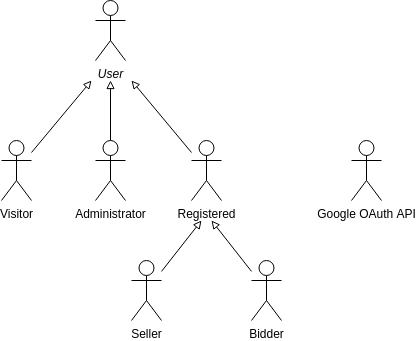

## A2: Actors and User stories

Specification of the actors, their user stories, and supplementary requirements are contained in this artifact, serving as agile documentation of the project requirements. This way, every featured idea of the project is presented in this section, along with their description and priority.

### 2.1 Actors:

Figure 1: Actors.

| Identifier | Description | Examples |
| ------ | ------ | ----- |
| User          | Generic user who has access to public information, such as the auctions, users’ profiles, and the advanced search                                                                                                       | n/a            |
| Visitor       | Unauthenticated user that can register itself (sign-up) or sign-in in the system. A visitor can’t participate in auctions or interact with the other users.                                                             | n/a            |
| Administrator | Authenticated user who has permission to manage ongoing auctions, suspending or rescheduling them, to assist or block users, and to update/delete website content.                                                       | Admin          |
| Registered    | Authenticated user that can participate in auctions, and interact with other users. It’s associated with a personal profile, where their auctions’ history, favourite auctions and sellers, and statistics can be seen. | WheelsAddict   |
| Seller        | Registered user that created an auction, where he is selling one or more model cars. He has access to the detailed data of the auction, like the number of bids, the respective bidders, or the price variation.        | CarBoss        |
| Bidder        | Registered user that can bid in a given auction and give feedback during the events.                                                                                                                                    | WheelsAddict   |
| Google OAuth API           | External OAuth API which is used to register or authenticate into the system.                                                                                                                                           | Google         |

Table 1: Actors Description.

### 2.2 User Stories

For this system, are considered the user stories that are presented in the following sections.

#### User

| Identifier | Name            | Priority | Description |
| ---------- | --------------- | -------- | ----------- |
| US001       | See Home        | High     | As a User, I want to access the website homepage, so that I can have an overview of the ongoing auctions and links for the other pages.|
| US002       | Advanced Search | High     | As a User, I want to search for all the public information, so that I can filter the auctions by the highest bids, the creation date, the car model brand, scale, colour, seller, or the remaining time. |
| US003       | Auction Page   | High     | As a User, I want to be able to see an auction’s information, so that I can know more about the car model being sold. |
| US004       | See About Us    | Medium     | As a User, I want to access the About Us page, so that I can see a complete website's description.|
| US005       | Profile Page    | Medium   | As a User, I want to see the profile page of another user, so that I can search all the auctions from this chosen user. |
| US006       | FAQ Page        | Low      | As a User, I want to access the FAQ, so that I can see Frequently Asked Questions about the website. |

Table 2: User's User Stories. 

#### Visitor

| Identifier | Name                      | Priority | Description |
| ---------- | ------------------------- | -------- | ----------- |
| US101       | Sign-In                   | High     | As a Visitor, I want to log in to the system, so that I can access privileged features. |
| US102       | Sign-Up                   | High     | As a Visitor, I want to register myself into the system, so that I can store all my data in a personal account.|
| US103       | Sign-In with external API | Low      | As a Visitor, I want to sign-in through my Google account, so that I can access privileged features. |
| US104       | Sign-Up with external API | Low      | As a Visitor, I want to register using my Google account, so that I can store all my data in the system. |

Table 3: Visitor's User Stories. 

#### Administrator

| Identifier | Name            | Priority | Description |
| ---------- | --------------- | -------- | ----------- |
| US201       | Manage auctions | High     | As an Administrator, I want to manage auctions, so that I can suspend or reschedule an auction. |
| US202       | Logout                     | High     | As an Administrator, I want to logout, so that I can leave the system. |
| US203       | Answer User Doubt     | Low   | As an Administrator, I want to answer a user's doubt in a private chat, so that I can clarify his questions. |
| US204       | User Reports    | Low      | As an Administrator, I want to see users' reports, so that I can review users' activity and decide to ban them. |
| US205       | Remove comments | Low     | As an Administrator, I want to remove a comment on a user profile, so that there are no inappropriate observations on the website. |
| US206       | Notifications | Low | As an Administrator, I want to receive notifications about questions received or user reports, so that I can be aware of what's happening. |

Table 4: Administrator's User Stories.

#### Registered

| Identifier | Name                       | Priority | Description |
| ---------- | -------------------------- | -------- | ----------- |
| US300       | Profile Page               | High     | As a Registered User, I want to have a profile page, so that I can view and update my personal information, favourites, and statistics. |
| US301       | Logout                     | High     | As a Registered User, I want to logout, so that I can leave the system. |
| US302       | Manage Favourite Auctions    | Medium     | As a Registered User, I want to add/remove a given auction to/from my Favourite Auctions, so that I can be notified of important related events. |
| US303       | Manage Favourite Sellers     | Medium   | As a Registered User, I want to add/remove a given seller to/from my Favourite Sellers, so that I can follow/unfollow his new auctions. |
| US304       | Rating Users               | Low   | As a Registered User, I want to write comments on the profile of a given user and rate him, so that other users can know if he is trustworthy. |
| US305       | Remove Comments            | Low   | As a Registered User, I want to remove my comments on the profile of a given user, so that it reflects my change of opinion. |
| US306       | Question Administrators     | Low   | As a Registered User, I want to ask the administrators my questions in a private chat, so that I can clarify my doubts. |
| US307       | Statistics                 | Low   | As a Registered User, I want to see my statistics, so that I can have an overview of my auctions' and bids' history and money spent/earned. |
| US308       | Notifications               | Low      | As a Registered User, I want to receive notifications about favourite auctions and related activity, so that I can be aware of what's happening. |
| US309       | Report Users               | Low   | As a Registered User, I want to report a given user, so that administrators can review this user's activity and ban him if needed. |
| US310       | Delete Profile               | Low   | As a Registered User, I want to be able to delete my account, so that my relationship with the website is over. |

Table 5: Registered's User Stories

#### Seller

| Identifier | Name | Priority | Description |
| ---------- | ------- | -------- | ------------- |
| US401       | Create an Auction | High | As a Seller, I want to create an auction, so that I can sell a model car. |
| US402       | Access to Auction Statistics | Low | As a Seller, I want to access private auction data (like the number of bids, the respective bidders, or the price variation), so that I can have a better perception of the auction details. |
| US403       | "Buy Now" Option | Low  | As a Seller, I want to have the option to set a "Buy Now" price for the auction, so that I can give the opportunity to sell the car model instantaneously. |

Table 6: Seller's User Stories.

#### Bidder

| Identifier | Name                   | Priority | Description |
| ---------- | ---------------------- | -------- | ----------- |
| US501       | Bid in a given auction | High     | As a Bidder, I want to bid in a given auction, so that I can try to buy the given model car. |
| US502       | "Buy Now" | Low     | As a Bidder, I want to trigger the "Buy Now" option if available, so that I can buy the car model without having to wait for the end of the auction. |
| US503       | Comment an auction     | Low   | As a Bidder, I want to write a comment in an ongoing auction, so that the other users can be informed of my interest. |

Table 7: Bidder's User Stories.

### 2.3 Supplementary requirements:

This annex contains business rules, technical requirements, and other non-functional requirements on the project.

#### Business rules

| Identifier | Name                     | Description |
| ---------- | ------------------------ | ----------- |
| BR01       | Auction finish date      | The auction finish date must be greater than the start date of the auction. |
| BR02       | Auction duration | The auction needs to have a minimum time duration of one day and a maximum of 7 days. |
| BR03       | Minimum bid              | The auction must have an initial minimum value of 1 euro from where bids can be placed. |
| BR04       | Auction requirements     | Only registered and non-blocked members are allowed to bid or create new auctions. |
| BR05       | Bidders details          | Only the creator has access to the profile of those who bid on their auction. |
| BR06       | Bids in growing order    | A new bid must have a greater value than the previous set bid. |
| BR07       | Auction self bid         | The seller cannot bid on his own auction. |
| BR08       | Deleted user             | When a user is deleted, active auctions and bids are canceled, its profile info is deleted, but not its history (past auctions/bids). |

Table 8: Business rules.

#### Technical requirements

| Identifier | Name            | Description |
| ---------- | --------------- | ----------- |
| TR01       | Availability    | The system must be available ideally all the time and prepared to handle and continue operating when runtime errors occur. |
| TR02       | Security        | The system shall protect information from unauthorized access through the use of an authentication and verification system. |
| TR03       | Data Consistency   | The system must be synchronous and consistent for all the users (for example, the remaining time of the auction should be the same for all users). |

Table 9: Technical requirements.

#### Restrictions

| Identifier | Name     | Description |
| ---------- | -------- | ----------- |
| C01        | Project Deadline | The system should be ready to be used at the project submission deadline (31/05/2021) to be able to buy or sell car models. |
| C03        | Artifacts Delivery | All the intermediate deadlines must be met, according to the course agenda. |
| C03        | Development Interruptions | The development activities will be interrupted during the Easter, and the LBAW exam. |

Table 10: Restrictions.