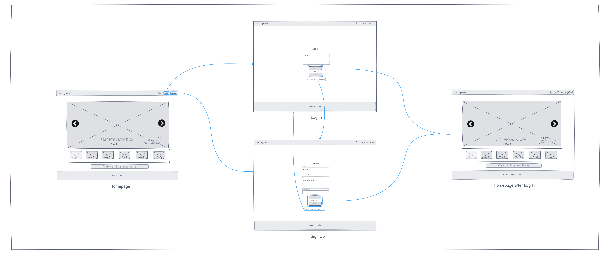
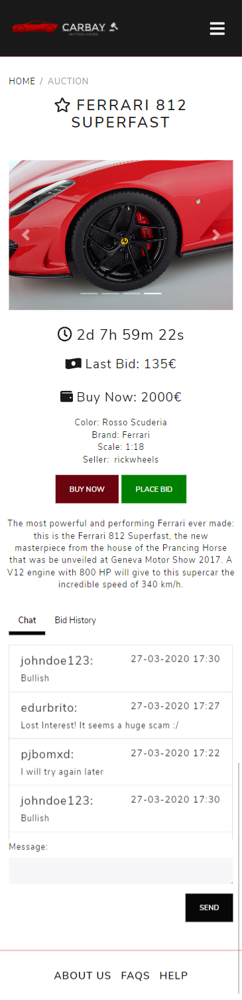

## A3: User Interface Prototype

This section pretends to associate the page design with the user stories described in the previous artefact, alongside new ones that came to our mind during this artefact’s development. The prototype must allow us to test the user interface’s main interactions and the navigation between the distinct pages.
 
In this artefact, we include a description of the website interface and its common features, using some screenshots to highlight the main functionalities. We also include a sitemap presenting the overall structure of the website from the user’s viewpoint, containing all the pages the site has. At last, we have organized a sequence of wireflows initially designed to show our website design and interface main ideas.
 
At the end of this document, there are prints of the website pages implemented for the prototype.

### 3.1 Interface and common features

Carbay is a web application based on HTML5, JavaScript, CSS, and PHP.

As requested by the project enunciate, the user interface of the website was implemented using the Bootstrap framework.

All the website pages will have the following common elements, whose positions are highlighted in the figure:

|  |  |
|----|----|

Figure 2: Interface's guidelines

1. **Logo:** When clicked, it redirects the user to the homepage
2. **Navbar:**
    * From a visitor perspective, it contains links to the search, login, and signup pages
    * When logged in, it contains links to the search, create auction and profile pages, and also a notifications icon and a logout button.
3. **Content:** Depends on the current page
4. **Footer:**
    * From a visitor perspective, it contains links to About Us and FAQs pages
    * When logged in, it also contains a link to the Help page.

Some common characteristics between all the pages are:
* Responsive behaviour, since every page adapts itself to the size of the screen, therefore allowing the website to be accessed by different devices (laptop, tablets, smartphones...)
* In order to keep the website consistent, and to enhance the user experience, the common elements of the pages maintain their position - the navbar is fixed on the top of the screen and the footer at the end.
* Consistency of the page components - we decided to maintain the design of the elements composing the page, by using only our theme’s colours, a centred vision of the content of the page, a rectangular shape for buttons and sections, and the same text font (“Nunito Sans”).
* Simplicity of the user interface - the majority of the links are represented by icons, representative of the target page’s functionalities, and no page contains too much-concentrated information.
* Apart from the Homepage, every page contains a breadcrumb, helping locate the user on the website.

### 3.2 Sitemap

Figure 3: Sitemap.

### 3.3 Wireflows

Figure 4: Wireflow centered on the visitor's options.

Figure 5: Wireflow for the log-in and sign-up interactions.

Figure 6: Wireflow centered on the admin's options.

Figure 7: Wireflow centered on the registered user's options.

Figure 8: Wireflow centered on the user's profile options.

Figure 9: Wireflow centered on the end of an auction.

[InVision Project](https://lbaw2155.invisionapp.com/freehand/lbaw2155-G5KykIqjB)

### 3.4 Interfaces

The following interfaces represent our platform's look and available features.

  - [UI01: Homepage](#ui01-homepage)
  - [UI02: About Us](#ui02-about-us)
  - [UI03: Faqs](#ui03-faqs)
  - [UI04: Help](#ui04-help)
  - [UI05: Log In](#ui05-log-in)
  - [UI06: Sign Up](#ui06-sign-up)
  - [UI07: Search](#ui07-search)
  - [UI08: Auction Page - Chat](#ui08-auction-page---chat)
  - [UI09: Auction Page - Bid History](#ui09-auction-page---bid-history)
  - [UI10: Create Auction - General Info](#ui10-create-auction---general-info)
  - [UI11: Create Auction - Description](#ui11-create-auction---description)
  - [UI12: Profile](#ui12-profile)
  - [UI13: Edit Profile](#ui13-edit-profile)
  - [UI14: Profile - Bid History](#ui14-profile---bid-history)
  - [UI15: Profile - Auctions Created](#ui15-profile---auctions-created)
  - [UI16: Profile - Favourite Auctions](#ui16-profile---favourite-auctions)
  - [UI17: Profile - Favourite Sellers](#ui17-profile---favourite-sellers)
  - [UI18: Profile - Users Ratings](#ui18-profile---users-ratings)
  - [UI19: Profile - Users Rated](#ui19-profile---users-rated)
  - [UI20: Admin Panel - Users Management](#ui20-admin-panel---users-management)
  - [UI21: Admin Panel - Auctions Management](#ui21-admin-panel---auctions-management)
  - [UI22: Admin Panel - Reports](#ui22-admin-panel---reports)
  - [UI23: Admin Panel - Help](#ui23-admin-panel---help)
  - [UI24: Error 404](#ui24-error-404)

 
#### UI01: Homepage

|  |  |
|----|----|

Figure 10: [Homepage](http://lbaw2155-piu.lbaw-prod.fe.up.pt/)

#### UI02: About Us

|  |  |
|----|----|

Figure 11: [About Us](http://lbaw2155-piu.lbaw-prod.fe.up.pt/about.php)

#### UI03: Faqs

|  |  |
|----|----|

Figure 12: [Faqs](http://lbaw2155-piu.lbaw-prod.fe.up.pt/faqs.php)

#### UI04: Help

|  |  |
|----|----|

Figure 13: [Help](http://lbaw2155-piu.lbaw-prod.fe.up.pt/help.php)

#### UI05: Log In

|  |  |
|----|----|

Figure 14: [Log In](http://lbaw2155-piu.lbaw-prod.fe.up.pt/login.php)

#### UI06: Sign Up

|  |  |
|----|----|

Figure 15: [Sign Up](http://lbaw2155-piu.lbaw-prod.fe.up.pt/signup.php)

#### UI07: Search

|  |  |
|----|----|

Figure 16: [Search](http://lbaw2155-piu.lbaw-prod.fe.up.pt/search.php)

#### UI08: Auction Page - Chat

|  |  |
|----|----|

Figure 17: [Auction](http://lbaw2155-piu.lbaw-prod.fe.up.pt/auction.php)

#### UI09: Auction Page - Bid History

|  |  |
|----|----|

Figure 18: [Auction](http://lbaw2155-piu.lbaw-prod.fe.up.pt/auction.php)

#### UI10: Create Auction - General Info

|  |  |
|----|----|

Figure 19: [Create Auction](http://lbaw2155-piu.lbaw-prod.fe.up.pt/create-auction.php)

#### UI11: Create Auction - Description

|  |  |
|----|----|

Figure 20: [Create Auction](http://lbaw2155-piu.lbaw-prod.fe.up.pt/create-auction.php)

#### UI12: Profile

|  |  |
|----|----|

Figure 21: [Profile](http://lbaw2155-piu.lbaw-prod.fe.up.pt/profile.php)

#### UI13: Edit Profile

|  |  |
|----|----|

Figure 22: [Edit Profile](http://lbaw2155-piu.lbaw-prod.fe.up.pt/edit-profile.php)

#### UI14: Profile - Bid History

|  |  |
|----|----|

Figure 23: [Profile](http://lbaw2155-piu.lbaw-prod.fe.up.pt/profile.php)

#### UI15: Profile - Auctions Created

|  |  |
|----|----|

Figure 24: [Profile](http://lbaw2155-piu.lbaw-prod.fe.up.pt/profile.php)

#### UI16: Profile - Favourite Auctions

|  |  |
|----|----|

Figure 25: [Profile](http://lbaw2155-piu.lbaw-prod.fe.up.pt/profile.php)

#### UI17: Profile - Favourite Sellers

|  |  |
|----|----|

Figure 26: [Profile](http://lbaw2155-piu.lbaw-prod.fe.up.pt/profile.php)

#### UI18: Profile - Users Ratings

|  |  |
|----|----|

Figure 27: [Profile](http://lbaw2155-piu.lbaw-prod.fe.up.pt/profile.php)

#### UI19: Profile - Users Rated

|  |  |
|----|----|

Figure 28: [Profile](http://lbaw2155-piu.lbaw-prod.fe.up.pt/profile.php)

#### UI20: Admin Panel - Users Management

|  |  |
|----|----|

Figure 29: [Admin Panel](http://lbaw2155-piu.lbaw-prod.fe.up.pt/admin.php)

#### UI21: Admin Panel - Auctions Management

|  |  |
|----|----|

Figure 30: [Admin Panel](http://lbaw2155-piu.lbaw-prod.fe.up.pt/admin.php)

#### UI22: Admin Panel - Reports

|  |  |
|----|----|

Figure 31: [Admin Panel](http://lbaw2155-piu.lbaw-prod.fe.up.pt/admin.php)

#### UI23: Admin Panel - Help

|  |  |
|----|----|

Figure 32: [Admin Panel](http://lbaw2155-piu.lbaw-prod.fe.up.pt/admin.php)

#### UI24: Error 404

|  |  |
|----|----|

Figure 33: [Error 404](http://lbaw2155-piu.lbaw-prod.fe.up.pt/404.php)

## Revision History

Changes made to the first submission:

## Team
* Eduardo Brito (Editor)
    * [up201806271@fe.up.pt](mailto:up201806271@fe.up.pt)
    * [up201806271@g.uporto.pt](mailto:up201806271@g.uporto.pt)
* Paulo Ribeiro
    * [up201806505@fe.up.pt](mailto:up201806505@fe.up.pt)
    * [up201806505@g.uporto.pt](mailto:up201806505@g.uporto.pt)
* Pedro Ferreira
    * [up201806506@fe.up.pt](mailto:up201806506@fe.up.pt)
    * [up201806506@g.uporto.pt](mailto:up201806506@g.uporto.pt)
* Pedro Ponte
    * [up201809694@fe.up.pt](mailto:up201809694@fe.up.pt)
    * [up201809694@g.uporto.pt](mailto:up201809694@g.uporto.pt)
----
GROUP 2155, 13/03/2021