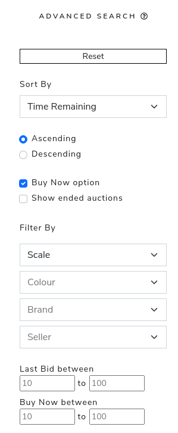
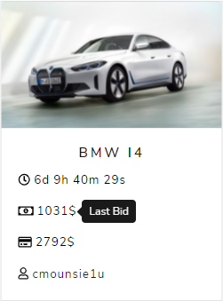
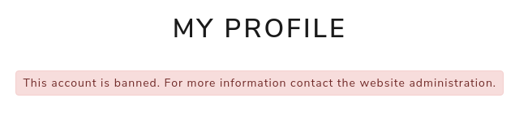
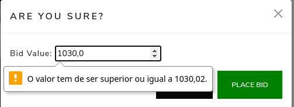
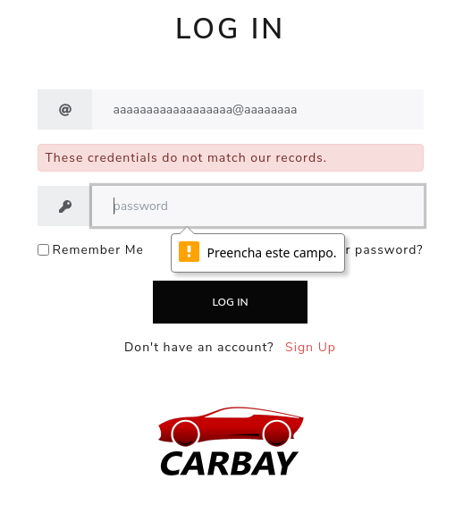
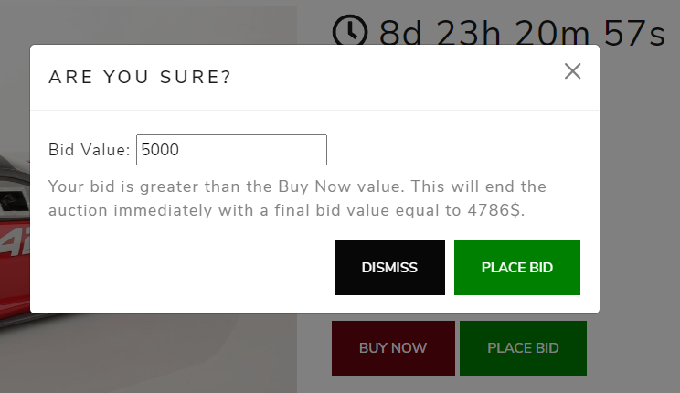

## A9: Product

A website for participating in live auctions of car models. You can choose from different scales, brands and colours. A user can create its auctions, bid and comment on other user’s ones, and search through all the available models. Besides this, it is also possible to add a given seller or auction to their favourites, as well as to manage their profile page, edit their information or check their statistics. The user is informed about all the main events of the website through notifications. The administrators of the system can promote a user to admin statute, ban users and schedule/cancel auctions.

### 1. Installation

To run our website locally simply clone the repository (link [here](https://git.fe.up.pt/lbaw/lbaw2021/lbaw2155)) and run the following command on the root of the repository:

`sudo docker run -it -p 8000:80 -e DB_DATABASE="lbaw2155" -e DB_USERNAME="lbaw2155" -e DB_PASSWORD="VP764843" lbaw2155/lbaw2155`

### 2. Usage

**URL to the product:** http://lbaw2155.lbaw-prod.fe.up.pt

#### 2.1. Administration Credentials

**Administration URL:** http://lbaw2155.lbaw-prod.fe.up.pt/admin
 
|     Email     | Password |
| ------------- |----------|
| aflowerden0@posterous.com | aflowerden0 |
| nberrisford1@netscape.com | nberrisford1 |
| gmcfadin2@washington.edu | gmcfadin2 |

#### 2.2. User Credentials

| Type | Email | Password |
|------|----------|----------|
| basic account | fbrauned@cam.ac.uk | fbrauned |
| basic account | rkemmey1x@homestead.com | rkemmey1x |
| basic account (banned) | mtaffrey1@pbs.org | mtaffrey1 |

#### 2.3 Mailtrap

https://mailtrap.io/
email: bibjigkhzhslpoiapg@twzhhq.online
password: bibjigkhzhslpoiapg

### 3. Application Help

The website has several ways to help the user, from tooltips and default values/tips in input fields to a textual description of some fields.
For example, on the search page, every search option is followed by an explication.

----

In the auction cards presented on the search page, each value presented is associated with a representative icon and a small description when in hover.

The user also receives feedback messages for every important action done. For instance, a red warning shows every time a user tries to bid in an auction whose highest bid is already of their authorship. In the next image, we can see the message shown on the profile page if the user is banned.

### 4. Input Validation

Every input is validated, not only on HTML but also on the server-side. For example, when a user tries to bid in an auction, the input is validated to warrant that its value is higher than the value of the last bid.

While logging in, the user inputs are also verified, and a red warning shows up if the credentials don't match the database records.

If the user tries to bid with a value that is higher than the BuyNow value, a message is also shown to inform him the action will end the auction with a final value equal to the BuyNow defined.

### 5. Check Accessibility and Usability

Accessibility: [Accessibility checklist report](https://git.fe.up.pt/lbaw/lbaw2021/lbaw2155/-/blob/80e90741749bbf28f297892ae33eed0c606e0a93/docs/pa/Checklist%20de%20Acessibilidade%20-%20SAPO%20UX.pdf)
Usability: [Usability checklist report](https://git.fe.up.pt/lbaw/lbaw2021/lbaw2155/-/blob/80e90741749bbf28f297892ae33eed0c606e0a93/docs/pa/Checklist%20de%20Usabilidade%20-%20SAPO%20UX.pdf)

### 6. HTML & CSS Validation

HTML: 
* [HTML Validation - Search](https://git.fe.up.pt/lbaw/lbaw2021/lbaw2155/-/blob/80e90741749bbf28f297892ae33eed0c606e0a93/docs/pa/Search.pdf)
* [HTML Validation - Auction Page](https://git.fe.up.pt/lbaw/lbaw2021/lbaw2155/-/blob/80e90741749bbf28f297892ae33eed0c606e0a93/docs/pa/Auction.pdf)
* [HTML Validation - FAQs](https://git.fe.up.pt/lbaw/lbaw2021/lbaw2155/-/blob/80e90741749bbf28f297892ae33eed0c606e0a93/docs/pa/FAQs.pdf)

CSS: [CSS Validation](https://git.fe.up.pt/lbaw/lbaw2021/lbaw2155/-/blob/80e90741749bbf28f297892ae33eed0c606e0a93/docs/pa/Css.pdf)

### 7. Revisions to the Project

There were some small changes in the design and layout of some pages to better suit the framework's usage and also some addings and changes to the User Stories. 

### 8. Implementation Details

#### 8.1. Libraries Used

Laravel - PHP Framework
Bootstrap - Front-end toolkit
Mailtrap - Email Testing tool

#### 8.2 User Stories

| US Identifier | Name | Module | Priority | Team Members | State |
|---------------|------|--------|----------|--------------|-------|
| US001       | See Home        | User | High | **Eduardo Brito**, Paulo Ribeiro | 100% |
| US002       | Advanced Search | User | High  | **Eduardo Brito**, Paulo Ribeiro | 100% |
| US003       | Auction Page   | User | High     | **Pedro Ferreira**, Pedro Ponte | 100% |
| US101       | Sign-In   | Visitor | High     | **Eduardo Brito**, Pedro Ponte | 100% |
| US102       | Sign-Up   | Visitor | High     | **Eduardo Brito**, Pedro Ponte | 100% |
| US103       | Password Recovery | Visitor | High | **Eduardo Brito**, Pedro Ferreira | 100% |
| US201       | Manage Auctions | Administrator | High  | **Eduardo Brito**, Pedro Ferreira | 100% |
| US202       | Logout | Administrator | High | **Pedro Ferreira**, Eduardo Brito | 100% |
| US300       | Profile Page | Registered | High     | **Paulo Ribeiro**, Pedro Ponte | 100% |
| US301       | Logout | Registered | High   | **Pedro Ponte**, Eduardo Brito | 100% |
| US310       | Delete Profile | Registered | High | **Pedro Ferreira**, Eduardo Brito | 100% |
| US401       | Create an Auction | Seller | High | **Pedro Ponte**, Eduardo Brito | 100% |
| US501       | Bid in a given auction | Bidder | High | **Pedro Ferreira**, Eduardo Brito | 100% |
| US004       | See About Us    | User | Medium  | **Paulo Ribeiro**, Eduardo Brito | 100% |
| US005       | Profile Page    | User | Medium  | **Paulo Ribeiro**, Eduardo Brito | 100% |
| US204       | User Reports | Administrator | Medium | **Pedro Ponte**, Paulo Ribeiro | 100% |
| US206       | Notifications | Registered | Medium | **Eduardo Brito**, Pedro Ferreira | 100% |
| US302       | Manage Favourite Auctions | Registered | Medium | **Paulo Ribeiro**, Pedro Ponte | 100% | 
| US303       | Manage Favourite Sellers  | Registered | Medium | Paulo Ribeiro, **Pedro Ponte** | 100% |
| US308       | Notifications | Administration | Medium | **Eduardo Brito**, Pedro Ferreira | 100% |
| US309       | Report Users  | Registered | Medium | **Paulo Ribeiro**, Pedro Ponte | 100% |
| US006       | FAQ Page        | User | Low      | **Pedro Ferreira**, Eduardo Brito | 100% |
| US304       | Rating Users | Registered | Low | **Pedro Ferreira**, Eduardo Brito | 100% |
| US307       | Statistics | Registered | Low | **Pedro Ponte**, Paulo Ribeiro | 100% |
| US403       | "Buy Now" Option | Seller | Low  | **Pedro Ponte**, Eduardo Brito | 100% |
| US502       | "Buy Now" | Bidder | Low | **Paulo Ribeiro**, Pedro Ponte | 100% |
| US503       | Comment an auction     | Bidder | Low  | **Pedro Ferreira**, Eduardo Brito | 100% |
| US104       | Sign-In with external API     | Visitor | Low  |  | 0% |
| US105       | Sign-Up with external API     | Visitor | Low  |  | 0% |
| US203       | Answer User Doubt     | Administrator | Low  |  | 0% |
| US305       | Remove Comments     | Registered | Low  |  | 0% |
| US306       | Question Administrator     | Registered | Low  |  | 0% |
| US402       | Access to Auction Statistics     | Seller | Low  |  | 0% |

